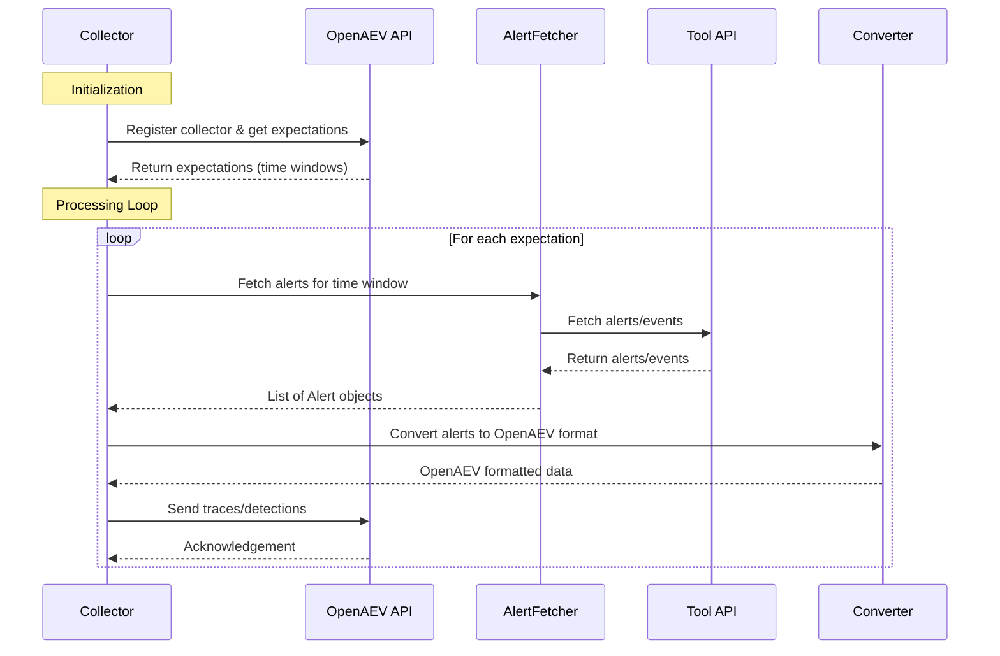

# Contribution Guide: Creating a New Collector for OpenAEV

## Overview
A collector integrates a security tool (EDR, XDR, SIEM, etc.) with the OpenAEV platform, fetching relevant data and transforming it into a standard format for analysis and validation. Each collector runs as a standalone service, following a common architecture and interface.

## Collector Anatomy



## Inputs
Collectors require configuration to connect to both OpenAEV and the target security tool. Inputs include:

- **OpenAEV connection**: URL and API token (see `config.yml`)
- **Collector metadata**: Unique collector ID, log level, etc.
- **Tool-specific settings**: API keys, FQDN, credentials, etc.

Example (`config.yml`):
```yaml
openaev:
  url: 'http://localhost:8081'
  token: '<your-openaev-token>'

collector:
  id: 'Palo Alto Cortex XDR'
  log_level: 'debug'

palo_alto_cortex_xdr:
  fqdn: '<xdr-fqdn>'
  api_key: '<api-key>'
  api_key_id: <id>
  api_key_type: 'standard'
```

## Expected Outputs
Collectors must produce:
- **Traces**: Structured records of expectation validation (see below)
- **Logs**: Informational, debug, and error logs for observability
- **Processing summaries**: Counts of processed, valid, invalid, and skipped expectations

Traces are sent to OpenAEV via the API, using a standard model (see `ExpectationTrace`).

## What Are Traces?
A **trace** is a record that links an expectation (what should be detected/prevented) to an actual alert or event in the security tool. Traces provide evidence that an expectation was met (or not) and are critical for validation and reporting.

A trace includes:
- Expectation ID
- Collector/source ID
- Alert name
- Alert link (URL to the alert in the tool)
- Date/time (ISO format)

Example (Python model):
```python
class ExpectationTrace(BaseModel):
    inject_expectation_trace_expectation: str  # Expectation ID
    inject_expectation_trace_source_id: str    # Collector/source ID
    inject_expectation_trace_alert_name: str   # Name of matched alert
    inject_expectation_trace_alert_link: str   # Link to alert in tool
    inject_expectation_trace_date: str         # ISO date string
```

## Step-by-Step: Creating a Collector
1. **Scaffold**: Use Poetry to create a new collector package:
   ```bash
   poetry new my-collector
   cd my-collector
   ```
   This creates the standard directory structure. Add a `pyproject.toml` and `config.yml` as shown above.

2. **Implement config loading**: Use a config loader to parse YAML and environment variables. Example:
   ```python
   # src/models/settings/config_loader.py
   import yaml
   import os

   class ConfigLoader:
       def __init__(self, config_path='src/config.yml'):
           with open(config_path) as f:
               self.config = yaml.safe_load(f)
           # Optionally override with env vars
           self.config['openaev']['token'] = os.getenv('OPENAEV_TOKEN', self.config['openaev']['token'])
   ```

3. **Build the Collector class**: Inherit from `CollectorDaemon`, implement setup and processing logic.
   ```python
   # src/collector/collector.py
   from pyoaev.daemons import CollectorDaemon
   from src.models.settings.config_loader import ConfigLoader

   class Collector(CollectorDaemon):
       def __init__(self):
           self.config = ConfigLoader()
           super().__init__(configuration=self.config.to_daemon_config(),
                            callback=self._process_callback,
                            collector_type="openaev_my_collector")

       def _setup(self):
           # Initialize services, managers, etc.
           pass

       def _process_callback(self):
           # Main processing logic
           pass
   ```

4. **Integrate with OpenAEV**: Use the `pyoaev` library for API communication and expectation management.
   ```python
   from pyoaev.helpers import OpenAEVDetectionHelper
   # ...
   self.oaev_detection_helper = OpenAEVDetectionHelper(
       logger=self.logger,
       relevant_signatures_types=[...],
   )
   # Use helper in your processing logic
   ```

5. **Implement trace creation**: Convert results into `ExpectationTrace` objects and send to OpenAEV.
   ```python
   from src.collector.models import ExpectationTrace
   # ...
   trace = ExpectationTrace(
       inject_expectation_trace_expectation=expectation_id,
       inject_expectation_trace_source_id=self.get_id(),
       inject_expectation_trace_alert_name=alert['name'],
       inject_expectation_trace_alert_link=alert['url'],
       inject_expectation_trace_date=datetime.utcnow().isoformat(),
   )
   # Send trace to OpenAEV API
   self.api.send_trace(trace.to_api_dict())
   ```

6. **Logging and error handling**: Use structured logging and handle all exceptions robustly.
   ```python
   import logging
   logger = logging.getLogger(__name__)
   try:
       # ... main logic ...
   except Exception as e:
       logger.error(f"Error: {e}")
       raise
   ```

7. **Testing**: Add unittests if possible, and run all linters (`black`, `isort`, `flake8`).
   ```bash
   poetry run python -m unittest
   black .
   isort --profile black .
   flake8 --ignore=E,W .
   ```

8. **Documentation**: Update the README and provide config samples.
   ```markdown
   # My Collector
   Example configuration:
   ...
   ```

## Best Practices
- Always validate and sanitize all inputs.
- Never hardcode secrets in code or config samples.
- Keep functions focused and well-named.
- Follow the repo’s linting and formatting requirements.
- Document any new configuration options.
- Use semantic versioning for releases.

For more details, see the Palo Alto Cortex XDR collector as a reference implementation.
