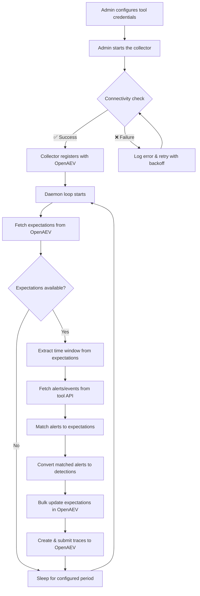
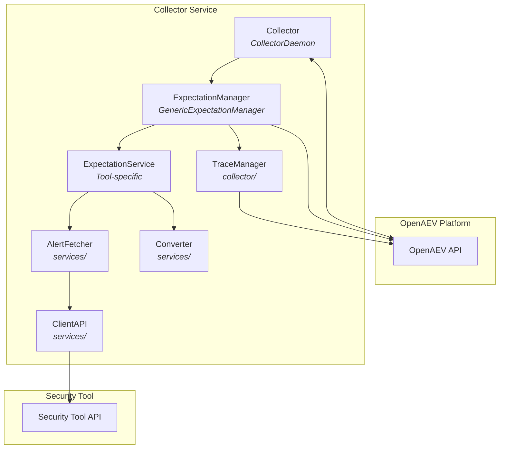
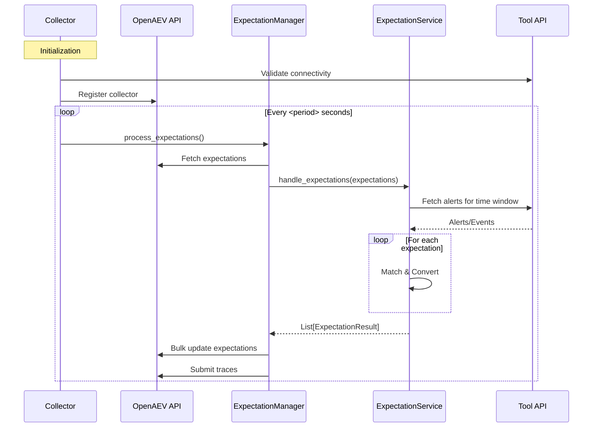

# Contribution Guide: Creating a New Collector for OpenAEV

## Overview
A collector integrates a security tool (EDR, XDR, SIEM, etc.) with the OpenAEV platform, fetching relevant data and transforming it into a standard format for analysis and validation. Each collector runs as a standalone service, following a common architecture and interface.

## Collector Anatomy

### High-Level Workflow



### Component Architecture



### Sequence Diagram



## Inputs
Collectors require configuration to connect to both OpenAEV and the target security tool. Inputs include:

- **OpenAEV connection**: URL and API token (see `config.yml`)
- **Collector metadata**: Unique collector ID, log level, etc.
- **Tool-specific settings**: API keys, FQDN, credentials, etc.

Example (`config.yml`):
```yaml
openaev:
  url: 'http://localhost:8081'
  token: '<your-openaev-token>'

collector:
  id: 'Palo Alto Cortex XDR'
  log_level: 'debug'

palo_alto_cortex_xdr:
  fqdn: '<xdr-fqdn>'
  api_key: '<api-key>'
  api_key_id: <id>
  api_key_type: 'standard'
```

## Expected Outputs
Collectors must produce:
- **Traces**: Structured records of expectation validation (see below)
- **Logs**: Informational, debug, and error logs for observability
- **Processing summaries**: Counts of processed, valid, invalid, and skipped expectations

Traces are sent to OpenAEV via the API, using a standard model (see `ExpectationTrace`).

## What Are Traces?
A **trace** is a record that links an expectation (what should be detected/prevented) to an actual alert or event in the security tool. Traces provide evidence that an expectation was met (or not) and are critical for validation and reporting.

A trace includes:
- Expectation ID
- Collector/source ID
- Alert name
- Alert link (URL to the alert in the tool)
- Date/time (ISO format)

Example (Python model):
```python
class ExpectationTrace(BaseModel):
    inject_expectation_trace_expectation: str  # Expectation ID
    inject_expectation_trace_source_id: str    # Collector/source ID
    inject_expectation_trace_alert_name: str   # Name of matched alert
    inject_expectation_trace_alert_link: str   # Link to alert in tool
    inject_expectation_trace_date: str         # ISO date string
```

## Step-by-Step: Creating a Collector
1. **Scaffold**: The easiest way to start is by copying the `collector-boilerplate` directory:
   ```bash
   cp -r collector-boilerplate my-collector
   cd my-collector
   ```
   Alternatively, use Poetry to create a new package and follow the directory structure of existing collectors.

2. **Implement config loading**: Use Pydantic for robust configuration management. Define your models in `src/models/settings/`.
   ```python
   # src/models/settings/my_collector_configs.py
   from pydantic import Field, SecretStr
   from .base_settings import ConfigBaseSettings

   class MyCollectorSettings(ConfigBaseSettings):
       api_key: SecretStr
       endpoint: str
   ```
   Then implement the `ConfigLoader` to handle YAML and environment variables.

3. **Build the Collector class**: Inherit from `CollectorDaemon`. In `_setup`, initialize your services and the `GenericExpectationManager`.
   ```python
   # src/collector/collector.py
   from pyoaev.daemons import CollectorDaemon
   from pyoaev.helpers import OpenAEVDetectionHelper
   from src.collector.expectation_manager import GenericExpectationManager
   from src.services.expectation_service import ExpectationService

   class Collector(CollectorDaemon):
       def _setup(self):
           super()._setup()
           self.expectation_service = ExpectationService(config=self.config)
           self.expectation_manager = GenericExpectationManager(
               oaev_api=self.api,
               collector_id=self.get_id(),
               expectation_service=self.expectation_service,
           )
           self.oaev_detection_helper = OpenAEVDetectionHelper(
               logger=self.logger,
               relevant_signatures_types=self.expectation_service.get_supported_signatures(),
           )

       def _process_callback(self):
           self.expectation_manager.process_expectations(
               detection_helper=self.oaev_detection_helper
           )
   ```

4. **Implement ExpectationService**: This is where the core logic resides. It must implement `handle_expectations` and `get_supported_signatures`.
   ```python
   # src/services/expectation_service.py
   class ExpectationService:
       def handle_expectations(self, expectations, detection_helper):
           # 1. Fetch alerts from tool API
           # 2. Match alerts to expectations using detection_helper
           # 3. Return List[ExpectationResult]
           pass
   ```

5. **Implement Alert Fetching & Conversion**:
   - Create a `ClientAPI` class for HTTP communication with the security tool.
   - Create an `AlertFetcher` to handle pagination and data retrieval.
   - Create a `Converter` to transform tool-specific data into the OpenAEV format.

6. **Implement trace creation**: Use a `TraceBuilder` utility to create `ExpectationTrace` objects.
   ```python
   # src/services/utils/trace_builder.py
   from src.collector.models import ExpectationTrace
   
   class TraceBuilder:
       @staticmethod
       def create_trace(alert):
           return ExpectationTrace(
               inject_expectation_trace_expectation=...,
               inject_expectation_trace_source_id=...,
               # ...
           )
   ```

7. **Testing**: Use `pytest` for unit and integration tests. Add factories for easy object creation.
   ```bash
   poetry run pytest
   ```

8. **Documentation**: Update the README and provide config samples.
   ```markdown
   # My Collector
   Example configuration:
   ...
   ```

## Best Practices
- Always validate and sanitize all inputs.
- Never hardcode secrets in code or config samples.
- Keep functions focused and well-named.
- Follow the repo’s linting and formatting requirements.
- Document any new configuration options.
- Use semantic versioning for releases.

For more details, see the Palo Alto Cortex XDR collector as a reference implementation.
