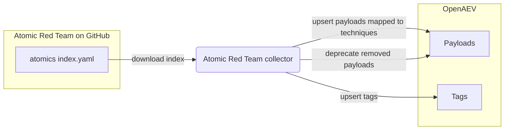

# OpenAEV Atomic Red Team Collector

The Atomic Red Team collector imports the [Atomic Red Team](https://www.atomicredteam.io/) payload library into OpenAEV.
On each run it downloads the public Red Canary `atomic-red-team` index from GitHub and upserts every atomic test as an
OpenAEV payload, mapped to its MITRE ATT&CK technique, supported platforms, and executor, with the matching arguments,
prerequisites, and cleanup commands. This is an importer: it does not register a security platform and does not validate
detection or prevention expectations.

## Table of Contents

- [OpenAEV Atomic Red Team Collector](#openaev-atomic-red-team-collector)
  - [Table of Contents](#table-of-contents)
  - [Introduction](#introduction)
  - [Requirements](#requirements)
  - [Configuration variables](#configuration-variables)
    - [OpenAEV environment variables](#openaev-environment-variables)
    - [Base collector environment variables](#base-collector-environment-variables)
  - [Deployment](#deployment)
    - [Docker Deployment](#docker-deployment)
    - [Manual Deployment](#manual-deployment)
  - [Usage](#usage)
  - [Behavior](#behavior)
  - [Data source](#data-source)
  - [Debugging](#debugging)
  - [Additional information](#additional-information)

## Introduction

OpenAEV (Breach and Attack Simulation) executes payloads to simulate attacker behavior on endpoints. This collector
feeds that payload catalog from Atomic Red Team, the open library of small, ATT&CK-mapped tests maintained by Red Canary.
On each run it downloads the Atomic Red Team index and, for every atomic test, upserts an OpenAEV payload that includes:

- The command and its executor (`powershell`, `command_prompt`, `bash`, `sh`, or `manual`), the input arguments, the
  prerequisites (including auto-generated download steps for required resource files), and the cleanup command.
- The supported platforms (mapped to `Windows`, `Linux`, `MacOS`), the linked ATT&CK technique, and the derived
  OpenAEV security domains.
- Descriptive tags (`source:atomic-red-team`, `technique:<id>`, `platform:<os>`, `executor:<name>`).

Payloads are imported as `COMMUNITY` source, `UNVERIFIED` status, `ALL_ARCHITECTURES`, with `PREVENTION` and `DETECTION`
expectations. A short list of atomic tests that have already been curated into the official OpenAEV payload library is
skipped to avoid duplicates. At the end of each run, payloads previously imported by this collector but no longer present
in the index are deprecated. The collector only imports payloads; it does not connect to a security platform and does not
reconcile detection / prevention expectations.

## Requirements

- A running OpenAEV platform, reachable from where the collector runs, with an administrator API token
- Outbound network access to GitHub (`raw.githubusercontent.com` / `github.com`) to download the Atomic Red Team index
- No API key or account is required (the Atomic Red Team data is public)
- For a manual (non-Docker) deployment: Python >= 3.11 and [Poetry](https://python-poetry.org/) >= 2.1

## Configuration variables

The collector is configured either through environment variables (recommended, read from `docker-compose.yml` / the
`.env` file for a Docker deployment) or through a `config.yml` file (for a manual deployment). Copy the provided
`.env.sample` / `config.yml.sample` and fill in the values flagged with `ChangeMe`.

### OpenAEV environment variables

| Parameter         | config.yml          | Docker environment variable | Mandatory | Description                                                                        |
|-------------------|---------------------|-----------------------------|-----------|------------------------------------------------------------------------------------|
| OpenAEV URL       | `openaev.url`       | `OPENAEV_URL`               | Yes       | The URL of the OpenAEV platform. Must be reachable from where the collector runs.  |
| OpenAEV Token     | `openaev.token`     | `OPENAEV_TOKEN`             | Yes       | The administrator token of the OpenAEV platform.                                   |
| OpenAEV Tenant ID | `openaev.tenant_id` | `OPENAEV_TENANT_ID`         | No        | Tenant identifier for multi-tenant deployments. When set, it must be a valid UUID. |

### Base collector environment variables

| Parameter        | config.yml            | Docker environment variable | Default         | Mandatory | Description                                                               |
|------------------|-----------------------|-----------------------------|-----------------|-----------|---------------------------------------------------------------------------|
| Collector ID     | `collector.id`        | `COLLECTOR_ID`              | /               | Yes       | A unique `UUIDv4` identifier for this collector instance.                  |
| Collector Name   | `collector.name`      | `COLLECTOR_NAME`            | Atomic Red Team | No        | The name of the collector as shown in OpenAEV.                            |
| Collector Period | `collector.period`    | `COLLECTOR_PERIOD`          | P7D             | No        | Interval between two runs, as an ISO 8601 duration (e.g. `P7D` = 7 days).  |
| Log Level        | `collector.log_level` | `COLLECTOR_LOG_LEVEL`       | error           | No        | Verbosity of the logs. One of `debug`, `info`, `warn`, `error`.            |

## Deployment

### Docker Deployment

Build the Docker image (or use the published `openaev/collector-atomic-red-team` image):

```shell
docker build . -t openaev/collector-atomic-red-team:latest
```

Create a `.env` file from `.env.sample` and fill in your values, then start the collector with the provided
`docker-compose.yml` (which reads those variables):

```shell
docker compose up -d
```

### Manual Deployment

Create a `config.yml` file from `config.yml.sample` and fill in your values, then install and run the collector:

```shell
poetry install --extras prod
poetry run python -m atomic_red_team.openaev_atomic_red_team
```

> For local development against a checkout of [client-python](https://github.com/OpenAEV-Platform/client-python)
> (cloned next to this repository), use `poetry install --extras dev` instead.

## Usage

Once started, the collector registers itself in OpenAEV and then runs automatically every `COLLECTOR_PERIOD` (7 days by
default). Each run re-downloads the latest Atomic Red Team index, upserts the payloads (existing ones are updated in
place), and deprecates the payloads it previously imported that have since been removed upstream. No manual interaction
is required.

## Behavior



On each run, the collector:

1. Downloads the Atomic Red Team `index.yaml` from the public Red Canary GitHub repository and parses it.
2. Iterates over each kill chain phase, attack pattern (technique), and atomic test, skipping the curated tests already
   present in the official OpenAEV payload library.
3. Builds an OpenAEV `Command` payload per atomic test: executor and command, input arguments, prerequisites (rewriting
   `PathToAtomicsFolder` references and adding download steps for required resources), cleanup command, supported
   platforms, the linked ATT&CK technique, security domains, and descriptive tags.
4. Upserts each payload, then deprecates the payloads previously imported by this collector that are no longer present
   in the index.

## Data source

This collector reads a public data source, so no credentials or API key are required.

- Source: the Atomic Red Team atomics index maintained by Red Canary.
- Endpoint used: `GET https://raw.githubusercontent.com/redcanaryco/atomic-red-team/master/atomics/Indexes/index.yaml`
- Generated prerequisite commands additionally reference raw resource files under
  `https://github.com/redcanaryco/atomic-red-team/raw/master/atomics/...`; these are downloaded on the OpenAEV agent at
  execution time, not by the collector.
- Reference: [Atomic Red Team](https://www.atomicredteam.io/).

## Debugging

Set `COLLECTOR_LOG_LEVEL=debug` to get verbose logs, including each kill chain phase, attack pattern, and atomic test as
it is imported. The most common failure is the collector being unable to reach GitHub: confirm outbound network / proxy
access to `github.com` and `raw.githubusercontent.com` from where the collector runs. Failures to create a tag are
logged as warnings and do not stop the payload import.

## Additional information

- The collector is idempotent: it upserts payloads on every run (keyed by the atomic test `auto_generated_guid`), so it
  is safe to run repeatedly, and it deprecates payloads removed upstream.
- Imported payloads are flagged `UNVERIFIED` and sourced from the `COMMUNITY`; review them before relying on them in
  production simulations.
- The required data source reflects the current implementation. Red Canary may change the repository layout over time,
  so always confirm against the official documentation before deploying.
