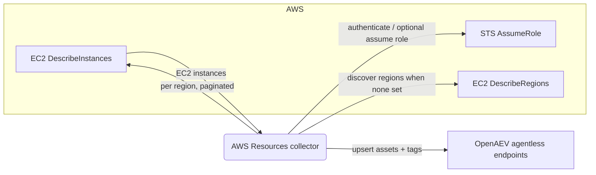

# OpenAEV Amazon Web Services Resources Collector

The Amazon Web Services Resources collector imports your [Amazon EC2](https://aws.amazon.com/ec2/) instances into OpenAEV
as agentless endpoints. On each run it lists the EC2 instances visible to the configured AWS credentials and creates or
updates a matching OpenAEV asset (endpoint) for every instance, so your simulation scope stays aligned with your AWS
inventory. This collector imports inventory only and does not validate detection or prevention expectations.

## Table of Contents

- [OpenAEV Amazon Web Services Resources Collector](#openaev-amazon-web-services-resources-collector)
  - [Table of Contents](#table-of-contents)
  - [Introduction](#introduction)
  - [Requirements](#requirements)
  - [Configuration variables](#configuration-variables)
    - [OpenAEV environment variables](#openaev-environment-variables)
    - [Base collector environment variables](#base-collector-environment-variables)
    - [Amazon Web Services collector environment variables](#amazon-web-services-collector-environment-variables)
  - [Deployment](#deployment)
    - [Docker Deployment](#docker-deployment)
    - [Manual Deployment](#manual-deployment)
  - [Usage](#usage)
  - [Behavior](#behavior)
  - [Required permissions and API endpoints](#required-permissions-and-api-endpoints)
  - [Debugging](#debugging)
  - [Additional information](#additional-information)

## Introduction

OpenAEV (Breach and Attack Simulation) executes injects (simulated attacks) against assets. To run those simulations
against your cloud fleet, OpenAEV needs to know which machines exist. This collector connects to AWS using the EC2 API,
enumerates the EC2 instances across the selected regions, and registers each one as an agentless endpoint in OpenAEV
(name, hostname, platform, architecture, IP addresses, cloud metadata and tags). It performs a full inventory
synchronization on every run: instances are upserted (created or updated) so existing assets are kept current.

## Requirements

- OpenAEV Platform >= 1.19.0
- An AWS account with EC2 instances and a way to authenticate (IAM user access keys, an EC2 instance role, or an IAM
  role to assume)
- IAM permissions allowing `ec2:DescribeInstances` and `ec2:DescribeRegions` (plus `sts:AssumeRole` when using
  AssumeRole)
- For a manual (non-Docker) deployment: Python >= 3.11 and [Poetry](https://python-poetry.org/) >= 2.1

## Configuration variables

The collector is configured either through environment variables (recommended, read from `docker-compose.yml` / the
`.env` file for a Docker deployment) or through a `config.yml` file (for a manual deployment). Copy the provided
`.env.sample` / `config.yml.sample` and fill in the values flagged with `ChangeMe`.

### OpenAEV environment variables

| Parameter         | config.yml          | Docker environment variable | Mandatory | Description                                                                         |
|-------------------|---------------------|-----------------------------|-----------|-------------------------------------------------------------------------------------|
| OpenAEV URL       | `openaev.url`       | `OPENAEV_URL`               | Yes       | The URL of the OpenAEV platform. Must be reachable from where the collector runs.   |
| OpenAEV Token     | `openaev.token`     | `OPENAEV_TOKEN`             | Yes       | The administrator token of the OpenAEV platform.                                    |
| OpenAEV Tenant ID | `openaev.tenant_id` | `OPENAEV_TENANT_ID`         | No        | Tenant identifier for multi-tenant deployments. When set, it must be a valid UUID.  |

### Base collector environment variables

| Parameter        | config.yml            | Docker environment variable | Default              | Mandatory | Description                                                                  |
|------------------|-----------------------|-----------------------------|----------------------|-----------|------------------------------------------------------------------------------|
| Collector ID     | `collector.id`        | `COLLECTOR_ID`              | /                    | Yes       | A unique `UUIDv4` identifier for this collector instance.                     |
| Collector Name   | `collector.name`      | `COLLECTOR_NAME`            | Amazon Web Services  | No        | The name of the collector as shown in OpenAEV.                                |
| Collector Period | `collector.period`    | `COLLECTOR_PERIOD`          | PT1H                 | No        | Interval between two runs, as an ISO 8601 duration (e.g. `PT1H` = 1 hour).    |
| Log Level        | `collector.log_level` | `COLLECTOR_LOG_LEVEL`       | error                | No        | Verbosity of the logs. One of `debug`, `info`, `warn`, `error`.              |

### Amazon Web Services collector environment variables

| Parameter             | config.yml                     | Docker environment variable          | Default | Mandatory | Description                                                                                       |
|-----------------------|--------------------------------|--------------------------------------|---------|-----------|--------------------------------------------------------------------------------------------------|
| AWS Access Key ID     | `collector.aws_access_key_id`     | `COLLECTOR_AWS_ACCESS_KEY_ID`     | /       | No        | AWS access key ID. Optional if the collector uses an EC2 instance role or AssumeRole.             |
| AWS Secret Access Key | `collector.aws_secret_access_key` | `COLLECTOR_AWS_SECRET_ACCESS_KEY` | /       | No        | AWS secret access key. Optional if the collector uses an EC2 instance role or AssumeRole.         |
| AWS Session Token     | `collector.aws_session_token`     | `COLLECTOR_AWS_SESSION_TOKEN`     | /       | No        | AWS session token. Optional, used only for temporary credentials.                                |
| AWS Assume Role ARN   | `collector.aws_assume_role_arn`   | `COLLECTOR_AWS_ASSUME_ROLE_ARN`   | /       | No        | ARN of an IAM role to assume after the initial authentication. Optional.                          |
| AWS Regions           | `collector.aws_regions`           | `COLLECTOR_AWS_REGIONS`           | /       | No        | Comma-separated list of AWS regions to scan. Leave empty to auto-discover and scan all regions.   |

## Deployment

### Docker Deployment

Build the Docker image (or use the published `openaev/collector-aws-resources` image):

```shell
docker build . -t openaev/collector-aws-resources:latest
```

Create a `.env` file from `.env.sample` and fill in your values, then start the collector with the provided
`docker-compose.yml` (which reads those variables):

```shell
docker compose up -d
```

### Manual Deployment

Create a `config.yml` file from `config.yml.sample` and fill in your values, then install and run the collector:

```shell
poetry install --extras prod
poetry run python -m aws_resources.openaev_aws_resources
```

> For local development against a checkout of [client-python](https://github.com/OpenAEV-Platform/client-python)
> (cloned next to this repository), use `poetry install --extras dev` instead.

## Usage

Once started, the collector registers itself in OpenAEV and then runs automatically every `COLLECTOR_PERIOD`. No manual
interaction is required: on each run it performs a full inventory synchronization of your EC2 instances into OpenAEV
assets. Because the period defaults to one hour (`PT1H`), newly created or removed EC2 instances are reflected at the
next scheduled run.

## Behavior



On each run, the collector:

1. Initializes an AWS session from the provided access keys, falls back to the default credential chain (for example an
   EC2 instance role) when no keys are set, and optionally assumes `aws_assume_role_arn` via STS.
2. Determines the regions to scan: the configured `aws_regions` list, or every enabled region discovered through
   `ec2:DescribeRegions` when the list is empty.
3. Lists all EC2 instances per region using `ec2:DescribeInstances` (paginated), including stopped instances.
4. Skips terminated instances and instances without any IP address.
5. Derives the platform (`Windows` / `Linux`) and architecture (`x86_64` / `arm64` / `arm` / `x86`), and collects the
   private and public IP addresses from the instance and its network interfaces.
6. Upserts each instance as an OpenAEV agentless endpoint, using the AWS instance ID as the external reference and
   setting the asset category to `HOST`, cloud provider `AWS`, cloud native type `ec2_instance` and the cloud region.
7. Creates and attaches tags derived from the instance metadata (source, region, instance type, availability zone,
   state and the instance's native AWS tags).

The synchronization is incremental from the platform's point of view: assets are created or updated (upserted), so an
instance seen in a previous run is refreshed rather than duplicated.

## Required permissions and API endpoints

- Authentication options (any one of):
  - IAM user access keys (`aws_access_key_id` + `aws_secret_access_key`, optionally `aws_session_token`).
  - An EC2 instance role / the default credential chain (leave the access keys empty).
  - An IAM role to assume (`aws_assume_role_arn`), which additionally requires `sts:AssumeRole` on the caller and a
    matching trust policy on the target role.
- Required IAM permissions:
  - `ec2:DescribeInstances` (list instances per region)
  - `ec2:DescribeRegions` (only when `aws_regions` is empty and regions are auto-discovered)
  - `sts:AssumeRole` (only when `aws_assume_role_arn` is set)
- AWS API endpoints used:
  - `ec2:DescribeInstances`
  - `ec2:DescribeRegions`
  - `sts:AssumeRole`
- Reference: [Amazon EC2 API - DescribeInstances](https://docs.aws.amazon.com/AWSEC2/latest/APIReference/API_DescribeInstances.html)

## Debugging

Set `COLLECTOR_LOG_LEVEL=debug` to get verbose logs, including the AWS session initialization, the regions scanned, the
number of instances found per region, and each endpoint upsert. Common issues:

- "No AWS credentials found": provide access keys, attach an instance role, or configure AssumeRole.
- No instances imported: confirm the credentials can reach the expected regions, that the instances are not terminated,
  and that they have at least one IP address (instances without IPs are skipped).

## Additional information

- The collector performs a full inventory synchronization on every run; it does not delete OpenAEV assets when an
  instance disappears from AWS.
- The required AWS permissions and endpoints reflect the current implementation. AWS may change its API over time, so
  always confirm against the official documentation before deploying.
