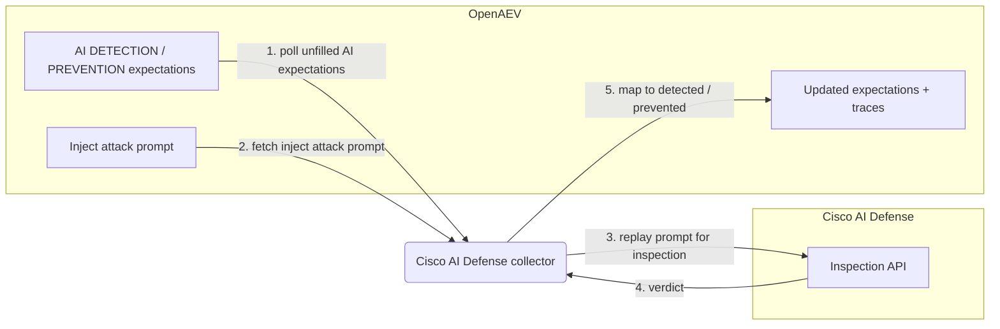

# OpenAEV Cisco AI Defense Collector

The Cisco AI Defense collector validates OpenAEV detection and prevention expectations against
[Cisco AI Defense](https://www.cisco.com/site/us/en/products/security/ai-defense/index.html), Cisco's
AI security product (built on the acquired Robust Intelligence engine) that inspects prompts and model
traffic for adversarial and unsafe content. This is an agentless validator: instead of waiting for an
endpoint agent, it replays each AI adversarial inject's attack prompt through the Cisco AI Defense
inspection API and maps the returned verdict to detected and/or prevented.

## Table of Contents

- [OpenAEV Cisco AI Defense Collector](#openaev-cisco-ai-defense-collector)
  - [Table of Contents](#table-of-contents)
  - [Introduction](#introduction)
  - [Requirements](#requirements)
  - [Configuration variables](#configuration-variables)
    - [OpenAEV environment variables](#openaev-environment-variables)
    - [Base collector environment variables](#base-collector-environment-variables)
    - [Cisco AI Defense collector environment variables](#cisco-ai-defense-collector-environment-variables)
  - [Deployment](#deployment)
    - [Docker Deployment](#docker-deployment)
    - [Manual Deployment](#manual-deployment)
  - [Usage](#usage)
  - [Behavior](#behavior)
  - [Required permissions and API endpoints](#required-permissions-and-api-endpoints)
  - [Debugging](#debugging)
  - [Additional information](#additional-information)

## Introduction

OpenAEV (Breach and Attack Simulation) raises "expectations" each time its AI red-team injector
launches an adversarial prompt: a DETECTION expectation (the AI security product should flag the
prompt) and/or a PREVENTION expectation (the product should block it). This collector connects to
Cisco AI Defense, registers a `SecurityPlatform` of type `LLM_FIREWALL`, and validates those
expectations by replaying each inject's attack prompt through the Cisco AI Defense inspection API. It
maps the verdict to detected/not detected and prevented/not prevented and attaches a trace that links
back to the originating inject. No endpoint agent is involved: the collector re-scans the recorded
attack content directly through the vendor API.

## Requirements

- An OpenAEV platform with AI red-team support (the AI inject-expectations domain exposed by
  `pyoaev`; platforms without AI red-team support are not compatible)
- A Cisco AI Defense subscription with inspection API access
- A Cisco AI Defense API key and the inspection API base URL for your region/tenant
- For a manual (non-Docker) deployment: Python >= 3.11 and [Poetry](https://python-poetry.org/) >= 2.1

## Configuration variables

The collector is configured either through environment variables (recommended, read from
`docker-compose.yml` / the `.env` file for a Docker deployment) or through a `config.yml` file (for a
manual deployment). Copy the provided `.env.sample` / `cisco_ai_defense/config.yml.sample` and fill in
the values flagged with `ChangeMe`. The collector-specific settings live under the `collector:`
section as `collector.*` keys, mapped to `COLLECTOR_*` environment variables.

### OpenAEV environment variables

| Parameter         | config.yml          | Docker environment variable | Mandatory | Description                                                                        |
|-------------------|---------------------|-----------------------------|-----------|------------------------------------------------------------------------------------|
| OpenAEV URL       | `openaev.url`       | `OPENAEV_URL`               | Yes       | The URL of the OpenAEV platform. Must be reachable from where the collector runs.  |
| OpenAEV Token     | `openaev.token`     | `OPENAEV_TOKEN`             | Yes       | The administrator token of the OpenAEV platform.                                   |
| OpenAEV Tenant ID | `openaev.tenant_id` | `OPENAEV_TENANT_ID`         | No        | Tenant identifier for multi-tenant deployments. When set, it must be a valid UUID. |

### Base collector environment variables

| Parameter        | config.yml            | Docker environment variable | Default          | Mandatory | Description                                                                          |
|------------------|-----------------------|-----------------------------|------------------|-----------|-------------------------------------------------------------------------------------|
| Collector ID     | `collector.id`        | `COLLECTOR_ID`              | /                | Yes       | A unique identifier for this collector instance (`UUIDv4` recommended).             |
| Collector Name   | `collector.name`      | `COLLECTOR_NAME`            | Cisco AI Defense | No        | The name of the collector as shown in OpenAEV.                                       |
| Collector Period | `collector.period`    | `COLLECTOR_PERIOD`          | PT120S           | No        | Interval between two runs, as an ISO 8601 duration (e.g. `PT120S` = 2 minutes).      |
| Log Level        | `collector.log_level` | `COLLECTOR_LOG_LEVEL`       | error            | No        | Verbosity of the logs. One of `debug`, `info`, `warn`, `error`.                      |
| Platform         | `collector.platform`  | `COLLECTOR_PLATFORM`        | LLM_FIREWALL     | No        | The `SecurityPlatform` type registered in OpenAEV. Use `LLM_FIREWALL` for AI firewall / guardrail validators. |

### Cisco AI Defense collector environment variables

| Parameter    | config.yml             | Docker environment variable | Default                       | Mandatory | Description                                                                                  |
|--------------|------------------------|-----------------------------|-------------------------------|-----------|---------------------------------------------------------------------------------------------|
| API Base URL | `collector.base_url`   | `COLLECTOR_BASE_URL`        | /                             | Yes       | Cisco AI Defense inspection API base URL (region/tenant specific), scheme + host only (e.g. `https://<region>.api.inspect.aidefense.security.cisco.com`). The collector appends `/api/v1/inspect/prompt`. |
| API Key      | `collector.api_key`    | `COLLECTOR_API_KEY`         | /                             | Yes       | Cisco AI Defense API key.                                                                    |
| Auth Header  | `collector.auth_header`| `COLLECTOR_AUTH_HEADER`     | `X-Cisco-AI-Defense-Api-Key`  | No        | HTTP header used to carry the API key.                                                       |

> Note: set `base_url` to the scheme + host only, with no path, query, or fragment. The collector
> appends the inspection path itself, so a URL that already includes a path is rejected.

## Deployment

### Docker Deployment

Build the Docker image (or use the published `openaev/collector-cisco-ai-defense` image):

```shell
docker build . -t openaev/collector-cisco-ai-defense:latest
```

Create a `.env` file from `.env.sample` and fill in your values, then start the collector with the
provided `docker-compose.yml` (which reads those variables):

```shell
docker compose up -d
```

### Manual Deployment

Create a `config.yml` file from `cisco_ai_defense/config.yml.sample` and fill in your values, then
install and run the collector:

```shell
poetry install --extras prod
poetry run python -m cisco_ai_defense.openaev_cisco_ai_defense
```

> For local development against a checkout of [client-python](https://github.com/OpenAEV-Platform/client-python)
> (cloned next to this repository), use `poetry install --extras dev` instead.

## Usage

Once started, the collector registers itself (and its `SecurityPlatform`) in OpenAEV and then runs
automatically every `COLLECTOR_PERIOD`. No manual interaction is required: as soon as the AI red-team
injector produces DETECTION / PREVENTION expectations bound to this collector, they are validated on
the next run by replaying the attack prompt through Cisco AI Defense.

## Behavior



On each run, the collector:

1. Polls the unfilled AI DETECTION / PREVENTION expectations assigned to this collector from OpenAEV
   (`GET /api/injects/expectations/ai/{collector_id}`).
2. For each expectation, fetches the originating inject (`GET /api/injects/{inject_id}`), reads its
   `inject_content.attack_prompt` (and optional `system_prompt`), and substitutes the inject's unique
   marker into the prompt.
3. Replays the attack prompt through the Cisco AI Defense inspection API (one inspection per inject,
   cached for the run).
4. Maps the verdict returned by Cisco AI Defense:
   - DETECTION: marked `Detected` when `is_safe` is false, the response carries classifications/rules,
     or the action is `block`; otherwise `Not Detected`.
   - PREVENTION: marked `Prevented` only when the action is `block`; otherwise `Not Prevented`.
5. Updates each expectation with the result and the matched classification in its metadata, and creates
   an expectation trace for each success.

## Required permissions and API endpoints

- Required permission: a Cisco AI Defense API key authorized to call the inspection API for your
  region/tenant.
- API endpoint used:
  - `POST {base_url}/api/v1/inspect/prompt` (prompt inspection), authenticated with the configurable
    auth header (default `X-Cisco-AI-Defense-Api-Key`).
- Reference: [Cisco AI Defense](https://www.cisco.com/site/us/en/products/security/ai-defense/index.html)
  (the public API surface is still consolidating; the endpoint path and auth header are configurable).

## Debugging

Set `COLLECTOR_LOG_LEVEL=debug` to get verbose logs, including expectation polling, the prompts
replayed to Cisco AI Defense, and the verdict mapping. Common causes of unexpected results:

- A `base_url` that includes a path, query, or fragment: it must be the scheme + host only, otherwise
  the collector rejects it before calling the API.
- A wrong region/tenant host in `base_url` (the inspection calls fail or time out).
- A mismatched `auth_header`: if your tenant expects a different header name, override
  `COLLECTOR_AUTH_HEADER` accordingly.

## Additional information

- The collector is agentless: it validates expectations by replaying the recorded attack prompt
  through the Cisco AI Defense inspection API, so it does not require an OpenAEV endpoint agent.
- The required permissions and endpoints reflect the current implementation. Cisco AI Defense (built on
  the Robust Intelligence engine) is still consolidating its public API, so always confirm against the
  official documentation before deploying.
