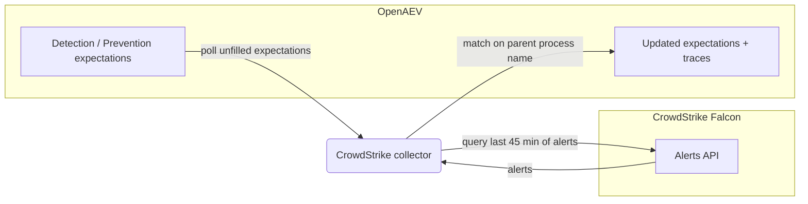

# OpenAEV CrowdStrike Endpoint Security Collector

The CrowdStrike Endpoint Security collector validates OpenAEV detection and prevention expectations against
[CrowdStrike Falcon](https://www.crowdstrike.com/), CrowdStrike's cloud-native endpoint detection and response (EDR)
platform. After OpenAEV agents execute attacks, the collector polls the Falcon Alerts API and correlates the resulting
alerts with the related injects to confirm whether the activity was detected and/or prevented.

## Table of Contents

- [OpenAEV CrowdStrike Endpoint Security Collector](#openaev-crowdstrike-endpoint-security-collector)
  - [Table of Contents](#table-of-contents)
  - [Introduction](#introduction)
  - [Requirements](#requirements)
  - [Configuration variables](#configuration-variables)
    - [OpenAEV environment variables](#openaev-environment-variables)
    - [Base collector environment variables](#base-collector-environment-variables)
    - [CrowdStrike collector environment variables](#crowdstrike-collector-environment-variables)
  - [Deployment](#deployment)
    - [Docker Deployment](#docker-deployment)
    - [Manual Deployment](#manual-deployment)
  - [Usage](#usage)
  - [Behavior](#behavior)
  - [Required permissions and API endpoints](#required-permissions-and-api-endpoints)
  - [Debugging](#debugging)
  - [Additional information](#additional-information)

## Introduction

OpenAEV (Breach and Attack Simulation) raises "expectations" each time it executes an inject (a simulated attack) on an
endpoint: a DETECTION expectation (the security product should raise an alert) and/or a PREVENTION expectation (the
security product should block the action). This collector connects to CrowdStrike Falcon, registers a
`SecurityPlatform` of type `EDR`, and periodically reconciles those expectations with the alerts produced by Falcon,
marking each expectation as detected/not detected and prevented/not prevented and attaching a trace that links back to
the originating Falcon alert.

## Requirements

- OpenAEV Platform >= 1.19.0
- A CrowdStrike Falcon subscription (the data available to the collector depends on your subscription tier)
- A CrowdStrike Falcon API client with the `Alerts: Read` scope (Client ID and Client Secret)
- For a manual (non-Docker) deployment: Python >= 3.11 and [Poetry](https://python-poetry.org/) >= 2.1

## Configuration variables

The collector is configured either through environment variables (recommended, read from `docker-compose.yml` / the
`.env` file for a Docker deployment) or through a `config.yml` file (for a manual deployment). Copy the provided
`.env.sample` / `config.yml.sample` and fill in the values flagged with `ChangeMe`.

### OpenAEV environment variables

| Parameter         | config.yml          | Docker environment variable | Mandatory | Description                                                                              |
|-------------------|---------------------|-----------------------------|-----------|------------------------------------------------------------------------------------------|
| OpenAEV URL       | `openaev.url`       | `OPENAEV_URL`               | Yes       | The URL of the OpenAEV platform. Must be reachable from where the collector runs.        |
| OpenAEV Token     | `openaev.token`     | `OPENAEV_TOKEN`             | Yes       | The administrator token of the OpenAEV platform.                                         |
| OpenAEV Tenant ID | `openaev.tenant_id` | `OPENAEV_TENANT_ID`         | No        | Tenant identifier for multi-tenant deployments. When set, it must be a valid UUID.       |

### Base collector environment variables

| Parameter        | config.yml            | Docker environment variable | Default                       | Mandatory | Description                                                                                  |
|------------------|-----------------------|-----------------------------|-------------------------------|-----------|----------------------------------------------------------------------------------------------|
| Collector ID     | `collector.id`        | `COLLECTOR_ID`              | /                             | Yes       | A unique `UUIDv4` identifier for this collector instance.                                     |
| Collector Name   | `collector.name`      | `COLLECTOR_NAME`            | CrowdStrike Endpoint Security | No        | The name of the collector as shown in OpenAEV.                                                |
| Collector Period | `collector.period`    | `COLLECTOR_PERIOD`          | PT1M                          | No        | Interval between two runs, as an ISO 8601 duration (e.g. `PT1M` = 1 minute).                  |
| Log Level        | `collector.log_level` | `COLLECTOR_LOG_LEVEL`       | error                         | No        | Verbosity of the logs. One of `debug`, `info`, `warn`, `error`.                               |
| Platform         | `collector.platform`  | `COLLECTOR_PLATFORM`        | EDR                           | No        | The `SecurityPlatform` type registered in OpenAEV. One of `EDR`, `XDR`, `SIEM`, `SOAR`, `NDR`, `ISPM`. |

### CrowdStrike collector environment variables

| Parameter     | config.yml                  | Docker environment variable | Default                               | Mandatory | Description                                                              |
|---------------|-----------------------------|-----------------------------|---------------------------------------|-----------|-------------------------------------------------------------------------|
| API Base URL  | `crowdstrike.api_base_url`  | `CROWDSTRIKE_API_BASE_URL`  | `https://api.us-2.crowdstrike.com`    | No        | The region-specific base URL of the CrowdStrike Falcon API.             |
| UI Base URL   | `crowdstrike.ui_base_url`   | `CROWDSTRIKE_UI_BASE_URL`   | `https://falcon.us-2.crowdstrike.com` | No        | The Falcon console base URL, used to build the alert links in traces.   |
| Client ID     | `crowdstrike.client_id`     | `CROWDSTRIKE_CLIENT_ID`     | /                                     | Yes       | The CrowdStrike Falcon API client ID.                                   |
| Client Secret | `crowdstrike.client_secret` | `CROWDSTRIKE_CLIENT_SECRET` | /                                     | Yes       | The CrowdStrike Falcon API client secret.                              |

> Note: select the `api_base_url` and `ui_base_url` that match your Falcon cloud region (US-1, US-2, EU-1, US-GOV-1).
> The defaults above target the US-2 cloud.

## Deployment

### Docker Deployment

Build the Docker image (or use the published `openaev/collector-crowdstrike` image):

```shell
docker build . -t openaev/collector-crowdstrike:latest
```

Create a `.env` file from `.env.sample` and fill in your values, then start the collector with the provided
`docker-compose.yml` (which reads those variables):

```shell
docker compose up -d
```

### Manual Deployment

Create a `config.yml` file from `config.yml.sample` and fill in your values, then install and run the collector:

```shell
poetry install --extras prod
poetry run python -m crowdstrike.openaev_crowdstrike
```

> For local development against a checkout of [client-python](https://github.com/OpenAEV-Platform/client-python)
> (cloned next to this repository), use `poetry install --extras dev` instead.

## Usage

Once started, the collector registers itself (and its `SecurityPlatform`) in OpenAEV and then runs automatically every
`COLLECTOR_PERIOD`. No manual interaction is required: as soon as injects produce expectations bound to this collector,
they are reconciled on the next run.

## Behavior



On each run, the collector:

1. Fetches the unfilled expectations assigned to this collector from OpenAEV.
2. Queries the CrowdStrike Falcon Alerts API for alerts created in the last 45 minutes.
3. Matches alerts to expectations using the `parent_process_name` signature (fuzzy match), comparing the OpenAEV
   implant process name against the alert process / parent process / grandparent process image names.
4. Updates each matched expectation:
   - DETECTION: marked `Detected` when a matching alert is found, otherwise `Not Detected` once the expectation expires.
   - PREVENTION: marked `Prevented` when the matching alert's `pattern_disposition` indicates the action was blocked,
     otherwise `Not Prevented`.
5. Creates an expectation trace for each match, including the alert name and a direct link to the alert in the Falcon
   console (`ui_base_url`).

Expectations that remain unmatched after the 45-minute window are marked as failed (`Not Detected` / `Not Prevented`).

## Required permissions and API endpoints

- Required permission: a Falcon API client with the **`Alerts: Read`** scope.
  Create it in the Falcon console under **Support and resources > API clients and keys**.
- API endpoints used:
  - `POST /oauth2/token` (OAuth2 client-credentials authentication)
  - `GET /alerts/queries/alerts/v2` (list alert IDs in the time window)
  - `GET /alerts/entities/alerts/v2` (fetch alert details)
- Reference: [CrowdStrike FalconPy Alerts service collection](https://falconpy.io/Service-Collections/Alerts.html)

## Debugging

Set `COLLECTOR_LOG_LEVEL=debug` to get verbose logs, including expectation polling, the alert queries issued to Falcon,
and the matching decisions. A common cause of "nothing detected" is a mismatched Falcon cloud region: double-check that
`CROWDSTRIKE_API_BASE_URL` matches the cloud where your sensors report.

## Additional information

- The collector only reads recent alerts (a 45-minute sliding window); it is designed to validate expectations shortly
  after an inject runs, not to back-fill historical data.
- The required CrowdStrike permissions and endpoints reflect the current implementation. CrowdStrike may change its API
  over time, so always confirm against the official documentation before deploying.
