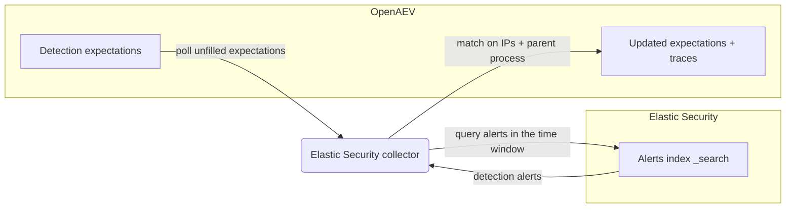

# OpenAEV Elastic Security Collector

The Elastic Security collector validates OpenAEV detection expectations against
[Elastic Security](https://www.elastic.co/security), Elastic's SIEM and security analytics solution built on the
Elastic Stack. After OpenAEV agents execute attacks, the collector queries the Elastic Security alerts index in
Elasticsearch and correlates the resulting detection alerts with the related injects to confirm whether the activity
was detected.

## Table of Contents

- [OpenAEV Elastic Security Collector](#openaev-elastic-security-collector)
  - [Table of Contents](#table-of-contents)
  - [Introduction](#introduction)
  - [Requirements](#requirements)
  - [Configuration variables](#configuration-variables)
    - [OpenAEV environment variables](#openaev-environment-variables)
    - [Base collector environment variables](#base-collector-environment-variables)
    - [Elastic collector environment variables](#elastic-collector-environment-variables)
  - [Deployment](#deployment)
    - [Docker Deployment](#docker-deployment)
    - [Manual Deployment](#manual-deployment)
  - [Usage](#usage)
  - [Behavior](#behavior)
  - [Required permissions and API endpoints](#required-permissions-and-api-endpoints)
  - [Debugging](#debugging)
  - [Additional information](#additional-information)

## Introduction

OpenAEV (Breach and Attack Simulation) raises "expectations" each time it executes an inject (a simulated attack) on an
endpoint: a DETECTION expectation (the security product should raise an alert) and/or a PREVENTION expectation (the
security product should block the action). This collector connects to Elastic Security, registers a `SecurityPlatform`
of type `SIEM`, and periodically reconciles those expectations with the detection alerts produced by Elastic Security,
marking each expectation as detected/not detected and attaching a trace that links back to the Elastic Security alerts
view in Kibana. Elastic Security is a detection source, so this collector validates DETECTION expectations only;
PREVENTION expectations are not supported.

## Requirements

- OpenAEV Platform >= 1.19.0
- An Elasticsearch cluster storing Elastic Security detection alerts (default index pattern `.alerts-security.alerts-*`)
- An Elasticsearch API key (preferred) or a username/password pair with read access to that alerts index
- Optionally, a Kibana instance to build alert links in the expectation traces
- For a manual (non-Docker) deployment: Python >= 3.11 and [Poetry](https://python-poetry.org/) >= 2.1

## Configuration variables

The collector is configured either through environment variables (recommended, read from `docker-compose.yml` / the
`.env` file for a Docker deployment) or through a `config.yml` file (for a manual deployment). Copy the provided
`src/.env.sample` / `src/config.yml.sample` and fill in the values flagged with `ChangeMe`.

### OpenAEV environment variables

| Parameter         | config.yml          | Docker environment variable | Mandatory | Description                                                                              |
|-------------------|---------------------|-----------------------------|-----------|------------------------------------------------------------------------------------------|
| OpenAEV URL       | `openaev.url`       | `OPENAEV_URL`               | Yes       | The URL of the OpenAEV platform. Must be reachable from where the collector runs.        |
| OpenAEV Token     | `openaev.token`     | `OPENAEV_TOKEN`             | Yes       | The administrator token of the OpenAEV platform.                                         |
| OpenAEV Tenant ID | `openaev.tenant_id` | `OPENAEV_TENANT_ID`         | No        | Tenant identifier for multi-tenant deployments. When set, it must be a valid UUID.       |

### Base collector environment variables

| Parameter        | config.yml            | Docker environment variable | Default          | Mandatory | Description                                                                                            |
|------------------|-----------------------|-----------------------------|------------------|-----------|--------------------------------------------------------------------------------------------------------|
| Collector ID     | `collector.id`        | `COLLECTOR_ID`              | /                | Yes       | A unique `UUIDv4` identifier for this collector instance.                                               |
| Collector Name   | `collector.name`      | `COLLECTOR_NAME`            | Elastic Security | No        | The name of the collector as shown in OpenAEV.                                                          |
| Collector Period | `collector.period`    | `COLLECTOR_PERIOD`          | PT1M             | No        | Interval between two runs, as an ISO 8601 duration (e.g. `PT1M` = 1 minute).                            |
| Log Level        | `collector.log_level` | `COLLECTOR_LOG_LEVEL`       | error            | No        | Verbosity of the logs. One of `debug`, `info`, `warn`, `error`.                                         |
| Platform         | `collector.platform`  | `COLLECTOR_PLATFORM`        | SIEM             | No        | The `SecurityPlatform` type registered in OpenAEV. One of `EDR`, `XDR`, `SIEM`, `SOAR`, `NDR`, `ISPM`.  |

### Elastic collector environment variables

| Parameter    | config.yml             | Docker environment variable | Default                     | Mandatory   | Description                                                                                                                                                |
|--------------|------------------------|-----------------------------|-----------------------------|-------------|----------------------------------------------------------------------------------------------------------------------------------------------------------|
| Base URL     | `elastic.base_url`     | `ELASTIC_BASE_URL`          | `https://localhost:9200`    | Yes         | Base URL of the Elasticsearch API (e.g. `https://elastic.company.com:9200`).                                                                              |
| API Key      | `elastic.api_key`      | `ELASTIC_API_KEY`           | /                           | Conditional | Elasticsearch API key (preferred). When set, it is used instead of username/password.                                                                     |
| Username     | `elastic.username`     | `ELASTIC_USERNAME`          | /                           | Conditional | Username for HTTP basic authentication (used when no API key is set).                                                                                     |
| Password     | `elastic.password`     | `ELASTIC_PASSWORD`          | /                           | Conditional | Password for HTTP basic authentication.                                                                                                                   |
| Alerts Index | `elastic.alerts_index` | `ELASTIC_ALERTS_INDEX`      | `.alerts-security.alerts-*` | No          | Index or index pattern to search for detection alerts.                                                                                                    |
| Kibana URL   | `elastic.kibana_url`   | `ELASTIC_KIBANA_URL`        | /                           | No          | Kibana base URL used to build trace links. When unset, `base_url` is reused with its port rewritten to 5601; set it when Kibana is elsewhere.            |
| Verify SSL   | `elastic.verify_ssl`   | `ELASTIC_VERIFY_SSL`        | true                        | No          | Whether to verify the Elasticsearch TLS certificate.                                                                                                      |
| Time Window  | `elastic.time_window`  | `ELASTIC_TIME_WINDOW`       | PT1H                        | No          | Default search window when no date signatures are provided, as an ISO 8601 duration.                                                                      |
| Offset       | `elastic.offset`       | `ELASTIC_OFFSET`            | PT30S                       | No          | Delay between retry attempts to absorb alert ingestion latency, as an ISO 8601 duration.                                                                  |
| Max Retry    | `elastic.max_retry`    | `ELASTIC_MAX_RETRY`         | 3                           | No          | Maximum number of retry attempts after the initial query returns no results.                                                                              |

> Note: authentication is required. Provide either `ELASTIC_API_KEY` (preferred) or both `ELASTIC_USERNAME` and
> `ELASTIC_PASSWORD`. The collector fails to start if neither is configured.

## Deployment

### Docker Deployment

Build the Docker image (or use the published `openaev/collector-elastic` image):

```shell
docker build . -t openaev/collector-elastic:latest
```

Create a `.env` file from `src/.env.sample` and fill in your values, then start the collector with the provided
`docker-compose.yml` (which reads those variables):

```shell
docker compose up -d
```

### Manual Deployment

Create a `config.yml` file from `src/config.yml.sample` and fill in your values, then install and run the collector:

```shell
poetry install --extras prod
poetry run ElasticCollector
```

> For local development against a checkout of [client-python](https://github.com/OpenAEV-Platform/client-python)
> (cloned next to this repository as `client-python`), use `poetry install --extras local` instead.

## Usage

Once started, the collector registers itself (and its `SecurityPlatform`) in OpenAEV and then runs automatically every
`COLLECTOR_PERIOD`. No manual interaction is required: as soon as injects produce expectations bound to this collector,
they are reconciled on the next run.

## Behavior



On each run, the collector:

1. Fetches the unfilled DETECTION expectations assigned to this collector from OpenAEV. PREVENTION expectations are
   marked invalid because Elastic Security only supports detection.
2. Builds an Elasticsearch query from the expectation signatures (source/destination IP `terms`, plus a `url.path`
   `match_phrase` derived from the inject/agent UUIDs embedded in the parent process name) and runs
   `POST /<alerts_index>/_search` over a sliding time window (default 1 hour, `ELASTIC_TIME_WINDOW`).
3. Retries up to `ELASTIC_MAX_RETRY` times, waiting `ELASTIC_OFFSET` between attempts and progressively widening the
   window, to absorb alert ingestion latency.
4. Matches alerts against the expectation signatures: the `parent_process_name` signature must match and, when IP
   signatures are present, at least one source or destination IP must match.
5. Marks each matched DETECTION expectation as `Detected` and creates an expectation trace, including the alert name and
   a link to the Kibana Security alerts view (`ELASTIC_KIBANA_URL`, or `base_url` with its port rewritten to 5601).

Expectations that remain unmatched after all retries are left for OpenAEV to mark as failed (`Not Detected`) once they
expire.

## Required permissions and API endpoints

- Required permission: an Elasticsearch API key or user with `read` privileges on the configured alerts index
  (default `.alerts-security.alerts-*`) and permission to run `_search` requests against it.
- API endpoints used:
  - `POST /<alerts_index>/_search` (Elasticsearch search API, authenticated with the `Authorization: ApiKey` header or
    HTTP basic authentication)
- ECS fields used for matching: `@timestamp`, `source.ip`, `destination.ip`, `url.path`.
- Reference: [Elasticsearch search API](https://www.elastic.co/guide/en/elasticsearch/reference/current/search-search.html)
  and [Create API key](https://www.elastic.co/guide/en/elasticsearch/reference/current/security-api-create-api-key.html)

## Debugging

Set `COLLECTOR_LOG_LEVEL=debug` to get verbose logs, including expectation polling, the queries issued to
Elasticsearch, and the matching decisions. Common causes of "nothing detected" are a wrong alerts index
(`ELASTIC_ALERTS_INDEX`) or a time window (`ELASTIC_TIME_WINDOW`) that is shorter than your alert ingestion latency. For
clusters with self-signed certificates, set `ELASTIC_VERIFY_SSL=false` (or trust the CA) if requests fail on TLS
verification.

## Additional information

- This collector validates detection only; it does not support prevention expectations.
- The collector only reads recent alerts (a sliding time window); it is designed to validate expectations shortly after
  an inject runs, not to back-fill historical data.
- Trace links to Kibana require either `ELASTIC_KIBANA_URL` or an explicit port in `ELASTIC_BASE_URL` (rewritten to
  5601); without either, the Elasticsearch base URL is used as-is.
- The required permissions and endpoints reflect the current implementation. Elastic may change its API over time, so
  always confirm against the official documentation before deploying.
