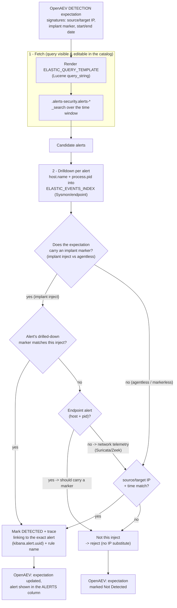

# OpenAEV Elastic Security Collector

The Elastic Security collector validates OpenAEV detection expectations against
[Elastic Security](https://www.elastic.co/security), Elastic's SIEM and security analytics solution built on the
Elastic Stack. After OpenAEV agents execute attacks, the collector queries the Elastic Security alerts index in
Elasticsearch and correlates the resulting detection alerts with the related injects to confirm whether the activity
was detected.

## Table of Contents

- [OpenAEV Elastic Security Collector](#openaev-elastic-security-collector)
  - [Table of Contents](#table-of-contents)
  - [Introduction](#introduction)
  - [Requirements](#requirements)
  - [Configuration variables](#configuration-variables)
    - [OpenAEV environment variables](#openaev-environment-variables)
    - [Base collector environment variables](#base-collector-environment-variables)
    - [Elastic collector environment variables](#elastic-collector-environment-variables)
  - [Deployment](#deployment)
    - [Docker Deployment](#docker-deployment)
    - [Manual Deployment](#manual-deployment)
  - [Usage](#usage)
  - [Behavior](#behavior)
  - [Required permissions and API endpoints](#required-permissions-and-api-endpoints)
  - [Debugging](#debugging)
  - [Additional information](#additional-information)

## Introduction

OpenAEV (Breach and Attack Simulation) raises "expectations" each time it executes an inject (a simulated attack) on an
endpoint: a DETECTION expectation (the security product should raise an alert) and/or a PREVENTION expectation (the
security product should block the action). This collector connects to Elastic Security, registers a `SecurityPlatform`
of type `SIEM`, and periodically reconciles those expectations with the detection alerts produced by Elastic Security,
marking each expectation as detected/not detected and attaching a trace that links back to the Elastic Security alerts
view in Kibana. Elastic Security is a detection source, so this collector validates DETECTION expectations only;
PREVENTION expectations are not supported.

## Requirements

- OpenAEV Platform >= 1.19.0
- An Elasticsearch cluster storing Elastic Security detection alerts (default index pattern `.alerts-security.alerts-*`)
- An Elasticsearch API key (preferred) or a username/password pair with read access to that alerts index
- Optionally, a Kibana instance to build alert links in the expectation traces
- For a manual (non-Docker) deployment: Python 3.14 and [Poetry](https://python-poetry.org/) >= 2.1

## Configuration variables

The collector is configured either through environment variables (recommended, read from `docker-compose.yml` / the
`.env` file for a Docker deployment) or through a `config.yml` file (for a manual deployment). Copy the provided
`src/.env.sample` / `src/config.yml.sample` and fill in the values flagged with `ChangeMe`.

### OpenAEV environment variables

| Parameter         | config.yml          | Docker environment variable | Mandatory | Description                                                                              |
|-------------------|---------------------|-----------------------------|-----------|------------------------------------------------------------------------------------------|
| OpenAEV URL       | `openaev.url`       | `OPENAEV_URL`               | Yes       | The URL of the OpenAEV platform. Must be reachable from where the collector runs.        |
| OpenAEV Token     | `openaev.token`     | `OPENAEV_TOKEN`             | Yes       | The administrator token of the OpenAEV platform.                                         |
| OpenAEV Tenant ID | `openaev.tenant_id` | `OPENAEV_TENANT_ID`         | No        | Tenant identifier for multi-tenant deployments. When set, it must be a valid UUID.       |

### Base collector environment variables

| Parameter        | config.yml            | Docker environment variable | Default          | Mandatory | Description                                                                                            |
|------------------|-----------------------|-----------------------------|------------------|-----------|--------------------------------------------------------------------------------------------------------|
| Collector ID     | `collector.id`        | `COLLECTOR_ID`              | /                | Yes       | A unique `UUIDv4` identifier for this collector instance.                                               |
| Collector Name   | `collector.name`      | `COLLECTOR_NAME`            | Elastic Security | No        | The name of the collector as shown in OpenAEV.                                                          |
| Collector Period | `collector.period`    | `COLLECTOR_PERIOD`          | PT1M             | No        | Interval between two runs, as an ISO 8601 duration (e.g. `PT1M` = 1 minute).                            |
| Log Level        | `collector.log_level` | `COLLECTOR_LOG_LEVEL`       | error            | No        | Verbosity of the logs. One of `debug`, `info`, `warn`, `error`.                                         |
| Platform         | `collector.platform`  | `COLLECTOR_PLATFORM`        | SIEM             | No        | The `SecurityPlatform` type registered in OpenAEV. One of `EDR`, `XDR`, `SIEM`, `SOAR`, `NDR`, `ISPM`.  |

### Elastic collector environment variables

| Parameter    | config.yml             | Docker environment variable | Default                     | Mandatory   | Description                                                                                                                                                |
|--------------|------------------------|-----------------------------|-----------------------------|-------------|----------------------------------------------------------------------------------------------------------------------------------------------------------|
| Base URL     | `elastic.base_url`     | `ELASTIC_BASE_URL`          | `https://localhost:9200`    | Yes         | Base URL of the Elasticsearch API (e.g. `https://elastic.company.com:9200`).                                                                              |
| API Key      | `elastic.api_key`      | `ELASTIC_API_KEY`           | /                           | Conditional | Elasticsearch API key (preferred). When set, it is used instead of username/password.                                                                     |
| Username     | `elastic.username`     | `ELASTIC_USERNAME`          | /                           | Conditional | Username for HTTP basic authentication (used when no API key is set).                                                                                     |
| Password     | `elastic.password`     | `ELASTIC_PASSWORD`          | /                           | Conditional | Password for HTTP basic authentication.                                                                                                                   |
| Alerts Index | `elastic.alerts_index` | `ELASTIC_ALERTS_INDEX`      | `.alerts-security.alerts-*` | No          | Index or index pattern to search for detection alerts.                                                                                                    |
| Query Template | `elastic.query_template` | `ELASTIC_QUERY_TEMPLATE` | / (built-in default)        | No          | Editable Lucene `query_string` used to fetch and correlate alerts. Placeholders: `{source_ips}` `{target_ips}` `{implant_urls}` `{implant_names}` `{start_date}` `{end_date}` `{time_window}` `{alerts_index}`. Empty uses the multi-field default. |
| Events Index | `elastic.events_index` | `ELASTIC_EVENTS_INDEX`      | `logs-windows.sysmon_operational-*,logs-endpoint.events.process-*` | No | Raw endpoint/process events index used by the source-event drilldown to recover the implant marker. Set empty to disable the drilldown (IP + time correlation only). |
| Kibana URL   | `elastic.kibana_url`   | `ELASTIC_KIBANA_URL`        | /                           | No          | Kibana base URL used to build trace links. When unset, `base_url` is reused with its port rewritten to 5601; set it when Kibana is elsewhere.            |
| Verify SSL   | `elastic.verify_ssl`   | `ELASTIC_VERIFY_SSL`        | true                        | No          | Whether to verify the Elasticsearch TLS certificate. Prefer trusting the cluster CA via `ELASTIC_CA_CERT` over disabling this.                            |
| CA Cert      | `elastic.ca_cert`      | `ELASTIC_CA_CERT`           | /                           | No          | Path to a CA bundle (PEM) used to verify the Elasticsearch TLS certificate (for self-signed / private CAs). When set, it takes precedence over `ELASTIC_VERIFY_SSL`. |
| Time Window  | `elastic.time_window`  | `ELASTIC_TIME_WINDOW`       | PT1H                        | No          | Default search window when no date signatures are provided, as an ISO 8601 duration.                                                                      |
| Offset       | `elastic.offset`       | `ELASTIC_OFFSET`            | PT30S                       | No          | Delay between retry attempts to absorb alert ingestion latency, as an ISO 8601 duration.                                                                  |
| Max Retry    | `elastic.max_retry`    | `ELASTIC_MAX_RETRY`         | 3                           | No          | Maximum number of retry attempts after the initial query returns no results.                                                                              |

> Note: authentication is required. Provide either `ELASTIC_API_KEY` (preferred) or both `ELASTIC_USERNAME` and
> `ELASTIC_PASSWORD`. The collector fails to start if neither is configured.

## Deployment

### Docker Deployment

Build the Docker image (or use the published `openaev/collector-elastic` image):

```shell
docker build . -t openaev/collector-elastic:latest
```

Create a `.env` file from `src/.env.sample` and fill in your values, then start the collector with the provided
`docker-compose.yml` (which reads those variables):

```shell
docker compose up -d
```

### Manual Deployment with Poetry

1. **Clone and Install Dependencies**:
   ```bash
   git clone <repository-url>
   cd <your-collector>
   poetry install
   ```

2. **Configure the Collector**:
- Copy `src/config.yml.sample` to `src/config.yml`
- Update configuration values or set environment variables

3. **Run the Collector**:
   ```bash
   # Using Poetry
   poetry run python -m src
   
   # Or 
   poetry run ElasticCollector

   # Or direct execution after installing the project and activating the virtual environment:
   ElasticCollector
   ```

For local development against a checkout of [client-python](https://github.com/OpenAEV-Platform/client-python),
The client-python repository must be cloned at the same level as the collectors repository, so that `../../client-python`
resolves correctly from the collector directory.

```
parent-directory/ 
├── collectors/
│   └── <your-collector>/
└── client-python/
```

Then install the local `client-python` version inside the <your-collector> environment:
```bash
poetry run pip install -e ../../client-python --force-reinstall
```
The `-e` option installs the package in editable mode, allowing local changes in `client-python` to be used immediately
without reinstalling the package.

## Usage

Once started, the collector registers itself (and its `SecurityPlatform`) in OpenAEV and then runs automatically every
`COLLECTOR_PERIOD`. No manual interaction is required: as soon as injects produce expectations bound to this collector,
they are reconciled on the next run.

## Behavior

Correlation is **deterministic**: it keys on the OpenAEV implant marker whenever the inject ran on an implant/agent, and
only falls back to IP + time where a marker is impossible.

- **Implant inject** (the expectation carries an implant marker): the marker is the key. A drilldown recovers the
  `oaev-implant-<inject>-agent-<agent>` lineage from the raw endpoint events, so two injects run on the same host in
  the same window are told apart. An **endpoint** alert (process context: `host.name` + `process.pid`) that does *not*
  carry this inject's marker is rejected - IP is **not** accepted as a substitute - so an unrelated same-host alert is
  never misattributed. Only **network** telemetry (Suricata/Zeek), which physically cannot carry an implant marker,
  falls back to source/target IP + time for that inject.
- **Agentless inject** (no implant marker, e.g. NetExec): there is a 0% chance of an implant marker on the endpoints,
  so correlation is source/target IP + time directly.


```mermaid
flowchart TD
    E["OpenAEV DETECTION expectation<br/>signatures: source/target IP,<br/>implant marker, start/end date"] --> Q

    subgraph FETCH["1 - Fetch (query visible & editable in the catalog)"]
      Q["Render ELASTIC_QUERY_TEMPLATE<br/>(Lucene query_string)"] --> S[".alerts-security.alerts-*<br/>_search over the time window"]
    end
    S --> A["Candidate alerts"]

    A --> DD["2 - Drilldown per alert<br/>host.name + process.pid into<br/>ELASTIC_EVENTS_INDEX (Sysmon/endpoint)"]
    DD --> EM{"Does the expectation<br/>carry an implant marker?<br/>(implant inject vs agentless)"}

    EM -->|"yes (implant inject)"| MM{"Alert's drilled-down<br/>marker matches this inject?"}
    MM -->|yes| OK["Mark DETECTED + trace<br/>linking to the exact alert<br/>(kibana.alert.uuid) + rule name"]
    MM -->|no| EPC{"Endpoint alert<br/>(host + pid)?"}
    EPC -->|"yes -> should carry a marker"| NO["Not this inject<br/>-> reject (no IP substitute)"]
    EPC -->|"no -> network telemetry<br/>(Suricata/Zeek)"| IP

    EM -->|"no (agentless / markerless)"| IP{"source/target IP<br/>+ time match?"}
    IP -->|yes| OK
    IP -->|no| NO

    OK --> R["OpenAEV: expectation updated,<br/>alert shown in the ALERTS column"]
    NO --> RN["OpenAEV: expectation<br/>marked Not Detected"]
```

On each run, the collector:

1. Fetches the unfilled DETECTION expectations assigned to this collector. PREVENTION expectations are marked invalid
   (Elastic Security is detection-only).
2. **Fetch** — renders `ELASTIC_QUERY_TEMPLATE` (the visible, editable Lucene `query_string`; a broad multi-field
   default is used when unset) with the expectation's IPs / implant markers, and runs `POST /<alerts_index>/_search`
   over a sliding time window (`ELASTIC_TIME_WINDOW`). Editing the query in the catalog changes exactly this fetch.
3. **Drilldown** — for each candidate alert, looks up the source process in `ELASTIC_EVENTS_INDEX` by `host.name` +
   `process.pid` and recovers the `oaev-implant-<inject>-agent-<agent>` marker from the (parent) process command line.
   Set `ELASTIC_EVENTS_INDEX` empty to disable this step.
4. **Correlate** — for an implant inject the alert's recovered marker MUST match: IP is not accepted as a substitute
   for an **endpoint** alert (an unrelated same-host alert is rejected, never misattributed); only **network** telemetry
   (no process context) falls back to IP + time. Agentless expectations use source/target IP + time directly. It
   retries up to `ELASTIC_MAX_RETRY` times, waiting `ELASTIC_OFFSET` and widening the window, to absorb detection
   latency.
5. **Report** — marks each matched DETECTION expectation `Detected` and submits an expectation trace that links to the
   exact matched alert (`kibana.alert.uuid`) with its rule name. Traces are submitted before the verdict updates so the
   evidence is never lost. Expectations still unmatched once the retry budget (`ELASTIC_MAX_RETRY` x `ELASTIC_OFFSET`)
   is exhausted are marked `Not Detected` on that run - the collector does not wait for OpenAEV's expiry.

> The **fetch query** (`ELASTIC_QUERY_TEMPLATE`) and the **drilldown index** (`ELASTIC_EVENTS_INDEX`) are configurable
> from the catalog. The deterministic correlation algorithm itself (marker for implant injects, IP + time only where a
> marker is impossible) is collector logic, not an editable query.

## Deployment prerequisites

- **Elastic version:** Elastic Security 8.x or later (the collector reads `.alerts-security.alerts-*` and uses the
  `kibana.alert.url` field for trace links, both 8.x+). Confirm the alert schema on your version.
- **Runtime:** Python 3.14 (matching the published container image and the rest of the collectors monorepo); the image bundles it.
- **Detection content must be enabled.** The collector only correlates alerts your rules actually raise. Enable the
  Elastic **Detection rules** (and the **Elastic Defend** and/or **Sysmon via Elastic Agent** integrations) that fire on
  the behaviours you inject. If no rule fires for a technique, the inject is legitimately `Not Detected`.
- **Process telemetry for deterministic correlation (important).** Per-inject determinism relies on recovering the
  implant marker from raw **process-creation events** (the drilldown into `ELASTIC_EVENTS_INDEX`, default
  `logs-windows.sysmon_operational-*,logs-endpoint.events.process-*`). Point it at the index that actually holds your
  endpoint process events. **SIEM-only deployments without process telemetry:** set `ELASTIC_EVENTS_INDEX=""` to disable
  the drilldown; correlation then degrades to source/target **IP + time** (lower confidence, cannot dissociate two
  injects on the same host in the same window). This is logged at startup.

## Required permissions and API endpoints

The collector is **read-only** and needs no cluster or Kibana privileges. Prefer an **API key** (scoped, revocable) over
basic auth; if you must use basic auth, use a dedicated least-privilege service account, never a personal/admin user.

Grant `read` + `view_index_metadata` on the alerts index **and** the events index used by the drilldown:

```json
{
  "elastic-collector": {
    "cluster": [],
    "indices": [
      {
        "names": [".alerts-security.alerts-*",
                  "logs-windows.sysmon_operational-*",
                  "logs-endpoint.events.process-*"],
        "privileges": ["read", "view_index_metadata"]
      }
    ]
  }
}
```

- API endpoints used: `POST /<alerts_index>/_search` and `POST /<events_index>/_search`
  (`Authorization: ApiKey` header, or HTTP basic auth). No Kibana API is called (trace links are only *built*).
- If the events-index read is **denied** (`401`/`403`) or the index does **not exist** (`404`), the drilldown does not
  silently degrade: the affected expectations are **left pending** (never graded as a false *Not Detected*) and an
  actionable error is logged each cycle. Fix it by granting the read, or by running in **SIEM-only mode** (set
  `ELASTIC_EVENTS_INDEX=""` above) so correlation intentionally degrades to IP + time.
- References: [Elasticsearch search API](https://www.elastic.co/guide/en/elasticsearch/reference/current/search-search.html),
  [Create API key](https://www.elastic.co/guide/en/elasticsearch/reference/current/security-api-create-api-key.html).

## Tuning detection latency

The collector waits for an alert to appear after an inject, bounded by `ELASTIC_MAX_RETRY` × `ELASTIC_OFFSET`
(default `3 × 30s ≈ 90s`) and searched over `ELASTIC_TIME_WINDOW` (default `PT1H`).

- Too short → **premature `Not Detected`** if your rules run on a slower schedule (SIEM ingestion + rule interval).
  A verdict is recorded once and not re-evaluated, so an alert that fires *after* the budget is exhausted is missed
  even though it exists — size the budget for your **slowest** relevant rule, not the average.
- Too long → slower cycles (the batch is sequential; see Known limitations).

| Cluster detection latency | Suggested settings |
|---|---|
| Fast (rules ~1 min) | `ELASTIC_MAX_RETRY=3`, `ELASTIC_OFFSET=PT30S` (default) |
| Moderate (a few min) | `ELASTIC_MAX_RETRY=4`, `ELASTIC_OFFSET=PT45S` |
| High-latency (e.g. PowerShell script-block / high-entropy rules) | `ELASTIC_MAX_RETRY=8`, `ELASTIC_OFFSET=PT30S` (~4 min) |
| Very high | raise `ELASTIC_TIME_WINDOW` (coverage) and the budget; expect slower cycles |

> **Note on script-based rules.** Detections built on PowerShell script-block / high-entropy analysis (e.g.
> *"Potential Invoke-Mimikatz PowerShell Script"*, *"PowerShell Obfuscated Script via High Entropy"*) can fire **one to
> several minutes after** the technique runs — well beyond the 90 s default. If injects that clearly executed are graded
> `Not Detected`, raise the retry budget (the `~4 min` row above) before suspecting the correlation logic.

`ELASTIC_TIME_WINDOW` (not the offset) governs how far back alerts are searched.

## Trace links

Trace links open the exact matched alert. The collector uses the alert's canonical `kibana.alert.url` (generated by
Kibana from **`server.publicBaseUrl`** — set that in your Kibana). If `publicBaseUrl` is wrong/unset for your topology
(e.g. reverse proxy), set `ELASTIC_KIBANA_URL` to the reachable Kibana base URL and the link host is rebased onto it.
Only `http(s)` links are ever emitted, any embedded credentials are stripped, and — because `kibana.alert.url` comes from
an alert document — when `ELASTIC_KIBANA_URL` is unset the host is trusted only if it matches the Elasticsearch host (a
co-located Kibana); an unverifiable host falls back to a collector-built link. Set `ELASTIC_KIBANA_URL` to trust a
separate Kibana host.

## Security notes

- **TLS on by default** (`ELASTIC_VERIFY_SSL=true`). For self-signed clusters, trust the CA via `ELASTIC_CA_CERT`
  (a bundle path) rather than disabling verification. `ELASTIC_VERIFY_SSL=false` is a **lab-only** downgrade that exposes
  credentials to interception and logs a loud warning.
- Put credentials in `ELASTIC_API_KEY` / `ELASTIC_USERNAME` / `ELASTIC_PASSWORD`, **not** inline in `ELASTIC_BASE_URL`.
- `debug` logging records hostnames, IPs and alert links; enable it transiently and keep logs on-host.

## Debugging

Set `COLLECTOR_LOG_LEVEL=debug` for verbose logs (expectation polling, the queries issued, matching decisions). Common
causes of "nothing detected": wrong `ELASTIC_ALERTS_INDEX`; a `ELASTIC_TIME_WINDOW` shorter than your ingestion latency;
or no detection rule enabled for the technique. A denied read (`401`/`403`) or missing index (`404`) — on the alerts index
or the events index used by the drilldown — surfaces an actionable error and leaves the affected expectations **pending**
(re-served next cycle) rather than grading a silent false *Not Detected*.

## Known limitations (current)

These are current constraints of the shared collector framework; the SDK rework is the roadmap.

- **Throughput:** expectations are processed **sequentially** with per-expectation retry (blocking). High-volume cycles
  are slow and cannot overlap the poll period; fresh injects can queue behind a large backlog.
- **No persistence/idempotency across restarts**; a mid-cycle crash re-processes next start.
- **Detection only** — PREVENTION expectations are not supported.
- Candidate alerts per expectation are capped, and the per-expectation drilldown fan-out is bounded, to protect the
  cluster; extremely noisy environments should tune detection rules to reduce alert volume.

## Additional information

- The collector reads only a recent sliding window; it validates expectations shortly after an inject, not historically.
- Transient SIEM/API outages leave an expectation **pending** (re-tried next cycle), never a false `Not Detected`.
- Permissions/endpoints reflect the current implementation; confirm against Elastic's official docs before deploying.
