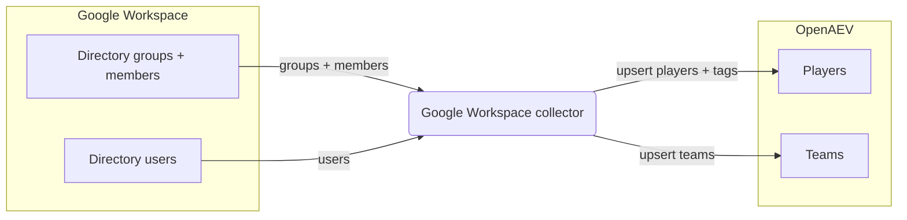

# OpenAEV Google Workspace Collector

The Google Workspace collector imports your [Google Workspace](https://workspace.google.com/) directory into OpenAEV as
players and teams. On each run it queries the Admin SDK Directory API for users and groups and creates or updates the
matching OpenAEV players (users) and teams, so your simulation audience stays aligned with your directory. This collector
imports identity data only and does not validate detection or prevention expectations.

## Table of Contents

- [OpenAEV Google Workspace Collector](#openaev-google-workspace-collector)
  - [Table of Contents](#table-of-contents)
  - [Introduction](#introduction)
  - [Requirements](#requirements)
  - [Configuration variables](#configuration-variables)
    - [OpenAEV environment variables](#openaev-environment-variables)
    - [Base collector environment variables](#base-collector-environment-variables)
    - [Google Workspace collector environment variables](#google-workspace-collector-environment-variables)
  - [Deployment](#deployment)
    - [Docker Deployment](#docker-deployment)
    - [Manual Deployment](#manual-deployment)
  - [Usage](#usage)
  - [Behavior](#behavior)
  - [Required permissions and API endpoints](#required-permissions-and-api-endpoints)
  - [Debugging](#debugging)
  - [Additional information](#additional-information)

## Introduction

OpenAEV (Breach and Attack Simulation) runs social-engineering and awareness simulations against players, who can be
organized into teams. To build that audience, OpenAEV needs to know your people and their group memberships. This
collector authenticates to Google with a service account using domain-wide delegation, calls the Admin SDK Directory API
to read users and groups, and registers them in OpenAEV as players (users) and teams. It performs a full directory
synchronization on every run: players and teams are upserted (created or updated) so existing records are kept current.

## Requirements

- OpenAEV Platform >= 1.19.0
- A Google Workspace tenant and an administrator account for domain-wide delegation
- A Google Cloud service account (JSON key) with domain-wide delegation authorized for the read-only Directory scopes,
  and the Admin SDK API enabled
- For a manual (non-Docker) deployment: Python >= 3.11 and [Poetry](https://python-poetry.org/) >= 2.1

## Configuration variables

The collector is configured either through environment variables (recommended, read from `docker-compose.yml` / the
`.env` file for a Docker deployment) or through a `config.yml` file (for a manual deployment). Copy the provided
`.env.sample` / `config.yml.sample` and fill in the values flagged with `ChangeMe`.

### OpenAEV environment variables

| Parameter         | config.yml          | Docker environment variable | Mandatory | Description                                                                         |
|-------------------|---------------------|-----------------------------|-----------|-------------------------------------------------------------------------------------|
| OpenAEV URL       | `openaev.url`       | `OPENAEV_URL`               | Yes       | The URL of the OpenAEV platform. Must be reachable from where the collector runs.   |
| OpenAEV Token     | `openaev.token`     | `OPENAEV_TOKEN`             | Yes       | The administrator token of the OpenAEV platform.                                    |
| OpenAEV Tenant ID | `openaev.tenant_id` | `OPENAEV_TENANT_ID`         | No        | Tenant identifier for multi-tenant deployments. When set, it must be a valid UUID.  |

### Base collector environment variables

| Parameter        | config.yml            | Docker environment variable | Default           | Mandatory | Description                                                                  |
|------------------|-----------------------|-----------------------------|-------------------|-----------|------------------------------------------------------------------------------|
| Collector ID     | `collector.id`        | `COLLECTOR_ID`              | /                 | Yes       | A unique `UUIDv4` identifier for this collector instance.                     |
| Collector Name   | `collector.name`      | `COLLECTOR_NAME`            | Google Workspace  | No        | The name of the collector as shown in OpenAEV.                                |
| Collector Period | `collector.period`    | `COLLECTOR_PERIOD`          | PT1H              | No        | Interval between two runs, as an ISO 8601 duration (e.g. `PT1H` = 1 hour).    |
| Log Level        | `collector.log_level` | `COLLECTOR_LOG_LEVEL`       | error             | No        | Verbosity of the logs. One of `debug`, `info`, `warn`, `error`.              |

### Google Workspace collector environment variables

| Parameter             | config.yml                                       | Docker environment variable                        | Default     | Mandatory | Description                                                                                              |
|-----------------------|--------------------------------------------------|----------------------------------------------------|-------------|-----------|--------------------------------------------------------------------------------------------------------|
| Service Account JSON  | `collector.google_workspace_service_account_json`   | `COLLECTOR_GOOGLE_WORKSPACE_SERVICE_ACCOUNT_JSON`   | /           | Yes       | The service account credentials as a JSON string.                                                       |
| Delegated Admin Email | `collector.google_workspace_delegated_admin_email`  | `COLLECTOR_GOOGLE_WORKSPACE_DELEGATED_ADMIN_EMAIL`  | /           | Yes       | The email of the administrator the service account impersonates through domain-wide delegation.         |
| Customer ID           | `collector.google_workspace_customer_id`            | `COLLECTOR_GOOGLE_WORKSPACE_CUSTOMER_ID`            | my_customer | No        | The Google Workspace customer ID, or `my_customer` to target your own domain.                           |
| Include Suspended     | `collector.include_suspended`                       | `COLLECTOR_INCLUDE_SUSPENDED`                       | false       | No        | Whether suspended users are imported.                                                                   |
| Sync All Users        | `collector.sync_all_users`                          | `COLLECTOR_SYNC_ALL_USERS`                          | false       | No        | If `true`, import every user; if `false`, import only users who are members of a group.                 |

## Deployment

### Docker Deployment

Build the Docker image (or use the published `openaev/collector-google-workspace` image):

```shell
docker build . -t openaev/collector-google-workspace:latest
```

Create a `.env` file from `.env.sample` and fill in your values, then start the collector with the provided
`docker-compose.yml` (which reads those variables):

```shell
docker compose up -d
```

### Manual Deployment

Create a `config.yml` file from `config.yml.sample` and fill in your values, then install and run the collector:

```shell
poetry install --extras prod
poetry run python -m google_workspace.openaev_google_workspace
```

> For local development against a checkout of [client-python](https://github.com/OpenAEV-Platform/client-python)
> (cloned next to this repository), use `poetry install --extras dev` instead.

## Usage

Once started, the collector registers itself in OpenAEV and then runs automatically every `COLLECTOR_PERIOD`. No manual
interaction is required: on each run it performs a full directory synchronization of your Google Workspace users and
groups into OpenAEV players and teams. Because the period defaults to one hour (`PT1H`), directory changes are reflected
at the next scheduled run.

## Behavior



On each run, the collector authenticates with the service account (domain-wide delegation impersonating the delegated
admin) and builds the Admin SDK Directory service, then follows one of two modes:

- Groups and members (default, `sync_all_users = false`):
  1. Lists all groups (`groups.list`, paginated) and upserts each as an OpenAEV team.
  2. For each group, lists its `USER` members (`members.list`), fetches the full user record (`users.get`), and upserts
     the user as an OpenAEV player attached to that team.
- All users (`sync_all_users = true`):
  1. Lists all users (`users.list`, paginated, ordered by email), excluding suspended users unless `include_suspended`
     is enabled, and upserts each as an OpenAEV player (without team association).

For every player, the collector sets the email, first name and last name, and attaches tags derived from the directory
data (source, status active/suspended, organizational unit, and admin / delegated-admin role). Users without a primary
email are skipped.

The synchronization is incremental from the platform's point of view: players and teams are created or updated
(upserted), so a record seen in a previous run is refreshed rather than duplicated.

## Required permissions and API endpoints

- Authentication: a Google Cloud service account (JSON key) configured for domain-wide delegation, impersonating an
  administrator (`google_workspace_delegated_admin_email`).
- Required OAuth scopes (read-only, authorized for the service account client ID in the Admin console):
  - `https://www.googleapis.com/auth/admin.directory.user.readonly`
  - `https://www.googleapis.com/auth/admin.directory.group.readonly`
  - `https://www.googleapis.com/auth/admin.directory.group.member.readonly`
- The Admin SDK API must be enabled in the Google Cloud project.
- API endpoints used (Admin SDK Directory API):
  - `GET /admin/directory/v1/users` (`users.list`) and `GET /admin/directory/v1/users/{userKey}` (`users.get`)
  - `GET /admin/directory/v1/groups` (`groups.list`)
  - `GET /admin/directory/v1/groups/{groupKey}/members` (`members.list`)
- Reference: [Admin SDK Directory API](https://developers.google.com/admin-sdk/directory/reference/rest)

## Debugging

Set `COLLECTOR_LOG_LEVEL=debug` to get verbose logs, including the number of users and groups found and each player /
team upsert. Common issues:

- Authentication or authorization errors: confirm the service account JSON is valid, that domain-wide delegation is
  authorized for the three read-only scopes above, that the Admin SDK API is enabled, and that
  `google_workspace_delegated_admin_email` is a real administrator.
- No players imported in the default mode: remember that only users who belong to a group are imported unless
  `sync_all_users` is set to `true`.

## Additional information

- The collector performs a full directory synchronization on every run; it does not delete OpenAEV players or teams when
  a user or group disappears from Google Workspace.
- The required Google Workspace scopes and endpoints reflect the current implementation. Google may change its API over
  time, so always confirm against the official documentation before deploying.
