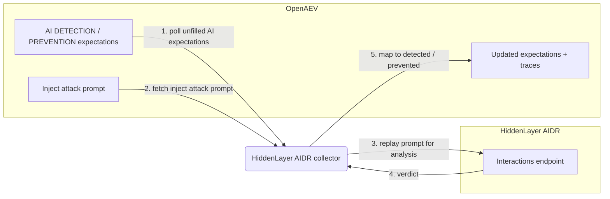

# OpenAEV HiddenLayer AIDR Collector

The HiddenLayer AIDR collector validates OpenAEV detection and prevention expectations against
[HiddenLayer](https://hiddenlayer.com/), whose AI Detection and Response (AIDR) provides runtime
security for GenAI prompts and model interactions. This is an agentless validator: instead of waiting
for an endpoint agent, it replays each AI adversarial inject's attack prompt through the HiddenLayer
Interactions endpoint and maps the returned verdict to detected and/or prevented.

## Table of Contents

- [OpenAEV HiddenLayer AIDR Collector](#openaev-hiddenlayer-aidr-collector)
  - [Table of Contents](#table-of-contents)
  - [Introduction](#introduction)
  - [Requirements](#requirements)
  - [Configuration variables](#configuration-variables)
    - [OpenAEV environment variables](#openaev-environment-variables)
    - [Base collector environment variables](#base-collector-environment-variables)
    - [HiddenLayer collector environment variables](#hiddenlayer-collector-environment-variables)
  - [Deployment](#deployment)
    - [Docker Deployment](#docker-deployment)
    - [Manual Deployment](#manual-deployment)
  - [Usage](#usage)
  - [Behavior](#behavior)
  - [Required permissions and API endpoints](#required-permissions-and-api-endpoints)
  - [Debugging](#debugging)
  - [Additional information](#additional-information)

## Introduction

OpenAEV (Breach and Attack Simulation) raises "expectations" each time its AI red-team injector
launches an adversarial prompt: a DETECTION expectation (the AI security product should flag the
prompt) and/or a PREVENTION expectation (the product should block it). This collector connects to
HiddenLayer AIDR, registers a `SecurityPlatform` of type `LLM_FIREWALL`, and validates those
expectations by replaying each inject's attack prompt through the HiddenLayer Interactions endpoint.
It maps the verdict to detected/not detected and prevented/not prevented and attaches a trace that
links back to the originating inject. No endpoint agent is involved: the collector re-scans the
recorded attack content directly through the vendor API, either against HiddenLayer SaaS or a
self-hosted AIDR container.

## Requirements

- An OpenAEV platform with AI red-team support (the AI inject-expectations domain exposed by
  `pyoaev`; platforms without AI red-team support are not compatible)
- One of:
  - A HiddenLayer SaaS subscription with OAuth2 API client credentials (client id and client secret), or
  - A reachable self-hosted HiddenLayer AIDR container (no credentials)
- For a manual (non-Docker) deployment: Python >= 3.11 and [Poetry](https://python-poetry.org/) >= 2.1

## Configuration variables

The collector is configured either through environment variables (recommended, read from
`docker-compose.yml` / the `.env` file for a Docker deployment) or through a `config.yml` file (for a
manual deployment). Copy the provided `.env.sample` / `hiddenlayer/config.yml.sample` and fill in the
values flagged with `ChangeMe`. The collector-specific settings live under the `collector:` section as
`collector.*` keys, mapped to `COLLECTOR_*` environment variables.

### OpenAEV environment variables

| Parameter         | config.yml          | Docker environment variable | Mandatory | Description                                                                        |
|-------------------|---------------------|-----------------------------|-----------|------------------------------------------------------------------------------------|
| OpenAEV URL       | `openaev.url`       | `OPENAEV_URL`               | Yes       | The URL of the OpenAEV platform. Must be reachable from where the collector runs.  |
| OpenAEV Token     | `openaev.token`     | `OPENAEV_TOKEN`             | Yes       | The administrator token of the OpenAEV platform.                                   |
| OpenAEV Tenant ID | `openaev.tenant_id` | `OPENAEV_TENANT_ID`         | No        | Tenant identifier for multi-tenant deployments. When set, it must be a valid UUID. |

### Base collector environment variables

| Parameter        | config.yml            | Docker environment variable | Default          | Mandatory | Description                                                                          |
|------------------|-----------------------|-----------------------------|------------------|-----------|-------------------------------------------------------------------------------------|
| Collector ID     | `collector.id`        | `COLLECTOR_ID`              | /                | Yes       | A unique identifier for this collector instance (`UUIDv4` recommended).             |
| Collector Name   | `collector.name`      | `COLLECTOR_NAME`            | HiddenLayer AIDR | No        | The name of the collector as shown in OpenAEV.                                       |
| Collector Period | `collector.period`    | `COLLECTOR_PERIOD`          | PT120S           | No        | Interval between two runs, as an ISO 8601 duration (e.g. `PT120S` = 2 minutes).      |
| Log Level        | `collector.log_level` | `COLLECTOR_LOG_LEVEL`       | error            | No        | Verbosity of the logs. One of `debug`, `info`, `warn`, `error`.                      |
| Platform         | `collector.platform`  | `COLLECTOR_PLATFORM`        | LLM_FIREWALL     | No        | The `SecurityPlatform` type registered in OpenAEV. Use `LLM_FIREWALL` for AI firewall / guardrail validators. |

### HiddenLayer collector environment variables

| Parameter     | config.yml                | Docker environment variable | Default                                       | Mandatory | Description                                                                  |
|---------------|---------------------------|-----------------------------|-----------------------------------------------|-----------|-----------------------------------------------------------------------------|
| API Base URL  | `collector.base_url`      | `COLLECTOR_BASE_URL`        | `https://api.us.hiddenlayer.ai`               | No        | HiddenLayer API base URL (SaaS region or self-hosted AIDR container).       |
| Auth URL      | `collector.auth_url`      | `COLLECTOR_AUTH_URL`        | `https://auth.hiddenlayer.ai/oauth2/token`    | No        | OAuth2 token endpoint (SaaS only).                                          |
| Client ID     | `collector.client_id`     | `COLLECTOR_CLIENT_ID`       | /                                             | No        | HiddenLayer API client id for SaaS OAuth2. Leave empty for a self-hosted container. |
| Client Secret | `collector.client_secret` | `COLLECTOR_CLIENT_SECRET`   | /                                             | No        | HiddenLayer API client secret for SaaS OAuth2. Leave empty for a self-hosted container. |

> Note: for HiddenLayer SaaS, set both `client_id` and `client_secret` (they are required together);
> the collector obtains an OAuth2 bearer token from `auth_url`. For a self-hosted AIDR container, leave
> both empty and point `base_url` at the container; requests are then sent unauthenticated. Setting
> only one of the two is a misconfiguration and fails fast.

## Deployment

### Docker Deployment

Build the Docker image (or use the published `openaev/collector-hiddenlayer` image):

```shell
docker build . -t openaev/collector-hiddenlayer:latest
```

Create a `.env` file from `.env.sample` and fill in your values, then start the collector with the
provided `docker-compose.yml` (which reads those variables):

```shell
docker compose up -d
```

### Manual Deployment

Create a `config.yml` file from `hiddenlayer/config.yml.sample` and fill in your values, then install
and run the collector:

```shell
poetry install --extras prod
poetry run python -m hiddenlayer.openaev_hiddenlayer
```

> For local development against a checkout of [client-python](https://github.com/OpenAEV-Platform/client-python)
> (cloned next to this repository), use `poetry install --extras dev` instead.

## Usage

Once started, the collector registers itself (and its `SecurityPlatform`) in OpenAEV and then runs
automatically every `COLLECTOR_PERIOD`. No manual interaction is required: as soon as the AI red-team
injector produces DETECTION / PREVENTION expectations bound to this collector, they are validated on
the next run by replaying the attack prompt through HiddenLayer AIDR.

## Behavior



On each run, the collector:

1. Polls the unfilled AI DETECTION / PREVENTION expectations assigned to this collector from OpenAEV
   (`GET /api/injects/expectations/ai/{collector_id}`).
2. For each expectation, fetches the originating inject (`GET /api/injects/{inject_id}`), reads its
   `inject_content.attack_prompt` (and optional `system_prompt`), and substitutes the inject's unique
   marker into the prompt.
3. Authenticates if needed (SaaS OAuth2 client-credentials, token cached until it expires) and replays
   the attack prompt through the HiddenLayer Interactions endpoint (one interaction per inject, cached
   for the run).
4. Maps the verdict returned by HiddenLayer:
   - DETECTION: marked `Detected` when the response carries detections, is flagged, or is blocked;
     otherwise `Not Detected`.
   - PREVENTION: marked `Prevented` when the action is `block`/`blocked` (or the response is marked
     blocked); otherwise `Not Prevented`.
5. Updates each expectation with the result and the matched detection in its metadata, and creates an
   expectation trace for each success.

## Required permissions and API endpoints

- Required permission: either HiddenLayer SaaS OAuth2 client credentials (client id and secret) or a
  reachable self-hosted AIDR container.
- API endpoints used:
  - `POST {auth_url}` (OAuth2 client-credentials token; default
    `https://auth.hiddenlayer.ai/oauth2/token`) - SaaS only, client auth via HTTP Basic.
  - `POST {base_url}/detection/v1/interactions` (interaction analysis), authenticated with the bearer
    token when running against SaaS.
- Reference: [HiddenLayer documentation](https://docs.hiddenlayer.ai) / [HiddenLayer developer portal](https://dev.hiddenlayer.ai)

## Debugging

Set `COLLECTOR_LOG_LEVEL=debug` to get verbose logs, including expectation polling, the OAuth2 token
exchange, the prompts replayed to HiddenLayer, and the verdict mapping. Common causes of unexpected
results:

- Only one of `client_id` / `client_secret` set: provide both for SaaS, or leave both empty for a
  self-hosted container.
- A wrong `base_url` for your SaaS region or self-hosted container (the analysis calls fail or time
  out).
- An OAuth2 token endpoint that returns a 2xx response without an `access_token`: verify the `auth_url`
  and client credentials.

## Additional information

- The collector is agentless: it validates expectations by replaying the recorded attack prompt
  through the HiddenLayer Interactions endpoint, so it does not require an OpenAEV endpoint agent.
- The required permissions and endpoints reflect the current implementation. HiddenLayer may change its
  API over time, so always confirm against the official documentation before deploying.
