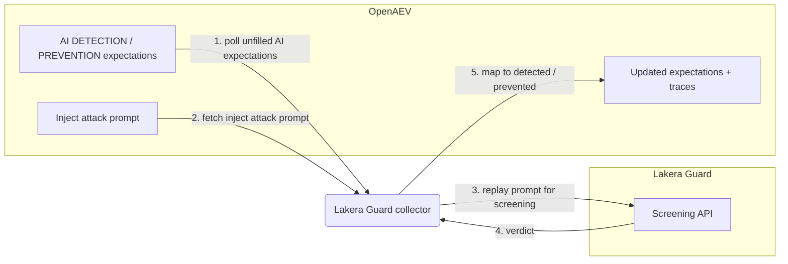

# OpenAEV Lakera Guard Collector

The Lakera Guard collector validates OpenAEV detection and prevention expectations against
[Lakera Guard](https://www.lakera.ai/) (Check Point AI Security), a screening API that flags prompt
attacks and unsafe content. This is an agentless validator: instead of waiting for an endpoint agent,
it replays each AI adversarial inject's attack prompt through the Lakera Guard screening API and maps
the returned verdict to detected and/or prevented.

## Table of Contents

- [OpenAEV Lakera Guard Collector](#openaev-lakera-guard-collector)
  - [Table of Contents](#table-of-contents)
  - [Introduction](#introduction)
  - [Requirements](#requirements)
  - [Configuration variables](#configuration-variables)
    - [OpenAEV environment variables](#openaev-environment-variables)
    - [Base collector environment variables](#base-collector-environment-variables)
    - [Lakera Guard collector environment variables](#lakera-guard-collector-environment-variables)
  - [Deployment](#deployment)
    - [Docker Deployment](#docker-deployment)
    - [Manual Deployment](#manual-deployment)
  - [Usage](#usage)
  - [Behavior](#behavior)
  - [Required permissions and API endpoints](#required-permissions-and-api-endpoints)
  - [Debugging](#debugging)
  - [Additional information](#additional-information)

## Introduction

OpenAEV (Breach and Attack Simulation) raises "expectations" each time its AI red-team injector
launches an adversarial prompt: a DETECTION expectation (the AI security product should flag the
prompt) and/or a PREVENTION expectation (the product should block it). This collector connects to
Lakera Guard, registers a `SecurityPlatform` of type `LLM_FIREWALL`, and validates those expectations
by replaying each inject's attack prompt through the Lakera Guard screening API. It maps the verdict
to detected/not detected and prevented/not prevented and attaches a trace that links back to the
originating inject. No endpoint agent is involved: the collector re-scans the recorded attack content
directly through the vendor API.

Lakera Guard returns a detection decision (`flagged`); enforcing block/allow is the policy's
responsibility. The `blocking_policy` setting tells the collector whether the targeted Lakera policy
blocks flagged prompts, which is what distinguishes a PREVENTION from a DETECTION-only result.

## Requirements

- An OpenAEV platform with AI red-team support (the AI inject-expectations domain exposed by
  `pyoaev`; platforms without AI red-team support are not compatible)
- A Lakera Guard subscription with API access
- A Lakera Guard API key (and optionally a project id selecting the policy to apply)
- For a manual (non-Docker) deployment: Python >= 3.11 and [Poetry](https://python-poetry.org/) >= 2.1

## Configuration variables

The collector is configured either through environment variables (recommended, read from
`docker-compose.yml` / the `.env` file for a Docker deployment) or through a `config.yml` file (for a
manual deployment). Copy the provided `.env.sample` / `lakera_guard/config.yml.sample` and fill in the
values flagged with `ChangeMe`. The collector-specific settings live under the `collector:` section as
`collector.*` keys, mapped to `COLLECTOR_*` environment variables.

### OpenAEV environment variables

| Parameter         | config.yml          | Docker environment variable | Mandatory | Description                                                                        |
|-------------------|---------------------|-----------------------------|-----------|------------------------------------------------------------------------------------|
| OpenAEV URL       | `openaev.url`       | `OPENAEV_URL`               | Yes       | The URL of the OpenAEV platform. Must be reachable from where the collector runs.  |
| OpenAEV Token     | `openaev.token`     | `OPENAEV_TOKEN`             | Yes       | The administrator token of the OpenAEV platform.                                   |
| OpenAEV Tenant ID | `openaev.tenant_id` | `OPENAEV_TENANT_ID`         | No        | Tenant identifier for multi-tenant deployments. When set, it must be a valid UUID. |

### Base collector environment variables

| Parameter        | config.yml            | Docker environment variable | Default      | Mandatory | Description                                                                          |
|------------------|-----------------------|-----------------------------|--------------|-----------|-------------------------------------------------------------------------------------|
| Collector ID     | `collector.id`        | `COLLECTOR_ID`              | /            | Yes       | A unique identifier for this collector instance (`UUIDv4` recommended).             |
| Collector Name   | `collector.name`      | `COLLECTOR_NAME`            | Lakera Guard | No        | The name of the collector as shown in OpenAEV.                                       |
| Collector Period | `collector.period`    | `COLLECTOR_PERIOD`          | PT120S       | No        | Interval between two runs, as an ISO 8601 duration (e.g. `PT120S` = 2 minutes).      |
| Log Level        | `collector.log_level` | `COLLECTOR_LOG_LEVEL`       | error        | No        | Verbosity of the logs. One of `debug`, `info`, `warn`, `error`.                      |
| Platform         | `collector.platform`  | `COLLECTOR_PLATFORM`        | LLM_FIREWALL | No        | The `SecurityPlatform` type registered in OpenAEV. Use `LLM_FIREWALL` for AI firewall / guardrail validators. |

### Lakera Guard collector environment variables

| Parameter       | config.yml                  | Docker environment variable  | Default                    | Mandatory | Description                                                                                  |
|-----------------|-----------------------------|------------------------------|----------------------------|-----------|---------------------------------------------------------------------------------------------|
| API Base URL    | `collector.base_url`        | `COLLECTOR_BASE_URL`         | `https://api.lakera.ai/v2` | No        | Lakera Guard API base URL. The collector calls `{base_url}/guard`.                          |
| API Key         | `collector.api_key`         | `COLLECTOR_API_KEY`          | /                          | Yes       | Lakera Guard API key, sent as a Bearer token.                                               |
| Project ID      | `collector.project_id`      | `COLLECTOR_PROJECT_ID`       | /                          | No        | Optional Lakera project id selecting the policy to apply.                                    |
| Blocking Policy | `collector.blocking_policy` | `COLLECTOR_BLOCKING_POLICY`  | true                       | No        | Whether the targeted Lakera policy blocks flagged prompts. When `true`, a flagged prompt satisfies PREVENTION; set `false` for detect/monitor-only policies. |

## Deployment

### Docker Deployment

Build the Docker image (or use the published `openaev/collector-lakera-guard` image):

```shell
docker build . -t openaev/collector-lakera-guard:latest
```

Create a `.env` file from `.env.sample` and fill in your values, then start the collector with the
provided `docker-compose.yml` (which reads those variables):

```shell
docker compose up -d
```

### Manual Deployment

Create a `config.yml` file from `lakera_guard/config.yml.sample` and fill in your values, then install
and run the collector:

```shell
poetry install --extras prod
poetry run python -m lakera_guard.openaev_lakera_guard
```

> For local development against a checkout of [client-python](https://github.com/OpenAEV-Platform/client-python)
> (cloned next to this repository), use `poetry install --extras dev` instead.

## Usage

Once started, the collector registers itself (and its `SecurityPlatform`) in OpenAEV and then runs
automatically every `COLLECTOR_PERIOD`. No manual interaction is required: as soon as the AI red-team
injector produces DETECTION / PREVENTION expectations bound to this collector, they are validated on
the next run by replaying the attack prompt through Lakera Guard.

## Behavior



On each run, the collector:

1. Polls the unfilled AI DETECTION / PREVENTION expectations assigned to this collector from OpenAEV
   (`GET /api/injects/expectations/ai/{collector_id}`).
2. For each expectation, fetches the originating inject (`GET /api/injects/{inject_id}`), reads its
   `inject_content.attack_prompt` (and optional `system_prompt`), and substitutes the inject's unique
   marker into the prompt.
3. Replays the attack prompt through the Lakera Guard screening API (one screening per inject, cached
   for the run), requesting the detector breakdown.
4. Maps the verdict returned by Lakera Guard:
   - DETECTION: marked `Detected` when the response is `flagged`; otherwise `Not Detected`.
   - PREVENTION: marked `Prevented` when the prompt is `flagged` and `blocking_policy` is `true` (the
     targeted policy blocks flagged prompts); otherwise `Not Prevented`.
5. Updates each expectation with the result and the matched detector type in its metadata, and creates
   an expectation trace for each success.

## Required permissions and API endpoints

- Required permission: a Lakera Guard API key authorized to call the screening API (optionally scoped
  to a project id).
- API endpoint used:
  - `POST {base_url}/guard` (prompt screening; default `https://api.lakera.ai/v2`, so
    `POST /v2/guard`), authenticated with an `Authorization: Bearer` header.
- Reference: [Lakera Guard API documentation](https://docs.lakera.ai/docs/api/guard)

## Debugging

Set `COLLECTOR_LOG_LEVEL=debug` to get verbose logs, including expectation polling, the prompts
replayed to Lakera Guard, and the verdict mapping. Common causes of unexpected results:

- PREVENTION never satisfied while DETECTION is: confirm `blocking_policy` is `true` and that the
  targeted Lakera policy actually blocks flagged prompts.
- A wrong `project_id` selects a different policy, changing whether prompts are flagged.
- An API key without screening access (the requests are rejected).

## Additional information

- The collector is agentless: it validates expectations by replaying the recorded attack prompt
  through the Lakera Guard screening API, so it does not require an OpenAEV endpoint agent.
- Lakera Guard returns a detection decision only; the block/allow action depends on your policy, which
  is why the collector uses `blocking_policy` to decide PREVENTION outcomes.
- The required permissions and endpoints reflect the current implementation. Lakera may change its API
  over time, so always confirm against the official documentation before deploying.
