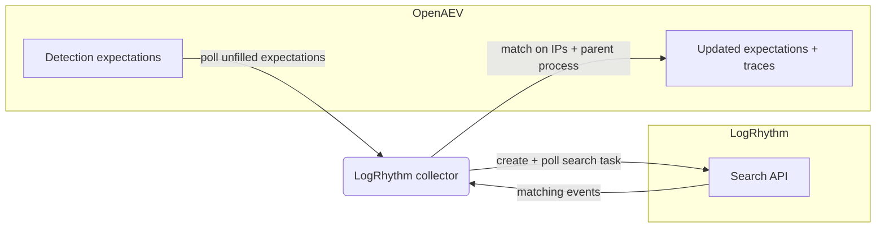

# OpenAEV LogRhythm Collector

The LogRhythm collector validates OpenAEV detection expectations against [LogRhythm](https://logrhythm.com/), a SIEM and
security analytics platform. After OpenAEV agents execute attacks, the collector runs searches against the LogRhythm
Search API and correlates the returned events with the related injects to confirm whether the activity was detected.

## Table of Contents

- [OpenAEV LogRhythm Collector](#openaev-logrhythm-collector)
  - [Table of Contents](#table-of-contents)
  - [Introduction](#introduction)
  - [Requirements](#requirements)
  - [Configuration variables](#configuration-variables)
    - [OpenAEV environment variables](#openaev-environment-variables)
    - [Base collector environment variables](#base-collector-environment-variables)
    - [LogRhythm collector environment variables](#logrhythm-collector-environment-variables)
  - [Deployment](#deployment)
    - [Docker Deployment](#docker-deployment)
    - [Manual Deployment](#manual-deployment)
  - [Usage](#usage)
  - [Behavior](#behavior)
  - [Required permissions and API endpoints](#required-permissions-and-api-endpoints)
  - [Debugging](#debugging)
  - [Additional information](#additional-information)

## Introduction

OpenAEV (Breach and Attack Simulation) raises "expectations" each time it executes an inject (a simulated attack) on an
endpoint: a DETECTION expectation (the security product should raise an alert) and/or a PREVENTION expectation (the
security product should block the action). This collector connects to LogRhythm, registers a `SecurityPlatform` of type
`SIEM`, and periodically reconciles those expectations with the events returned by the LogRhythm Search API, marking
each expectation as detected/not detected and attaching a trace that links back to the LogRhythm Web Console. LogRhythm
is a detection source, so this collector validates DETECTION expectations only; PREVENTION expectations are not
supported.

## Requirements

- OpenAEV Platform >= 1.19.0
- A LogRhythm deployment with the Search API (`lr-search-api`) reachable through the API gateway (default port 8501)
- A LogRhythm API bearer token (preferred) or a username/password pair allowed to run searches via the Search API
- For a manual (non-Docker) deployment: Python >= 3.11 and [Poetry](https://python-poetry.org/) >= 2.1

## Configuration variables

The collector is configured either through environment variables (recommended, read from `docker-compose.yml` / the
`.env` file for a Docker deployment) or through a `config.yml` file (for a manual deployment). Copy the provided
`src/.env.sample` / `src/config.yml.sample` and fill in the values flagged with `ChangeMe`.

### OpenAEV environment variables

| Parameter         | config.yml          | Docker environment variable | Mandatory | Description                                                                              |
|-------------------|---------------------|-----------------------------|-----------|------------------------------------------------------------------------------------------|
| OpenAEV URL       | `openaev.url`       | `OPENAEV_URL`               | Yes       | The URL of the OpenAEV platform. Must be reachable from where the collector runs.        |
| OpenAEV Token     | `openaev.token`     | `OPENAEV_TOKEN`             | Yes       | The administrator token of the OpenAEV platform.                                         |
| OpenAEV Tenant ID | `openaev.tenant_id` | `OPENAEV_TENANT_ID`         | No        | Tenant identifier for multi-tenant deployments. When set, it must be a valid UUID.       |

### Base collector environment variables

| Parameter        | config.yml            | Docker environment variable | Default   | Mandatory | Description                                                                                            |
|------------------|-----------------------|-----------------------------|-----------|-----------|--------------------------------------------------------------------------------------------------------|
| Collector ID     | `collector.id`        | `COLLECTOR_ID`              | /         | Yes       | A unique `UUIDv4` identifier for this collector instance.                                               |
| Collector Name   | `collector.name`      | `COLLECTOR_NAME`            | LogRhythm | No        | The name of the collector as shown in OpenAEV.                                                          |
| Collector Period | `collector.period`    | `COLLECTOR_PERIOD`          | PT1M      | No        | Interval between two runs, as an ISO 8601 duration (e.g. `PT1M` = 1 minute).                            |
| Log Level        | `collector.log_level` | `COLLECTOR_LOG_LEVEL`       | error     | No        | Verbosity of the logs. One of `debug`, `info`, `warn`, `error`.                                         |
| Platform         | `collector.platform`  | `COLLECTOR_PLATFORM`        | SIEM      | No        | The `SecurityPlatform` type registered in OpenAEV. One of `EDR`, `XDR`, `SIEM`, `SOAR`, `NDR`, `ISPM`.  |

### LogRhythm collector environment variables

| Parameter           | config.yml                      | Docker environment variable     | Default                              | Mandatory   | Description                                                                              |
|---------------------|---------------------------------|---------------------------------|--------------------------------------|-------------|-----------------------------------------------------------------------------------------|
| Base URL            | `logrhythm.base_url`            | `LOGRHYTHM_BASE_URL`            | `https://logrhythm.company.com:8501` | Yes         | Base URL of the LogRhythm API gateway hosting `lr-search-api`.                           |
| Token               | `logrhythm.token`               | `LOGRHYTHM_TOKEN`               | /                                    | Conditional | API bearer token (preferred). Sent as `Authorization: Bearer`.                          |
| Username            | `logrhythm.username`            | `LOGRHYTHM_USERNAME`            | /                                    | Conditional | Username for HTTP basic authentication (used when no token is set).                      |
| Password            | `logrhythm.password`            | `LOGRHYTHM_PASSWORD`            | /                                    | Conditional | Password for HTTP basic authentication.                                                  |
| Query Event Manager | `logrhythm.query_event_manager` | `LOGRHYTHM_QUERY_EVENT_MANAGER` | true                                 | No          | Whether to query the Event Manager (events) in addition to raw logs.                    |
| Max Messages        | `logrhythm.max_msgs`            | `LOGRHYTHM_MAX_MSGS`            | 100                                  | No          | Maximum number of messages to query per search.                                         |
| Console URL         | `logrhythm.console_url`         | `LOGRHYTHM_CONSOLE_URL`         | /                                    | No          | LogRhythm Web Console URL used to build trace links (defaults to `base_url`).            |
| Verify SSL          | `logrhythm.verify_ssl`          | `LOGRHYTHM_VERIFY_SSL`          | true                                 | No          | Whether to verify the LogRhythm TLS certificate.                                         |
| Time Window         | `logrhythm.time_window`         | `LOGRHYTHM_TIME_WINDOW`         | PT1H                                 | No          | Default search window when no date signatures are provided, as an ISO 8601 duration.     |
| Offset              | `logrhythm.offset`              | `LOGRHYTHM_OFFSET`              | PT30S                                | No          | Delay between retry attempts to absorb event ingestion latency, as an ISO 8601 duration. |
| Max Retry           | `logrhythm.max_retry`           | `LOGRHYTHM_MAX_RETRY`           | 3                                    | No          | Maximum number of retry attempts after the initial search returns no results.            |
| Search Timeout      | `logrhythm.search_timeout`      | `LOGRHYTHM_SEARCH_TIMEOUT`      | PT5M                                 | No          | Maximum time to wait for a search task to complete, as an ISO 8601 duration.             |
| Poll Interval       | `logrhythm.poll_interval`       | `LOGRHYTHM_POLL_INTERVAL`       | PT5S                                 | No          | Interval between search result status polls, as an ISO 8601 duration.                    |

> Note: authentication is required. Provide either `LOGRHYTHM_TOKEN` (preferred) or both `LOGRHYTHM_USERNAME` and
> `LOGRHYTHM_PASSWORD`. The collector fails to start if neither is configured.

## Deployment

### Docker Deployment

Build the Docker image (or use the published `openaev/collector-logrhythm` image):

```shell
docker build . -t openaev/collector-logrhythm:latest
```

Create a `.env` file from `src/.env.sample` and fill in your values, then start the collector with the provided
`docker-compose.yml` (which reads those variables):

```shell
docker compose up -d
```

### Manual Deployment

Create a `config.yml` file from `src/config.yml.sample` and fill in your values, then install and run the collector:

```shell
poetry install --extras prod
poetry run LogRhythmCollector
```

> For local development against a checkout of [client-python](https://github.com/OpenAEV-Platform/client-python)
> (cloned next to this repository as `client-python`), use `poetry install --extras local` instead.

## Usage

Once started, the collector registers itself (and its `SecurityPlatform`) in OpenAEV and then runs automatically every
`COLLECTOR_PERIOD`. No manual interaction is required: as soon as injects produce expectations bound to this collector,
they are reconciled on the next run.

## Behavior



On each run, the collector:

1. Fetches the unfilled DETECTION expectations assigned to this collector from OpenAEV. PREVENTION expectations are
   marked invalid because LogRhythm only supports detection.
2. Builds a Search API query filter from the expectation signatures (SIP field `18` for source IPs, DIP field `19` for
   destination IPs, and URL field `42` derived from the inject/agent UUIDs embedded in the parent process name),
   combined with OR over a relative time window (default 1 hour, `LOGRHYTHM_TIME_WINDOW`).
3. Creates a search task (`POST /lr-search-api/actions/search-task`), then polls the results endpoint
   (`POST /lr-search-api/actions/search-result`) every `LOGRHYTHM_POLL_INTERVAL` until the task completes or
   `LOGRHYTHM_SEARCH_TIMEOUT` elapses.
4. Retries up to `LOGRHYTHM_MAX_RETRY` times, waiting `LOGRHYTHM_OFFSET` between attempts and progressively widening the
   window, to absorb event ingestion latency.
5. Matches events against the expectation signatures: the `parent_process_name` signature must match and, when IP
   signatures are present, at least one source or destination IP must match. Each matched DETECTION expectation is marked
   `Detected` and gets an expectation trace linking to the LogRhythm Web Console (`LOGRHYTHM_CONSOLE_URL`, or `base_url`
   when unset).

Expectations that remain unmatched after all retries are left for OpenAEV to mark as failed (`Not Detected`) once they
expire.

## Required permissions and API endpoints

- Required permission: a LogRhythm API bearer token or user account allowed to initiate and read searches via the
  Search API (`/lr-search-api/actions/*`).
- API endpoints used:
  - `POST /lr-search-api/actions/search-task` (create a search task)
  - `POST /lr-search-api/actions/search-result` (poll for status and fetch results)
  - Authentication: `Authorization: Bearer <token>` or HTTP basic authentication
- LogRhythm field IDs used for matching: SIP (`18`), DIP (`19`), URL (`42`).
- Reference: LogRhythm Search API documentation (available on your deployment at `https://<host>:8505/lr-search-api/docs`).

## Debugging

Set `COLLECTOR_LOG_LEVEL=debug` to get verbose logs, including expectation polling, the search tasks created, the poll
cycles, and the matching decisions. Common causes of "nothing detected" are a `base_url` that does not point at the API
gateway hosting `lr-search-api`, a `LOGRHYTHM_TIME_WINDOW` shorter than your ingestion latency, or a
`LOGRHYTHM_SEARCH_TIMEOUT` too short for large searches. For deployments with self-signed certificates, set
`LOGRHYTHM_VERIFY_SSL=false` (or trust the CA) if requests fail on TLS verification.

## Additional information

- This collector validates detection only; it does not support prevention expectations.
- Searches use a relative time window widened on retries; the expectation start/end date signatures are not used to
  bound the query, so late-ingested events are still captured.
- Trace links use `LOGRHYTHM_CONSOLE_URL` when set, otherwise the configured `base_url`.
- The required permissions and endpoints reflect the current implementation. LogRhythm may change its API over time, so
  always confirm against the official documentation before deploying.
