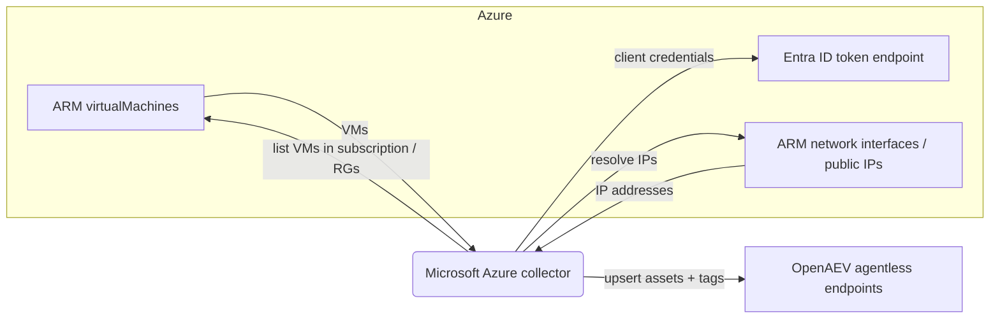

# OpenAEV Microsoft Azure Collector

The Microsoft Azure collector imports your [Microsoft Azure](https://azure.microsoft.com/) Virtual Machines into OpenAEV
as agentless endpoints. On each run it queries Azure Resource Manager for the virtual machines in the configured
subscription and creates or updates a matching OpenAEV asset (endpoint) for every VM, so your simulation scope stays
aligned with your Azure inventory. This collector imports inventory only and does not validate detection or prevention
expectations.

## Table of Contents

- [OpenAEV Microsoft Azure Collector](#openaev-microsoft-azure-collector)
  - [Table of Contents](#table-of-contents)
  - [Introduction](#introduction)
  - [Requirements](#requirements)
  - [Configuration variables](#configuration-variables)
    - [OpenAEV environment variables](#openaev-environment-variables)
    - [Base collector environment variables](#base-collector-environment-variables)
    - [Microsoft Azure collector environment variables](#microsoft-azure-collector-environment-variables)
  - [Deployment](#deployment)
    - [Docker Deployment](#docker-deployment)
    - [Manual Deployment](#manual-deployment)
  - [Usage](#usage)
  - [Behavior](#behavior)
  - [Required permissions and API endpoints](#required-permissions-and-api-endpoints)
  - [Debugging](#debugging)
  - [Additional information](#additional-information)

## Introduction

OpenAEV (Breach and Attack Simulation) executes injects (simulated attacks) against assets. To run those simulations
against your cloud fleet, OpenAEV needs to know which machines exist. This collector authenticates to Microsoft Entra ID
with an application (client credentials), calls the Azure Resource Manager API to enumerate the Virtual Machines in the
target subscription, resolves their network interfaces and IP addresses, and registers each one as an agentless endpoint
in OpenAEV (name, hostname, platform, architecture, IP addresses, cloud metadata and tags). It performs a full inventory
synchronization on every run: VMs are upserted (created or updated) so existing assets are kept current.

## Requirements

- OpenAEV Platform >= 1.19.0
- A Microsoft Azure subscription containing Virtual Machines
- A Microsoft Entra ID application registration (client ID + client secret) granted the `Reader` role on the target
  subscription
- For a manual (non-Docker) deployment: Python >= 3.11 and [Poetry](https://python-poetry.org/) >= 2.1

## Configuration variables

The collector is configured either through environment variables (recommended, read from `docker-compose.yml` / the
`.env` file for a Docker deployment) or through a `config.yml` file (for a manual deployment). Copy the provided
`.env.sample` / `config.yml.sample` and fill in the values flagged with `ChangeMe`.

### OpenAEV environment variables

| Parameter         | config.yml          | Docker environment variable | Mandatory | Description                                                                         |
|-------------------|---------------------|-----------------------------|-----------|-------------------------------------------------------------------------------------|
| OpenAEV URL       | `openaev.url`       | `OPENAEV_URL`               | Yes       | The URL of the OpenAEV platform. Must be reachable from where the collector runs.   |
| OpenAEV Token     | `openaev.token`     | `OPENAEV_TOKEN`             | Yes       | The administrator token of the OpenAEV platform.                                    |
| OpenAEV Tenant ID | `openaev.tenant_id` | `OPENAEV_TENANT_ID`         | No        | Tenant identifier for multi-tenant deployments. When set, it must be a valid UUID.  |

### Base collector environment variables

| Parameter        | config.yml            | Docker environment variable | Default          | Mandatory | Description                                                                  |
|------------------|-----------------------|-----------------------------|------------------|-----------|------------------------------------------------------------------------------|
| Collector ID     | `collector.id`        | `COLLECTOR_ID`              | /                | Yes       | A unique `UUIDv4` identifier for this collector instance.                     |
| Collector Name   | `collector.name`      | `COLLECTOR_NAME`            | Microsoft Azure  | No        | The name of the collector as shown in OpenAEV.                                |
| Collector Period | `collector.period`    | `COLLECTOR_PERIOD`          | PT1H             | No        | Interval between two runs, as an ISO 8601 duration (e.g. `PT1H` = 1 hour).    |
| Log Level        | `collector.log_level` | `COLLECTOR_LOG_LEVEL`       | error            | No        | Verbosity of the logs. One of `debug`, `info`, `warn`, `error`.              |

### Microsoft Azure collector environment variables

| Parameter            | config.yml                              | Docker environment variable               | Default | Mandatory | Description                                                                                          |
|----------------------|-----------------------------------------|-------------------------------------------|---------|-----------|----------------------------------------------------------------------------------------------------|
| Azure Tenant ID      | `collector.microsoft_azure_tenant_id`       | `COLLECTOR_MICROSOFT_AZURE_TENANT_ID`       | /       | Yes       | The Microsoft Entra ID (Azure AD) tenant ID used for authentication.                                |
| Azure Client ID      | `collector.microsoft_azure_client_id`       | `COLLECTOR_MICROSOFT_AZURE_CLIENT_ID`       | /       | Yes       | The application (client) ID of the Entra ID app registration.                                        |
| Azure Client Secret  | `collector.microsoft_azure_client_secret`   | `COLLECTOR_MICROSOFT_AZURE_CLIENT_SECRET`   | /       | Yes       | The client secret of the Entra ID app registration.                                                 |
| Azure Subscription ID| `collector.microsoft_azure_subscription_id` | `COLLECTOR_MICROSOFT_AZURE_SUBSCRIPTION_ID` | /       | Yes       | The Azure subscription ID whose Virtual Machines are imported.                                       |
| Azure Resource Groups| `collector.microsoft_azure_resource_groups` | `COLLECTOR_MICROSOFT_AZURE_RESOURCE_GROUPS` | /       | No        | Comma-separated list of resource groups to scan. Leave empty to import all VMs in the subscription.  |

## Deployment

### Docker Deployment

Build the Docker image (or use the published `openaev/collector-microsoft-azure` image):

```shell
docker build . -t openaev/collector-microsoft-azure:latest
```

Create a `.env` file from `.env.sample` and fill in your values, then start the collector with the provided
`docker-compose.yml` (which reads those variables):

```shell
docker compose up -d
```

### Manual Deployment

Create a `config.yml` file from `config.yml.sample` and fill in your values, then install and run the collector:

```shell
poetry install --extras prod
poetry run python -m microsoft_azure.openaev_microsoft_azure
```

> For local development against a checkout of [client-python](https://github.com/OpenAEV-Platform/client-python)
> (cloned next to this repository), use `poetry install --extras dev` instead.

## Usage

Once started, the collector registers itself in OpenAEV and then runs automatically every `COLLECTOR_PERIOD`. No manual
interaction is required: on each run it performs a full inventory synchronization of your Azure Virtual Machines into
OpenAEV assets. Because the period defaults to one hour (`PT1H`), newly created or removed VMs are reflected at the next
scheduled run.

## Behavior



On each run, the collector:

1. Acquires an access token from Microsoft Entra ID using the application client credentials (MSAL), scoped to Azure
   Resource Manager (`https://management.azure.com/.default`).
2. Lists Virtual Machines through Azure Resource Manager: all VMs in the subscription
   (`/providers/Microsoft.Compute/virtualMachines`, API version `2023-03-01`) when `microsoft_azure_resource_groups` is
   empty, or only the VMs in the listed resource groups otherwise.
3. Skips VMs whose provisioning state is not `Succeeded`.
4. Resolves the network profile of each VM by reading its network interfaces and public IP addresses
   (`Microsoft.Network/networkInterfaces` and `Microsoft.Network/publicIPAddresses`, API version `2023-06-01`); VMs
   without any resolved IP are skipped.
5. Derives the platform (`Windows` / `Linux` / `Generic`) from the OS disk type and an architecture hint from the VM
   size.
6. Upserts each VM as an OpenAEV agentless endpoint, using the Azure resource ID as the external reference and setting
   the asset category to `HOST`, cloud provider `AZURE`, cloud native type `virtual_machine` and the cloud region
   (location).
7. Creates and attaches tags derived from the VM metadata (source, location, VM size, provisioning state, resource group
   and the VM's native Azure tags).

The synchronization is incremental from the platform's point of view: assets are created or updated (upserted), so a VM
seen in a previous run is refreshed rather than duplicated.

## Required permissions and API endpoints

- Authentication: Microsoft Entra ID application (client credentials) - tenant ID, application (client) ID and client
  secret.
- Required Azure role: the application's service principal must hold the `Reader` role (or another role that grants
  read access to Compute and Network resources) on the target subscription so it can list VMs, network interfaces and
  public IP addresses.
- API endpoints used:
  - `POST https://login.microsoftonline.com/{tenant_id}/oauth2/v2.0/token` (OAuth2 client-credentials authentication via
    MSAL)
  - `GET /subscriptions/{subscription_id}/providers/Microsoft.Compute/virtualMachines` (list all VMs in the
    subscription)
  - `GET /subscriptions/{subscription_id}/resourceGroups/{resource_group}/providers/Microsoft.Compute/virtualMachines`
    (list VMs in a resource group)
  - `GET .../Microsoft.Network/networkInterfaces/{nic}` (resolve private IPs)
  - `GET .../Microsoft.Network/publicIPAddresses/{name}` (resolve public IPs)
- Reference: [Azure Resource Manager - Virtual Machines REST API](https://learn.microsoft.com/en-us/rest/api/compute/virtual-machines)

## Debugging

Set `COLLECTOR_LOG_LEVEL=debug` to get verbose logs, including the authentication result, the number of VMs found, and
each endpoint upsert. Common issues:

- Authentication failures: confirm the tenant ID, client ID and client secret, and that the secret has not expired.
- No VMs imported: confirm the service principal has the `Reader` role on the subscription, that the subscription ID is
  correct, and that the VMs are in a `Succeeded` provisioning state with at least one IP address.

## Additional information

- The collector performs a full inventory synchronization on every run; it does not delete OpenAEV assets when a VM
  disappears from Azure.
- The required Azure permissions and endpoints reflect the current implementation. Microsoft may change its API over
  time, so always confirm against the official documentation before deploying.
