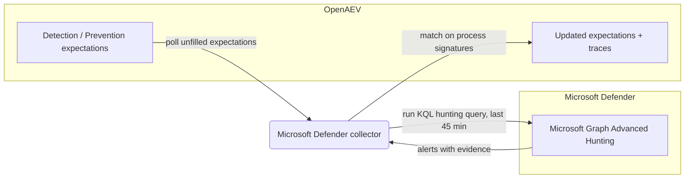

# OpenAEV Microsoft Defender Collector

The Microsoft Defender collector validates OpenAEV detection and prevention expectations against
[Microsoft Defender for Endpoint](https://www.microsoft.com/en-us/security/business/endpoint-security/microsoft-defender-endpoint),
Microsoft's endpoint detection and response (EDR) platform. After OpenAEV agents execute attacks, the collector runs a
Microsoft Graph Advanced Hunting query and correlates the resulting alerts with the related injects to confirm whether
the activity was detected and/or prevented.

## Table of Contents

- [OpenAEV Microsoft Defender Collector](#openaev-microsoft-defender-collector)
  - [Table of Contents](#table-of-contents)
  - [Introduction](#introduction)
  - [Requirements](#requirements)
  - [Configuration variables](#configuration-variables)
    - [OpenAEV environment variables](#openaev-environment-variables)
    - [Base collector environment variables](#base-collector-environment-variables)
    - [Microsoft Defender collector environment variables](#microsoft-defender-collector-environment-variables)
  - [Deployment](#deployment)
    - [Docker Deployment](#docker-deployment)
    - [Manual Deployment](#manual-deployment)
  - [Usage](#usage)
  - [Behavior](#behavior)
  - [Required permissions and API endpoints](#required-permissions-and-api-endpoints)
  - [Debugging](#debugging)
  - [Additional information](#additional-information)

## Introduction

OpenAEV (Breach and Attack Simulation) raises "expectations" each time it executes an inject (a simulated attack) on an
endpoint: a DETECTION expectation (the security product should raise an alert) and/or a PREVENTION expectation (the
security product should block the action). This collector connects to Microsoft Defender for Endpoint through the
Microsoft Graph API, registers a `SecurityPlatform` of type `EDR`, and periodically reconciles those expectations with
the alerts produced by Defender, marking each expectation as detected/not detected and prevented/not prevented and
attaching a trace that links back to the originating Defender alert.

## Requirements

- OpenAEV Platform >= 1.19.0
- A Microsoft Defender for Endpoint subscription onboarded to the Microsoft 365 Defender portal
- An Entra ID (Azure AD) application registration with the Microsoft Graph `ThreatHunting.Read.All` application
  permission (admin consent granted), and its tenant ID, client ID, and client secret
- For a manual (non-Docker) deployment: Python >= 3.11 and [Poetry](https://python-poetry.org/) >= 2.1

## Configuration variables

The collector is configured either through environment variables (recommended, read from `docker-compose.yml` / the
`.env` file for a Docker deployment) or through a `config.yml` file (for a manual deployment). Copy the provided
`.env.sample` / `config.yml.sample` and fill in the values flagged with `ChangeMe`.

### OpenAEV environment variables

| Parameter         | config.yml          | Docker environment variable | Mandatory | Description                                                                              |
|-------------------|---------------------|-----------------------------|-----------|------------------------------------------------------------------------------------------|
| OpenAEV URL       | `openaev.url`       | `OPENAEV_URL`               | Yes       | The URL of the OpenAEV platform. Must be reachable from where the collector runs.        |
| OpenAEV Token     | `openaev.token`     | `OPENAEV_TOKEN`             | Yes       | The administrator token of the OpenAEV platform.                                         |
| OpenAEV Tenant ID | `openaev.tenant_id` | `OPENAEV_TENANT_ID`         | No        | Tenant identifier for multi-tenant deployments. When set, it must be a valid UUID.       |

### Base collector environment variables

| Parameter        | config.yml            | Docker environment variable | Default            | Mandatory | Description                                                                                  |
|------------------|-----------------------|-----------------------------|--------------------|-----------|----------------------------------------------------------------------------------------------|
| Collector ID     | `collector.id`        | `COLLECTOR_ID`              | /                  | Yes       | A unique `UUIDv4` identifier for this collector instance.                                     |
| Collector Name   | `collector.name`      | `COLLECTOR_NAME`            | Microsoft Defender | No        | The name of the collector as shown in OpenAEV.                                                |
| Collector Period | `collector.period`    | `COLLECTOR_PERIOD`          | PT1M               | No        | Interval between two runs, as an ISO 8601 duration (e.g. `PT1M` = 1 minute).                  |
| Log Level        | `collector.log_level` | `COLLECTOR_LOG_LEVEL`       | error              | No        | Verbosity of the logs. One of `debug`, `info`, `warn`, `error`.                               |
| Platform         | `collector.platform`  | `COLLECTOR_PLATFORM`        | EDR                | No        | The `SecurityPlatform` type registered in OpenAEV. One of `EDR`, `XDR`, `SIEM`, `SOAR`, `NDR`, `ISPM`. |

### Microsoft Defender collector environment variables

| Parameter     | config.yml                                   | Docker environment variable                  | Default | Mandatory | Description                                                          |
|---------------|----------------------------------------------|----------------------------------------------|---------|-----------|---------------------------------------------------------------------|
| Tenant ID     | `collector.microsoft_defender_tenant_id`     | `COLLECTOR_MICROSOFT_DEFENDER_TENANT_ID`     | /       | Yes       | The Entra ID (Azure AD) tenant ID of the Defender application.      |
| Client ID     | `collector.microsoft_defender_client_id`     | `COLLECTOR_MICROSOFT_DEFENDER_CLIENT_ID`     | /       | Yes       | The Entra ID application (client) ID.                               |
| Client Secret | `collector.microsoft_defender_client_secret` | `COLLECTOR_MICROSOFT_DEFENDER_CLIENT_SECRET` | /       | Yes       | The Entra ID application client secret.                             |

## Deployment

### Docker Deployment

Build the Docker image (or use the published `openaev/collector-microsoft-defender` image):

```shell
docker build . -t openaev/collector-microsoft-defender:latest
```

Create a `.env` file from `.env.sample` and fill in your values, then start the collector with the provided
`docker-compose.yml` (which reads those variables):

```shell
docker compose up -d
```

### Manual Deployment

Create a `config.yml` file from `config.yml.sample` and fill in your values, then install and run the collector:

```shell
poetry install --extras prod
poetry run python -m microsoft_defender.openaev_microsoft_defender
```

> For local development against a checkout of [client-python](https://github.com/OpenAEV-Platform/client-python)
> (cloned next to this repository), use `poetry install --extras dev` instead.

> Note (Windows hosts): the Microsoft Graph SDK for Python is a large package and the initial install may take a few
> minutes. If you hit a `Could not install packages due to an OSError`, enable long paths (see
> [Enable Long Paths in Windows](https://learn.microsoft.com/en-us/windows/win32/fileio/maximum-file-path-limitation?tabs=powershell#enable-long-paths-in-windows-10-version-1607-and-later)).

## Usage

Once started, the collector registers itself (and its `SecurityPlatform`) in OpenAEV and then runs automatically every
`COLLECTOR_PERIOD`. No manual interaction is required: as soon as injects produce expectations bound to this collector,
they are reconciled on the next run.

## Behavior



On each run, the collector:

1. Fetches the unfilled expectations assigned to this collector from OpenAEV.
2. Runs a Microsoft Graph Advanced Hunting (`runHuntingQuery`) KQL query that joins alert evidence with the device
   process tree and keeps only alerts whose process tree contains an `oaev-implant-*` ancestor, looking back 45 minutes.
3. Matches alerts to expectations using these signatures: `parent_process_name` (fuzzy, score 95), `process_name`
   (simple), `command_line` (fuzzy, score 60), `file_name` (fuzzy, score 80), `hostname` (fuzzy, score 80), and
   `ipv4_address` / `ipv6_address` (fuzzy, score 80). Values are compared in lowercase because the query lowercases file
   names.
4. Updates each matched expectation:
   - DETECTION: marked `Detected` when a matching alert is found, otherwise `Not Detected` once the expectation expires.
   - PREVENTION: marked `Prevented` when the matching evidence `LastRemediationState` is one of `Prevented`, `Blocked`,
     or `Remediated`, otherwise `Not Prevented`.
5. Creates an expectation trace for each match, including the alert title and a direct link to the alert in the Defender
   portal (`https://security.microsoft.com/alerts/<AlertId>`).

Expectations that remain unmatched after the 45-minute window are marked as failed (`Not Detected` / `Not Prevented`).

## Required permissions and API endpoints

- Required permission: an Entra ID (Azure AD) application with the Microsoft Graph **`ThreatHunting.Read.All`**
  application permission, with admin consent granted.
- API endpoints used:
  - `POST https://login.microsoftonline.com/<tenant_id>/oauth2/v2.0/token` (OAuth2 client-credentials authentication)
  - `POST /security/runHuntingQuery` (Microsoft Graph Advanced Hunting)
- Reference: [Microsoft Graph permissions reference](https://learn.microsoft.com/en-us/graph/permissions-reference) and
  [runHuntingQuery](https://learn.microsoft.com/en-us/graph/api/security-security-runhuntingquery).

## Debugging

Set `COLLECTOR_LOG_LEVEL=debug` to get verbose logs, including expectation polling, the number of alerts returned by the
hunting query, and the matching decisions. You can copy/paste the KQL query into the Advanced Hunting sandbox at
`https://security.microsoft.com/v2/advanced-hunting` to inspect the raw results. A common cause of "nothing detected" is
a missing admin consent on `ThreatHunting.Read.All` or a wrong tenant ID / client secret.

## Additional information

- The collector only reads recent activity (a 45-minute sliding window); it is designed to validate expectations shortly
  after an inject runs, not to back-fill historical data.
- Only `File` and `Process` evidence types are considered when correlating alerts with the implant process tree.
- The required Microsoft permissions and endpoints reflect the current implementation. Microsoft may change its API over
  time, so always confirm against the official documentation before deploying.
