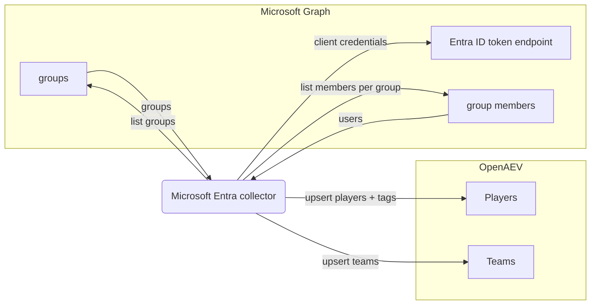

# OpenAEV Microsoft Entra Collector

The Microsoft Entra collector imports your [Microsoft Entra ID](https://www.microsoft.com/security/business/microsoft-entra)
directory into OpenAEV as players and teams. On each run it queries Microsoft Graph for groups and their members and
creates or updates the matching OpenAEV teams and players (users), so your simulation audience stays aligned with your
directory. This collector imports identity data only and does not validate detection or prevention expectations.

## Table of Contents

- [OpenAEV Microsoft Entra Collector](#openaev-microsoft-entra-collector)
  - [Table of Contents](#table-of-contents)
  - [Introduction](#introduction)
  - [Requirements](#requirements)
  - [Configuration variables](#configuration-variables)
    - [OpenAEV environment variables](#openaev-environment-variables)
    - [Base collector environment variables](#base-collector-environment-variables)
    - [Microsoft Entra collector environment variables](#microsoft-entra-collector-environment-variables)
  - [Deployment](#deployment)
    - [Docker Deployment](#docker-deployment)
    - [Manual Deployment](#manual-deployment)
  - [Usage](#usage)
  - [Behavior](#behavior)
  - [Required permissions and API endpoints](#required-permissions-and-api-endpoints)
  - [Debugging](#debugging)
  - [Additional information](#additional-information)

## Introduction

OpenAEV (Breach and Attack Simulation) runs social-engineering and awareness simulations against players, who can be
organized into teams. To build that audience, OpenAEV needs to know your people and their group memberships. This
collector authenticates to Microsoft Entra ID with an application (client credentials), calls the Microsoft Graph API to
read groups and their members, and registers them in OpenAEV as teams and players (users). It performs a full directory
synchronization on every run: teams and players are upserted (created or updated) so existing records are kept current.

## Requirements

- OpenAEV Platform >= 1.19.0
- A Microsoft Entra ID tenant
- A Microsoft Entra ID application registration (client ID + client secret) granted the `Directory.Read.All` application
  permission (with admin consent)
- For a manual (non-Docker) deployment: Python >= 3.11 and [Poetry](https://python-poetry.org/) >= 2.1

## Configuration variables

The collector is configured either through environment variables (recommended, read from `docker-compose.yml` / the
`.env` file for a Docker deployment) or through a `config.yml` file (for a manual deployment). Copy the provided
`.env.sample` / `config.yml.sample` and fill in the values flagged with `ChangeMe`.

### OpenAEV environment variables

| Parameter         | config.yml          | Docker environment variable | Mandatory | Description                                                                         |
|-------------------|---------------------|-----------------------------|-----------|-------------------------------------------------------------------------------------|
| OpenAEV URL       | `openaev.url`       | `OPENAEV_URL`               | Yes       | The URL of the OpenAEV platform. Must be reachable from where the collector runs.   |
| OpenAEV Token     | `openaev.token`     | `OPENAEV_TOKEN`             | Yes       | The administrator token of the OpenAEV platform.                                    |
| OpenAEV Tenant ID | `openaev.tenant_id` | `OPENAEV_TENANT_ID`         | No        | Tenant identifier for multi-tenant deployments. When set, it must be a valid UUID.  |

### Base collector environment variables

| Parameter        | config.yml            | Docker environment variable | Default          | Mandatory | Description                                                                  |
|------------------|-----------------------|-----------------------------|------------------|-----------|------------------------------------------------------------------------------|
| Collector ID     | `collector.id`        | `COLLECTOR_ID`              | /                | Yes       | A unique `UUIDv4` identifier for this collector instance.                     |
| Collector Name   | `collector.name`      | `COLLECTOR_NAME`            | Microsoft Entra  | No        | The name of the collector as shown in OpenAEV.                                |
| Collector Period | `collector.period`    | `COLLECTOR_PERIOD`          | PT1H             | No        | Interval between two runs, as an ISO 8601 duration (e.g. `PT1H` = 1 hour).    |
| Log Level        | `collector.log_level` | `COLLECTOR_LOG_LEVEL`       | error            | No        | Verbosity of the logs. One of `debug`, `info`, `warn`, `error`.              |

### Microsoft Entra collector environment variables

| Parameter           | config.yml                             | Docker environment variable              | Default | Mandatory | Description                                                                              |
|---------------------|----------------------------------------|------------------------------------------|---------|-----------|-----------------------------------------------------------------------------------------|
| Entra Tenant ID     | `collector.microsoft_entra_tenant_id`     | `COLLECTOR_MICROSOFT_ENTRA_TENANT_ID`     | /       | Yes       | The Microsoft Entra ID (Azure AD) tenant ID used for authentication.                     |
| Entra Client ID     | `collector.microsoft_entra_client_id`     | `COLLECTOR_MICROSOFT_ENTRA_CLIENT_ID`     | /       | Yes       | The application (client) ID of the Entra ID app registration.                             |
| Entra Client Secret | `collector.microsoft_entra_client_secret` | `COLLECTOR_MICROSOFT_ENTRA_CLIENT_SECRET` | /       | Yes       | The client secret of the Entra ID app registration.                                      |
| Include External    | `collector.include_external`              | `COLLECTOR_INCLUDE_EXTERNAL`              | false   | No        | Whether guest users (those with `#EXT#` in their user principal name) are imported.       |

## Deployment

### Docker Deployment

Build the Docker image (or use the published `openaev/collector-microsoft-entra` image):

```shell
docker build . -t openaev/collector-microsoft-entra:latest
```

Create a `.env` file from `.env.sample` and fill in your values, then start the collector with the provided
`docker-compose.yml` (which reads those variables):

```shell
docker compose up -d
```

### Manual Deployment

Create a `config.yml` file from `config.yml.sample` and fill in your values, then install and run the collector:

```shell
poetry install --extras prod
poetry run python -m microsoft_entra.openaev_microsoft_entra
```

> For local development against a checkout of [client-python](https://github.com/OpenAEV-Platform/client-python)
> (cloned next to this repository), use `poetry install --extras dev` instead.

## Usage

Once started, the collector registers itself in OpenAEV and then runs automatically every `COLLECTOR_PERIOD`. No manual
interaction is required: on each run it performs a full directory synchronization of your Microsoft Entra ID groups and
members into OpenAEV teams and players. Because the period defaults to one hour (`PT1H`), directory changes are reflected
at the next scheduled run.

## Behavior



On each run, the collector:

1. Authenticates to Microsoft Entra ID with the application client credentials (`ClientSecretCredential`) and builds a
   Microsoft Graph client scoped to `https://graph.microsoft.com/.default`.
2. Lists all groups (`/groups`, paginated) and upserts each as an OpenAEV team.
3. For each group, lists its members (`/groups/{id}/members`, paginated) and keeps only user objects
   (`#microsoft.graph.user`) that have a mail address.
4. Applies the `include_external` toggle: guest users (those with `#EXT#` in their user principal name) are imported only
   when `include_external` is `true`.
5. Upserts each retained user as an OpenAEV player (email, first name, last name) attached to its team, and attaches tags
   derived from the directory data (source, user type internal/external, department and job title).

The synchronization is incremental from the platform's point of view: teams and players are created or updated
(upserted), so a record seen in a previous run is refreshed rather than duplicated.

## Required permissions and API endpoints

- Authentication: Microsoft Entra ID application (client credentials) - tenant ID, application (client) ID and client
  secret.
- Required Microsoft Graph application permission (admin consent required): `Directory.Read.All`, which allows reading
  groups, group members and user profiles.
- API endpoints used:
  - `POST https://login.microsoftonline.com/{tenant_id}/oauth2/v2.0/token` (OAuth2 client-credentials authentication)
  - `GET /groups` (list groups)
  - `GET /groups/{id}/members` (list group members)
- Reference: [Microsoft Graph - List groups](https://learn.microsoft.com/en-us/graph/api/group-list)

## Debugging

Set `COLLECTOR_LOG_LEVEL=debug` to get verbose logs, including each team and player upsert. Common issues:

- Authentication failures: confirm the tenant ID, client ID and client secret, and that the secret has not expired.
- No players imported: confirm that admin consent was granted for `Directory.Read.All`, and remember that only members
  of a group are imported. Guest users are skipped unless `include_external` is set to `true`.

## Additional information

- The collector performs a full directory synchronization on every run; it does not delete OpenAEV teams or players when
  a group or user disappears from Microsoft Entra ID.
- The required Microsoft Graph permissions and endpoints reflect the current implementation. Microsoft may change its
  API over time, so always confirm against the official documentation before deploying.
