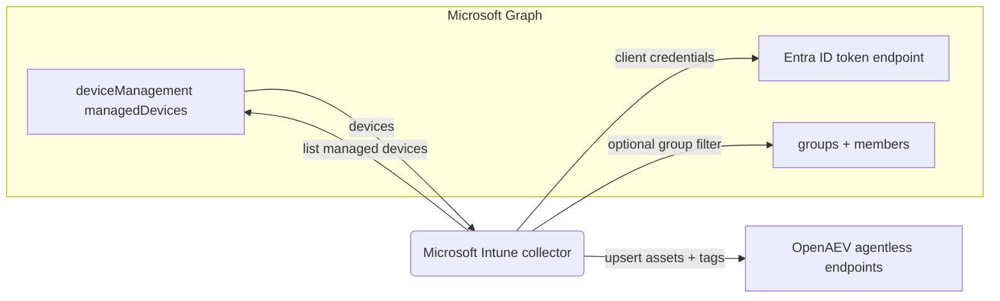

# OpenAEV Microsoft Intune Collector

The Microsoft Intune collector imports your [Microsoft Intune](https://www.microsoft.com/security/business/microsoft-intune)
managed devices into OpenAEV as agentless endpoints. On each run it queries Microsoft Graph for the devices enrolled in
Intune and creates or updates a matching OpenAEV asset (endpoint) for every device, so your simulation scope stays
aligned with your managed device inventory. This collector imports inventory only and does not validate detection or
prevention expectations.

## Table of Contents

- [OpenAEV Microsoft Intune Collector](#openaev-microsoft-intune-collector)
  - [Table of Contents](#table-of-contents)
  - [Introduction](#introduction)
  - [Requirements](#requirements)
  - [Configuration variables](#configuration-variables)
    - [OpenAEV environment variables](#openaev-environment-variables)
    - [Base collector environment variables](#base-collector-environment-variables)
    - [Microsoft Intune collector environment variables](#microsoft-intune-collector-environment-variables)
  - [Deployment](#deployment)
    - [Docker Deployment](#docker-deployment)
    - [Manual Deployment](#manual-deployment)
  - [Usage](#usage)
  - [Behavior](#behavior)
  - [Required permissions and API endpoints](#required-permissions-and-api-endpoints)
  - [Debugging](#debugging)
  - [Additional information](#additional-information)

## Introduction

OpenAEV (Breach and Attack Simulation) executes injects (simulated attacks) against assets. To run those simulations
against your managed fleet, OpenAEV needs to know which devices exist. This collector authenticates to Microsoft Entra ID
with an application (client credentials), calls the Microsoft Graph API to enumerate the devices managed by Intune, and
registers each one as an agentless endpoint in OpenAEV (name, hostname, platform, architecture, MAC addresses and tags).
It performs a full inventory synchronization on every run: devices are upserted (created or updated) so existing assets
are kept current.

## Requirements

- OpenAEV Platform >= 1.19.0
- A Microsoft Intune tenant with managed devices
- A Microsoft Entra ID application registration (client ID + client secret) granted the
  `DeviceManagementManagedDevices.Read.All` application permission (with admin consent)
- For a manual (non-Docker) deployment: Python >= 3.11 and [Poetry](https://python-poetry.org/) >= 2.1

## Configuration variables

The collector is configured either through environment variables (recommended, read from `docker-compose.yml` / the
`.env` file for a Docker deployment) or through a `config.yml` file (for a manual deployment). Copy the provided
`.env.sample` / `config.yml.sample` and fill in the values flagged with `ChangeMe`.

### OpenAEV environment variables

| Parameter         | config.yml          | Docker environment variable | Mandatory | Description                                                                         |
|-------------------|---------------------|-----------------------------|-----------|-------------------------------------------------------------------------------------|
| OpenAEV URL       | `openaev.url`       | `OPENAEV_URL`               | Yes       | The URL of the OpenAEV platform. Must be reachable from where the collector runs.   |
| OpenAEV Token     | `openaev.token`     | `OPENAEV_TOKEN`             | Yes       | The administrator token of the OpenAEV platform.                                    |
| OpenAEV Tenant ID | `openaev.tenant_id` | `OPENAEV_TENANT_ID`         | No        | Tenant identifier for multi-tenant deployments. When set, it must be a valid UUID.  |

### Base collector environment variables

| Parameter        | config.yml            | Docker environment variable | Default           | Mandatory | Description                                                                  |
|------------------|-----------------------|-----------------------------|-------------------|-----------|------------------------------------------------------------------------------|
| Collector ID     | `collector.id`        | `COLLECTOR_ID`              | /                 | Yes       | A unique `UUIDv4` identifier for this collector instance.                     |
| Collector Name   | `collector.name`      | `COLLECTOR_NAME`            | Microsoft Intune  | No        | The name of the collector as shown in OpenAEV.                                |
| Collector Period | `collector.period`    | `COLLECTOR_PERIOD`          | PT1H              | No        | Interval between two runs, as an ISO 8601 duration (e.g. `PT1H` = 1 hour).    |
| Log Level        | `collector.log_level` | `COLLECTOR_LOG_LEVEL`       | error             | No        | Verbosity of the logs. One of `debug`, `info`, `warn`, `error`.              |

### Microsoft Intune collector environment variables

| Parameter            | config.yml                              | Docker environment variable               | Default | Mandatory | Description                                                                                                          |
|----------------------|-----------------------------------------|-------------------------------------------|---------|-----------|--------------------------------------------------------------------------------------------------------------------|
| Intune Tenant ID     | `collector.microsoft_intune_tenant_id`     | `COLLECTOR_MICROSOFT_INTUNE_TENANT_ID`     | /       | Yes       | The Microsoft Entra ID (Azure AD) tenant ID used for authentication.                                                |
| Intune Client ID     | `collector.microsoft_intune_client_id`     | `COLLECTOR_MICROSOFT_INTUNE_CLIENT_ID`     | /       | Yes       | The application (client) ID of the Entra ID app registration.                                                        |
| Intune Client Secret | `collector.microsoft_intune_client_secret` | `COLLECTOR_MICROSOFT_INTUNE_CLIENT_SECRET` | /       | Yes       | The client secret of the Entra ID app registration.                                                                 |
| Intune Device Filter | `collector.microsoft_intune_device_filter` | `COLLECTOR_MICROSOFT_INTUNE_DEVICE_FILTER` | /       | No        | Optional OData `$filter` applied to managed devices, e.g. `operatingSystem eq 'Windows'`. Leave empty for all devices. |
| Intune Device Groups | `collector.microsoft_intune_device_groups` | `COLLECTOR_MICROSOFT_INTUNE_DEVICE_GROUPS` | /       | No        | Optional comma-separated list of device group names or IDs to restrict the import. Leave empty for all devices.      |

## Deployment

### Docker Deployment

Build the Docker image (or use the published `openaev/collector-microsoft-intune` image):

```shell
docker build . -t openaev/collector-microsoft-intune:latest
```

Create a `.env` file from `.env.sample` and fill in your values, then start the collector with the provided
`docker-compose.yml` (which reads those variables):

```shell
docker compose up -d
```

### Manual Deployment

Create a `config.yml` file from `config.yml.sample` and fill in your values, then install and run the collector:

```shell
poetry install --extras prod
poetry run python -m microsoft_intune.openaev_microsoft_intune
```

> For local development against a checkout of [client-python](https://github.com/OpenAEV-Platform/client-python)
> (cloned next to this repository), use `poetry install --extras dev` instead.

## Usage

Once started, the collector registers itself in OpenAEV and then runs automatically every `COLLECTOR_PERIOD`. No manual
interaction is required: on each run it performs a full inventory synchronization of your Intune managed devices into
OpenAEV assets. Because the period defaults to one hour (`PT1H`), newly enrolled or removed devices are reflected at the
next scheduled run.

## Behavior



On each run, the collector:

1. Acquires an access token from Microsoft Entra ID using the application client credentials (MSAL), scoped to Microsoft
   Graph (`https://graph.microsoft.com/.default`).
2. When `microsoft_intune_device_groups` is set, resolves those groups (by display name or ID) through
   `/groups`, reads their device members through `/groups/{id}/members`, and keeps only devices in those groups.
3. Lists managed devices through `/deviceManagement/managedDevices` (paginated), applying the optional
   `microsoft_intune_device_filter` OData filter when provided.
4. Derives the platform (`Windows` / `Android` / `iOS` / `MacOS` / `Linux` / `Generic`) and an architecture hint
   (`arm64` / `x86_64`), and collects the Wi-Fi and Ethernet MAC addresses.
5. Upserts each device as an OpenAEV agentless endpoint, using the Intune device ID as the external reference, mapping
   mobile platforms (`iOS` / `Android`) to the `MOBILE_DEVICE` asset category and everything else to `HOST`, and adding
   a description built from model, manufacturer, compliance, serial number and enrollment / last-sync dates.
6. Creates and attaches tags derived from the device metadata (source, compliance state, management agent, enrollment
   type, device category, manufacturer, model, OS, and encryption / supervision flags).

The synchronization is incremental from the platform's point of view: assets are created or updated (upserted), so a
device seen in a previous run is refreshed rather than duplicated.

## Required permissions and API endpoints

- Authentication: Microsoft Entra ID application (client credentials) - tenant ID, application (client) ID and client
  secret.
- Required Microsoft Graph application permissions (admin consent required):
  - `DeviceManagementManagedDevices.Read.All` - read the Intune managed devices (always required).
  - When device-group filtering is used (`microsoft_intune_device_groups`), the application additionally needs to read
    groups and their members, for example `GroupMember.Read.All` (or `Group.Read.All` / `Directory.Read.All`).
- API endpoints used:
  - `POST https://login.microsoftonline.com/{tenant_id}/oauth2/v2.0/token` (OAuth2 client-credentials authentication via
    MSAL)
  - `GET /deviceManagement/managedDevices` (list managed devices)
  - `GET /groups` (only when device-group filtering is used)
  - `GET /groups/{id}/members` (only when device-group filtering is used)
- Reference: [Microsoft Graph - List managedDevices](https://learn.microsoft.com/en-us/graph/api/intune-devices-manageddevice-list)

## Debugging

Set `COLLECTOR_LOG_LEVEL=debug` to get verbose logs, including the authentication result, the number of devices found,
and each endpoint upsert. Common issues:

- Authentication failures: confirm the tenant ID, client ID and client secret, and that the secret has not expired.
- No devices imported: confirm that admin consent was granted for `DeviceManagementManagedDevices.Read.All`, that the
  optional `microsoft_intune_device_filter` is a valid OData filter, and that any `microsoft_intune_device_groups`
  values match existing group names or IDs.

## Additional information

- The collector performs a full inventory synchronization on every run; it does not delete OpenAEV assets when a device
  disappears from Intune.
- The required Microsoft Graph permissions and endpoints reflect the current implementation. Microsoft may change its
  API over time, so always confirm against the official documentation before deploying.
