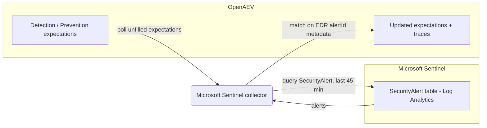

# OpenAEV Microsoft Sentinel Collector

The Microsoft Sentinel collector validates OpenAEV detection and prevention expectations against
[Microsoft Sentinel](https://www.microsoft.com/en-us/security/business/siem-and-xdr/microsoft-sentinel), Microsoft's
cloud-native SIEM built on Azure Log Analytics. After OpenAEV agents execute attacks, the collector queries the
`SecurityAlert` table and correlates the resulting alerts with the related injects, using the alert identifiers that
linked EDR collectors recorded for the same activity.

## Table of Contents

- [OpenAEV Microsoft Sentinel Collector](#openaev-microsoft-sentinel-collector)
  - [Table of Contents](#table-of-contents)
  - [Introduction](#introduction)
  - [Requirements](#requirements)
  - [Configuration variables](#configuration-variables)
    - [OpenAEV environment variables](#openaev-environment-variables)
    - [Base collector environment variables](#base-collector-environment-variables)
    - [Microsoft Sentinel collector environment variables](#microsoft-sentinel-collector-environment-variables)
  - [Deployment](#deployment)
    - [Docker Deployment](#docker-deployment)
    - [Manual Deployment](#manual-deployment)
  - [Usage](#usage)
  - [Behavior](#behavior)
  - [Required permissions and API endpoints](#required-permissions-and-api-endpoints)
  - [Debugging](#debugging)
  - [Additional information](#additional-information)

## Introduction

OpenAEV (Breach and Attack Simulation) raises "expectations" each time it executes an inject (a simulated attack) on an
endpoint: a DETECTION expectation (the security product should raise an alert) and/or a PREVENTION expectation (the
security product should block the action). This collector connects to a Microsoft Sentinel workspace through the Azure
Log Analytics query API, registers a `SecurityPlatform` of type `SIEM`, and periodically reconciles those expectations
with the alerts ingested into the `SecurityAlert` table, marking each expectation as detected/not detected and
prevented/not prevented and attaching a trace that links back to the originating Sentinel alert.

This collector relies on the alert identifiers (`alertId`) recorded by the linked EDR collectors (for example the
Microsoft Defender collector). It must therefore run alongside at least one EDR collector that reconciles the same
activity.

## Requirements

- OpenAEV Platform >= 1.19.0
- A Microsoft Sentinel workspace backed by Azure Log Analytics
- An Entra ID (Azure AD) application registration with the Log Analytics API `Data.Read` permission, plus its tenant ID,
  client ID, client secret, the target workspace ID, subscription ID, and resource group
- At least one OpenAEV EDR collector (for example Microsoft Defender) deployed and reconciling expectations; Sentinel
  matching uses the `alertId` metadata those collectors attach
- For a manual (non-Docker) deployment: Python >= 3.11 and [Poetry](https://python-poetry.org/) >= 2.1

## Configuration variables

The collector is configured either through environment variables (recommended, read from `docker-compose.yml` / the
`.env` file for a Docker deployment) or through a `config.yml` file (for a manual deployment). Copy the provided
`.env.sample` / `config.yml.sample` and fill in the values flagged with `ChangeMe`.

### OpenAEV environment variables

| Parameter         | config.yml          | Docker environment variable | Mandatory | Description                                                                              |
|-------------------|---------------------|-----------------------------|-----------|------------------------------------------------------------------------------------------|
| OpenAEV URL       | `openaev.url`       | `OPENAEV_URL`               | Yes       | The URL of the OpenAEV platform. Must be reachable from where the collector runs.        |
| OpenAEV Token     | `openaev.token`     | `OPENAEV_TOKEN`             | Yes       | The administrator token of the OpenAEV platform.                                         |
| OpenAEV Tenant ID | `openaev.tenant_id` | `OPENAEV_TENANT_ID`         | No        | Tenant identifier for multi-tenant deployments. When set, it must be a valid UUID.       |

### Base collector environment variables

| Parameter        | config.yml            | Docker environment variable | Default            | Mandatory | Description                                                                                  |
|------------------|-----------------------|-----------------------------|--------------------|-----------|----------------------------------------------------------------------------------------------|
| Collector ID     | `collector.id`        | `COLLECTOR_ID`              | /                  | Yes       | A unique `UUIDv4` identifier for this collector instance.                                     |
| Collector Name   | `collector.name`      | `COLLECTOR_NAME`            | Microsoft Sentinel | No        | The name of the collector as shown in OpenAEV.                                                |
| Collector Period | `collector.period`    | `COLLECTOR_PERIOD`          | PT1M               | No        | Interval between two runs, as an ISO 8601 duration (e.g. `PT1M` = 1 minute).                  |
| Log Level        | `collector.log_level` | `COLLECTOR_LOG_LEVEL`       | error              | No        | Verbosity of the logs. One of `debug`, `info`, `warn`, `error`.                               |
| Platform         | `collector.platform`  | `COLLECTOR_PLATFORM`        | SIEM               | No        | The `SecurityPlatform` type registered in OpenAEV. One of `EDR`, `XDR`, `SIEM`, `SOAR`, `NDR`, `ISPM`. |

### Microsoft Sentinel collector environment variables

| Parameter      | config.yml                                     | Docker environment variable                    | Default | Mandatory | Description                                                                                          |
|----------------|------------------------------------------------|------------------------------------------------|---------|-----------|------------------------------------------------------------------------------------------------------|
| Tenant ID      | `collector.microsoft_sentinel_tenant_id`       | `COLLECTOR_MICROSOFT_SENTINEL_TENANT_ID`       | /       | Yes       | The Entra ID (Azure AD) tenant ID of the Sentinel application.                                       |
| Client ID      | `collector.microsoft_sentinel_client_id`       | `COLLECTOR_MICROSOFT_SENTINEL_CLIENT_ID`       | /       | Yes       | The Entra ID application (client) ID.                                                                |
| Client Secret  | `collector.microsoft_sentinel_client_secret`   | `COLLECTOR_MICROSOFT_SENTINEL_CLIENT_SECRET`   | /       | Yes       | The Entra ID application client secret.                                                              |
| Subscription ID| `collector.microsoft_sentinel_subscription_id` | `COLLECTOR_MICROSOFT_SENTINEL_SUBSCRIPTION_ID` | /       | Yes       | The Azure subscription ID containing the Sentinel workspace.                                         |
| Workspace ID   | `collector.microsoft_sentinel_workspace_id`    | `COLLECTOR_MICROSOFT_SENTINEL_WORKSPACE_ID`    | /       | Yes       | The Log Analytics workspace ID queried for alerts.                                                  |
| Resource Group | `collector.microsoft_sentinel_resource_group`  | `COLLECTOR_MICROSOFT_SENTINEL_RESOURCE_GROUP`  | /       | Yes       | The Azure resource group containing the Sentinel workspace.                                          |
| EDR Collectors | `collector.microsoft_sentinel_edr_collectors`  | `COLLECTOR_MICROSOFT_SENTINEL_EDR_COLLECTORS`  | /       | Yes       | Comma-separated list of OpenAEV EDR collector UUIDs whose `alertId` metadata feeds Sentinel matching. |

## Deployment

### Docker Deployment

Build the Docker image (or use the published `openaev/collector-microsoft-sentinel` image):

```shell
docker build . -t openaev/collector-microsoft-sentinel:latest
```

Create a `.env` file from `.env.sample` and fill in your values, then start the collector with the provided
`docker-compose.yml` (which reads those variables):

```shell
docker compose up -d
```

### Manual Deployment

Create a `config.yml` file from `config.yml.sample` and fill in your values, then install and run the collector:

```shell
poetry install --extras prod
poetry run python -m microsoft_sentinel.openaev_microsoft_sentinel
```

> For local development against a checkout of [client-python](https://github.com/OpenAEV-Platform/client-python)
> (cloned next to this repository), use `poetry install --extras dev` instead.

## Usage

Once started, the collector registers itself (and its `SecurityPlatform`) in OpenAEV and then runs automatically every
`COLLECTOR_PERIOD`. No manual interaction is required: as soon as injects produce expectations bound to this collector,
they are reconciled on the next run. Matching depends on the linked EDR collectors having already recorded their
`alertId` for the same activity.

## Behavior



On each run, the collector:

1. Fetches the unfilled expectations assigned to this collector from OpenAEV.
2. Queries the Log Analytics workspace with the KQL statement `SecurityAlert | sort by TimeGenerated desc | take 200`.
3. For each expectation, looks up an existing result produced by one of the linked EDR collectors
   (`microsoft_sentinel_edr_collectors`) that carries an `alertId` in its metadata, then matches a Sentinel alert whose
   `AlertLink` / `ExtendedLinks` contain that `alertId`. Only alerts generated within the last 45 minutes are
   considered.
4. Updates each matched expectation:
   - DETECTION: marked `Detected` when a matching alert is found, otherwise `Not Detected` once the expectation expires.
   - PREVENTION: marked `Prevented` when the matched alert name contains one of `blocked`, `quarantine`, `remove`,
     `prevented`, otherwise `Not Prevented`.
5. Creates an expectation trace for each match, including the alert display name, link, and start time.

Expectations that remain unmatched after the 45-minute window are marked as failed (`Not Detected` / `Not Prevented`).

## Required permissions and API endpoints

- Required permission: an Entra ID (Azure AD) application with the Log Analytics API **`Data.Read`** permission
  (Application type) on the target workspace.
- API endpoints used:
  - `POST https://login.microsoftonline.com/<tenant_id>/oauth2/v2.0/token` (OAuth2 client-credentials authentication,
    scope `https://api.loganalytics.io/.default`)
  - `POST https://api.loganalytics.azure.com/v1/workspaces/<workspace_id>/query` (Log Analytics query)
- Reference: [Log Analytics API access control](https://learn.microsoft.com/en-us/azure/azure-monitor/logs/api/access-control).

## Debugging

Set `COLLECTOR_LOG_LEVEL=debug` to get verbose logs, including expectation polling, the number of alerts returned by the
query, and the matching decisions. The most common cause of "nothing detected" is a missing or mis-configured
`COLLECTOR_MICROSOFT_SENTINEL_EDR_COLLECTORS` (no linked EDR collector), or the EDR collector not having matched yet (so
there is no `alertId` metadata to correlate). Also confirm the `Data.Read` permission and the workspace ID.

## Additional information

- This collector only works when paired with at least one EDR collector (for example Microsoft Defender) whose alerts
  feed the `alertId` metadata used for correlation.
- The collector only reads recent alerts (a 45-minute sliding window); it is designed to validate expectations shortly
  after an inject runs, not to back-fill historical data.
- The required Microsoft permissions and endpoints reflect the current implementation. Microsoft may change its API over
  time, so always confirm against the official documentation before deploying.
