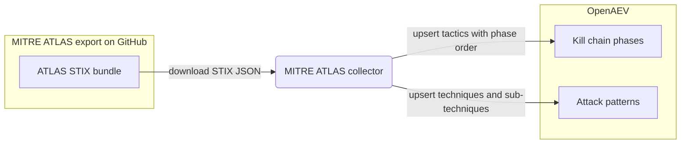

# OpenAEV MITRE ATLAS Collector

The MITRE ATLAS collector imports the [MITRE ATLAS](https://atlas.mitre.org/) knowledge base (Adversarial Threat
Landscape for Artificial-Intelligence Systems) into OpenAEV. On each run it downloads the official ATLAS STIX export
from GitHub and upserts ATLAS tactics as kill chain phases and ATLAS techniques / sub-techniques as attack patterns, so
OpenAEV can describe AI-focused adversarial behaviors against an up-to-date ATLAS taxonomy. This is an importer: it does
not register a security platform and does not validate detection or prevention expectations.

## Table of Contents

- [OpenAEV MITRE ATLAS Collector](#openaev-mitre-atlas-collector)
  - [Table of Contents](#table-of-contents)
  - [Introduction](#introduction)
  - [Requirements](#requirements)
  - [Configuration variables](#configuration-variables)
    - [OpenAEV environment variables](#openaev-environment-variables)
    - [Base collector environment variables](#base-collector-environment-variables)
  - [Deployment](#deployment)
    - [Docker Deployment](#docker-deployment)
    - [Manual Deployment](#manual-deployment)
  - [Usage](#usage)
  - [Behavior](#behavior)
  - [Data source](#data-source)
  - [Debugging](#debugging)
  - [Additional information](#additional-information)

## Introduction

OpenAEV (Breach and Attack Simulation) relies on a shared library of kill chain phases and attack patterns to describe
and organize the attacks it simulates. This collector keeps that library aligned with MITRE ATLAS, the ATT&CK-style
matrix dedicated to adversarial threats against AI / machine-learning systems. ATLAS publishes an ATT&CK-compatible
STIX representation, so on each run the collector fetches the ATLAS STIX bundle and upserts:

- ATLAS tactics as kill chain phases (kill chain name `mitre-atlas`), each tagged with a canonical phase order so the
  ATLAS matrix renders left-to-right in OpenAEV.
- ATLAS techniques and sub-techniques as attack patterns, preserving the sub-technique to parent technique relationship
  and the associated kill chain phases.

Revoked attack patterns are skipped. The collector only imports reference knowledge; it does not connect to a security
platform and does not reconcile detection / prevention expectations.

## Requirements

- A running OpenAEV platform, reachable from where the collector runs, with an administrator API token
- Outbound network access to GitHub (`raw.githubusercontent.com`) to download the ATLAS STIX bundle
- No API key or account is required (the MITRE ATLAS data is public)
- For a manual (non-Docker) deployment: Python >= 3.11 and [Poetry](https://python-poetry.org/) >= 2.1

## Configuration variables

The collector is configured either through environment variables (recommended, read from `docker-compose.yml` / the
`.env` file for a Docker deployment) or through a `config.yml` file (for a manual deployment). Copy the provided
`.env.sample` / `config.yml.sample` and fill in the values flagged with `ChangeMe`.

### OpenAEV environment variables

| Parameter         | config.yml          | Docker environment variable | Mandatory | Description                                                                        |
|-------------------|---------------------|-----------------------------|-----------|------------------------------------------------------------------------------------|
| OpenAEV URL       | `openaev.url`       | `OPENAEV_URL`               | Yes       | The URL of the OpenAEV platform. Must be reachable from where the collector runs.  |
| OpenAEV Token     | `openaev.token`     | `OPENAEV_TOKEN`             | Yes       | The administrator token of the OpenAEV platform.                                   |
| OpenAEV Tenant ID | `openaev.tenant_id` | `OPENAEV_TENANT_ID`         | No        | Tenant identifier for multi-tenant deployments. When set, it must be a valid UUID. |

### Base collector environment variables

| Parameter        | config.yml            | Docker environment variable | Default                                                                              | Mandatory | Description                                                                                                |
|------------------|-----------------------|-----------------------------|--------------------------------------------------------------------------------------|-----------|------------------------------------------------------------------------------------------------------------|
| Collector ID     | `collector.id`        | `COLLECTOR_ID`              | /                                                                                    | Yes       | A unique `UUIDv4` identifier for this collector instance.                                                   |
| Collector Name   | `collector.name`      | `COLLECTOR_NAME`            | MITRE ATLAS                                                                          | No        | The name of the collector as shown in OpenAEV.                                                             |
| Collector Period | `collector.period`    | `COLLECTOR_PERIOD`          | P7D                                                                                  | No        | Interval between two runs, as an ISO 8601 duration (e.g. `P7D` = 7 days).                                   |
| Log Level        | `collector.log_level` | `COLLECTOR_LOG_LEVEL`       | error                                                                                | No        | Verbosity of the logs. One of `debug`, `info`, `warn`, `error`.                                            |
| STIX URL         | `collector.stix_url`  | `COLLECTOR_STIX_URL`        | `https://raw.githubusercontent.com/mitre-atlas/atlas-navigator-data/main/dist/stix-atlas.json` | No | Override URL of the MITRE ATLAS STIX bundle to ingest. Defaults to the official ATLAS export when unset.    |

> Note: `STIX URL` only needs to be set when you want to ingest ATLAS from somewhere other than the official source
> (for example an air-gapped mirror). Leave it unset to use the default export.

## Deployment

### Docker Deployment

Build the Docker image (or use the published `openaev/collector-mitre-atlas` image):

```shell
docker build . -t openaev/collector-mitre-atlas:latest
```

Create a `.env` file from `.env.sample` and fill in your values, then start the collector with the provided
`docker-compose.yml` (which reads those variables):

```shell
docker compose up -d
```

### Manual Deployment

Create a `config.yml` file from `config.yml.sample` and fill in your values, then install and run the collector:

```shell
poetry install --extras prod
poetry run python -m mitre_atlas.openaev_atlas
```

> For local development against a checkout of [client-python](https://github.com/OpenAEV-Platform/client-python)
> (cloned next to this repository), use `poetry install --extras dev` instead.

## Usage

Once started, the collector registers itself in OpenAEV and then runs automatically every `COLLECTOR_PERIOD` (7 days by
default). Each run re-downloads the latest ATLAS bundle and upserts the tactics and techniques, so existing entries are
updated in place and new ones are added. No manual interaction is required.

## Behavior



On each run, the collector:

1. Downloads the ATLAS STIX bundle (the default export, or the `COLLECTOR_STIX_URL` override when set).
2. Splits the STIX objects into tactics (`x-mitre-tactic`), attack patterns (`attack-pattern`, excluding revoked ones),
   and `subtechnique-of` relationships.
3. Upserts the tactics as kill chain phases (kill chain name `mitre-atlas`), applying the canonical ATLAS matrix order.
4. Upserts the techniques and sub-techniques as attack patterns, linking each to its kill chain phases and, for
   sub-techniques, to its parent technique.

## Data source

This collector reads a public data source, so no credentials or API key are required.

- Source: the MITRE ATLAS STIX bundle published by the `mitre-atlas/atlas-navigator-data` project.
- Endpoint used (default): `GET https://raw.githubusercontent.com/mitre-atlas/atlas-navigator-data/main/dist/stix-atlas.json`
- The endpoint can be overridden with `COLLECTOR_STIX_URL` / `collector.stix_url` (for example to point at an internal mirror).
- Reference: [MITRE ATLAS](https://atlas.mitre.org/).

## Debugging

Set `COLLECTOR_LOG_LEVEL=debug` to get verbose logs, including the HTTP response headers and a snippet of the downloaded
bundle. The most common failure is the collector being unable to reach the STIX export: confirm outbound network /
proxy access to `raw.githubusercontent.com` (or to your `COLLECTOR_STIX_URL` mirror) from where the collector runs. The
collector also raises on non-2xx HTTP responses, so a wrong or unreachable `COLLECTOR_STIX_URL` will be reported in the
logs.

## Additional information

- The collector is idempotent: it upserts tactics and techniques on every run, so it is safe to run repeatedly and to
  re-run after a failure.
- ATLAS uses the same STIX layout as ATT&CK; only the kill chain name (`mitre-atlas`) and the source name differ, which
  keeps the imported taxonomy separate from the Enterprise ATT&CK one.
- The required data source reflects the current implementation. MITRE may change its export layout over time, so always
  confirm against the official documentation before deploying.
