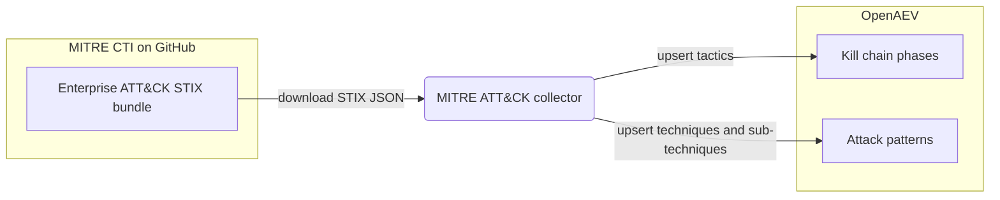

# OpenAEV MITRE ATT&CK Collector

The MITRE ATT&CK collector imports the [MITRE ATT&CK](https://attack.mitre.org/) Enterprise knowledge base into
OpenAEV. On each run it downloads the public MITRE CTI STIX bundle from GitHub and upserts ATT&CK tactics as kill chain
phases and techniques / sub-techniques as attack patterns, so OpenAEV always describes its simulated attacks against an
up-to-date ATT&CK taxonomy. This is an importer: it does not register a security platform and does not validate
detection or prevention expectations.

## Table of Contents

- [OpenAEV MITRE ATT&CK Collector](#openaev-mitre-attck-collector)
  - [Table of Contents](#table-of-contents)
  - [Introduction](#introduction)
  - [Requirements](#requirements)
  - [Configuration variables](#configuration-variables)
    - [OpenAEV environment variables](#openaev-environment-variables)
    - [Base collector environment variables](#base-collector-environment-variables)
  - [Deployment](#deployment)
    - [Docker Deployment](#docker-deployment)
    - [Manual Deployment](#manual-deployment)
  - [Usage](#usage)
  - [Behavior](#behavior)
  - [Data source](#data-source)
  - [Debugging](#debugging)
  - [Additional information](#additional-information)

## Introduction

OpenAEV (Breach and Attack Simulation) relies on a shared library of kill chain phases and attack patterns to describe
and organize the attacks it simulates. This collector keeps that library aligned with MITRE ATT&CK. On each run it
fetches the Enterprise ATT&CK STIX bundle published in the public `mitre/cti` GitHub repository and upserts:

- ATT&CK tactics as kill chain phases (kill chain name `mitre-attack`).
- ATT&CK techniques and sub-techniques as attack patterns, preserving the sub-technique to parent technique
  relationship, the associated kill chain phases, platforms, and required permissions.

Revoked attack patterns are skipped. The collector only imports reference knowledge; it does not connect to a security
platform and does not reconcile detection / prevention expectations.

## Requirements

- A running OpenAEV platform, reachable from where the collector runs, with an administrator API token
- Outbound network access to GitHub (`raw.githubusercontent.com` / `github.com`) to download the STIX bundle
- No API key or account is required (the MITRE CTI data is public)
- For a manual (non-Docker) deployment: Python >= 3.11 and [Poetry](https://python-poetry.org/) >= 2.1

## Configuration variables

The collector is configured either through environment variables (recommended, read from `docker-compose.yml` / the
`.env` file for a Docker deployment) or through a `config.yml` file (for a manual deployment). Copy the provided
`.env.sample` / `config.yml.sample` and fill in the values flagged with `ChangeMe`.

### OpenAEV environment variables

| Parameter         | config.yml          | Docker environment variable | Mandatory | Description                                                                        |
|-------------------|---------------------|-----------------------------|-----------|------------------------------------------------------------------------------------|
| OpenAEV URL       | `openaev.url`       | `OPENAEV_URL`               | Yes       | The URL of the OpenAEV platform. Must be reachable from where the collector runs.  |
| OpenAEV Token     | `openaev.token`     | `OPENAEV_TOKEN`             | Yes       | The administrator token of the OpenAEV platform.                                   |
| OpenAEV Tenant ID | `openaev.tenant_id` | `OPENAEV_TENANT_ID`         | No        | Tenant identifier for multi-tenant deployments. When set, it must be a valid UUID. |

### Base collector environment variables

| Parameter        | config.yml            | Docker environment variable | Default     | Mandatory | Description                                                                  |
|------------------|-----------------------|-----------------------------|-------------|-----------|------------------------------------------------------------------------------|
| Collector ID     | `collector.id`        | `COLLECTOR_ID`              | /           | Yes       | A unique `UUIDv4` identifier for this collector instance.                     |
| Collector Name   | `collector.name`      | `COLLECTOR_NAME`            | MITRE ATT&CK | No        | The name of the collector as shown in OpenAEV.                               |
| Collector Period | `collector.period`    | `COLLECTOR_PERIOD`          | P7D         | No        | Interval between two runs, as an ISO 8601 duration (e.g. `P7D` = 7 days).      |
| Log Level        | `collector.log_level` | `COLLECTOR_LOG_LEVEL`       | error       | No        | Verbosity of the logs. One of `debug`, `info`, `warn`, `error`.               |

## Deployment

### Docker Deployment

Build the Docker image (or use the published `openaev/collector-mitre-attack` image):

```shell
docker build . -t openaev/collector-mitre-attack:latest
```

Create a `.env` file from `.env.sample` and fill in your values, then start the collector with the provided
`docker-compose.yml` (which reads those variables):

```shell
docker compose up -d
```

### Manual Deployment

Create a `config.yml` file from `config.yml.sample` and fill in your values, then install and run the collector:

```shell
poetry install --extras prod
poetry run python -m mitre_attack.openaev_mitre
```

> For local development against a checkout of [client-python](https://github.com/OpenAEV-Platform/client-python)
> (cloned next to this repository), use `poetry install --extras dev` instead.

## Usage

Once started, the collector registers itself in OpenAEV and then runs automatically every `COLLECTOR_PERIOD` (7 days by
default). Each run re-downloads the latest Enterprise ATT&CK bundle and upserts the tactics and techniques, so existing
entries are updated in place and new ones are added. No manual interaction is required.

## Behavior



On each run, the collector:

1. Downloads the Enterprise ATT&CK STIX bundle from the public MITRE CTI GitHub repository.
2. Splits the STIX objects into tactics (`x-mitre-tactic`), attack patterns (`attack-pattern`, excluding revoked ones),
   and `subtechnique-of` relationships.
3. Upserts the tactics as kill chain phases (kill chain name `mitre-attack`).
4. Upserts the techniques and sub-techniques as attack patterns, linking each to its kill chain phases and, for
   sub-techniques, to its parent technique.

## Data source

This collector reads a public data source, so no credentials or API key are required.

- Source: the Enterprise ATT&CK STIX 2.x bundle from the MITRE CTI repository.
- Endpoint used: `GET https://github.com/mitre/cti/raw/master/enterprise-attack/enterprise-attack.json`
- Reference: [MITRE ATT&CK](https://attack.mitre.org/) and the [MITRE CTI repository](https://github.com/mitre/cti).

## Debugging

Set `COLLECTOR_LOG_LEVEL=debug` to get verbose logs, including the HTTP response headers and a snippet of the downloaded
bundle. The most common failure is the collector being unable to reach GitHub: confirm outbound network / proxy access
to `github.com` and `raw.githubusercontent.com` from where the collector runs.

## Additional information

- The collector is idempotent: it upserts tactics and techniques on every run, so it is safe to run repeatedly and to
  re-run after a failure.
- The data volume is small (a single STIX bundle), so a long `COLLECTOR_PERIOD` (the default is 7 days) is usually
  sufficient since ATT&CK is updated only a few times per year.
- The required data source reflects the current implementation. MITRE may change its repository layout over time, so
  always confirm against the official documentation before deploying.
