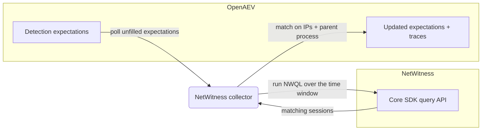

# OpenAEV NetWitness Collector

The NetWitness collector validates OpenAEV detection expectations against [NetWitness](https://www.netwitness.com/), a
network detection and response (NDR) and SIEM platform. After OpenAEV agents execute attacks, the collector queries the
NetWitness Core SDK and correlates the returned sessions with the related injects to confirm whether the activity was
detected.

## Table of Contents

- [OpenAEV NetWitness Collector](#openaev-netwitness-collector)
  - [Table of Contents](#table-of-contents)
  - [Introduction](#introduction)
  - [Requirements](#requirements)
  - [Configuration variables](#configuration-variables)
    - [OpenAEV environment variables](#openaev-environment-variables)
    - [Base collector environment variables](#base-collector-environment-variables)
    - [NetWitness collector environment variables](#netwitness-collector-environment-variables)
  - [Deployment](#deployment)
    - [Docker Deployment](#docker-deployment)
    - [Manual Deployment](#manual-deployment)
  - [Usage](#usage)
  - [Behavior](#behavior)
  - [Required permissions and API endpoints](#required-permissions-and-api-endpoints)
  - [Debugging](#debugging)
  - [Additional information](#additional-information)

## Introduction

OpenAEV (Breach and Attack Simulation) raises "expectations" each time it executes an inject (a simulated attack) on an
endpoint: a DETECTION expectation (the security product should raise an alert) and/or a PREVENTION expectation (the
security product should block the action). This collector connects to NetWitness, registers a `SecurityPlatform` of type
`SIEM`, and periodically reconciles those expectations with the sessions returned by the NetWitness Core SDK, marking
each expectation as detected/not detected and attaching a trace that links back to NetWitness Investigate. NetWitness is
a detection source, so this collector validates DETECTION expectations only; PREVENTION expectations are not supported.

## Requirements

- OpenAEV Platform >= 1.19.0
- A NetWitness Core service (Broker on port 50103 or Concentrator on port 50105) with the RESTful API reachable
- A Core service username/password (Core SDK) or a NetWitness Platform API bearer token allowed to run Core SDK queries
- For a manual (non-Docker) deployment: Python >= 3.11 and [Poetry](https://python-poetry.org/) >= 2.1

## Configuration variables

The collector is configured either through environment variables (recommended, read from `docker-compose.yml` / the
`.env` file for a Docker deployment) or through a `config.yml` file (for a manual deployment). Copy the provided
`src/.env.sample` / `src/config.yml.sample` and fill in the values flagged with `ChangeMe`.

### OpenAEV environment variables

| Parameter         | config.yml          | Docker environment variable | Mandatory | Description                                                                              |
|-------------------|---------------------|-----------------------------|-----------|------------------------------------------------------------------------------------------|
| OpenAEV URL       | `openaev.url`       | `OPENAEV_URL`               | Yes       | The URL of the OpenAEV platform. Must be reachable from where the collector runs.        |
| OpenAEV Token     | `openaev.token`     | `OPENAEV_TOKEN`             | Yes       | The administrator token of the OpenAEV platform.                                         |
| OpenAEV Tenant ID | `openaev.tenant_id` | `OPENAEV_TENANT_ID`         | No        | Tenant identifier for multi-tenant deployments. When set, it must be a valid UUID.       |

### Base collector environment variables

| Parameter        | config.yml            | Docker environment variable | Default    | Mandatory | Description                                                                                            |
|------------------|-----------------------|-----------------------------|------------|-----------|--------------------------------------------------------------------------------------------------------|
| Collector ID     | `collector.id`        | `COLLECTOR_ID`              | /          | Yes       | A unique `UUIDv4` identifier for this collector instance.                                               |
| Collector Name   | `collector.name`      | `COLLECTOR_NAME`            | NetWitness | No        | The name of the collector as shown in OpenAEV.                                                          |
| Collector Period | `collector.period`    | `COLLECTOR_PERIOD`          | PT1M       | No        | Interval between two runs, as an ISO 8601 duration (e.g. `PT1M` = 1 minute).                            |
| Log Level        | `collector.log_level` | `COLLECTOR_LOG_LEVEL`       | error      | No        | Verbosity of the logs. One of `debug`, `info`, `warn`, `error`.                                         |
| Platform         | `collector.platform`  | `COLLECTOR_PLATFORM`        | SIEM       | No        | The `SecurityPlatform` type registered in OpenAEV. One of `EDR`, `XDR`, `SIEM`, `SOAR`, `NDR`, `ISPM`.  |

### NetWitness collector environment variables

| Parameter   | config.yml             | Docker environment variable | Default                                | Mandatory   | Description                                                                              |
|-------------|------------------------|-----------------------------|----------------------------------------|-------------|-----------------------------------------------------------------------------------------|
| Base URL    | `netwitness.base_url`  | `NETWITNESS_BASE_URL`       | `https://netwitness.company.com:50103` | Yes         | Base URL of a NetWitness Core service (Broker/Concentrator).                             |
| Username    | `netwitness.username`  | `NETWITNESS_USERNAME`       | /                                      | Conditional | Username for HTTP basic authentication to the Core SDK.                                  |
| Password    | `netwitness.password`  | `NETWITNESS_PASSWORD`       | /                                      | Conditional | Password for HTTP basic authentication.                                                  |
| Token       | `netwitness.token`     | `NETWITNESS_TOKEN`          | /                                      | Conditional | Bearer token for the NetWitness Platform API.                                            |
| Max Results | `netwitness.max_results` | `NETWITNESS_MAX_RESULTS`  | 100                                    | No          | Maximum number of sessions to return per query.                                         |
| Console URL | `netwitness.console_url` | `NETWITNESS_CONSOLE_URL`  | /                                      | No          | NetWitness console URL used to build trace links (defaults to `base_url`).               |
| Verify SSL  | `netwitness.verify_ssl`  | `NETWITNESS_VERIFY_SSL`   | true                                   | No          | Whether to verify the NetWitness TLS certificate.                                       |
| Time Window | `netwitness.time_window` | `NETWITNESS_TIME_WINDOW`  | PT1H                                   | No          | Default search window when no date signatures are provided, as an ISO 8601 duration.     |
| Offset      | `netwitness.offset`      | `NETWITNESS_OFFSET`       | PT30S                                  | No          | Delay between retry attempts to absorb ingestion latency, as an ISO 8601 duration.       |
| Max Retry   | `netwitness.max_retry`   | `NETWITNESS_MAX_RETRY`    | 3                                      | No          | Maximum number of retry attempts after the initial query returns no results.             |

> Note: authentication is required. Provide either a username/password pair (Core SDK) or `NETWITNESS_TOKEN`
> (NetWitness Platform API). The collector fails to start if neither is configured.

## Deployment

### Docker Deployment

Build the Docker image (or use the published `openaev/collector-netwitness` image):

```shell
docker build . -t openaev/collector-netwitness:latest
```

Create a `.env` file from `src/.env.sample` and fill in your values, then start the collector with the provided
`docker-compose.yml` (which reads those variables):

```shell
docker compose up -d
```

### Manual Deployment

Create a `config.yml` file from `src/config.yml.sample` and fill in your values, then install and run the collector:

```shell
poetry install --extras prod
poetry run NetWitnessCollector
```

> For local development against a checkout of [client-python](https://github.com/OpenAEV-Platform/client-python)
> (cloned next to this repository as `client-python`), use `poetry install --extras local` instead.

## Usage

Once started, the collector registers itself (and its `SecurityPlatform`) in OpenAEV and then runs automatically every
`COLLECTOR_PERIOD`. No manual interaction is required: as soon as injects produce expectations bound to this collector,
they are reconciled on the next run.

## Behavior



On each run, the collector:

1. Fetches the unfilled DETECTION expectations assigned to this collector from OpenAEV. PREVENTION expectations are
   marked invalid because NetWitness only supports detection.
2. Builds an NWQL query from the expectation signatures (`ip.src` for source IPs, `ip.dst` for destination IPs, and
   `url contains '<inject path>'` derived from the inject/agent UUIDs embedded in the parent process name), combined
   with OR and bounded by a time window (default 1 hour, `NETWITNESS_TIME_WINDOW`). At least one filter must be derived;
   the collector refuses to issue an unbounded query.
3. Runs `GET /sdk?msg=query` against the Core service, returning up to `NETWITNESS_MAX_RESULTS` sessions.
4. Retries up to `NETWITNESS_MAX_RETRY` times, waiting `NETWITNESS_OFFSET` between attempts and progressively widening
   the window, to absorb ingestion latency.
5. Matches sessions against the expectation signatures: the `parent_process_name` signature must match and, when IP
   signatures are present, at least one source or destination IP must match. Each matched DETECTION expectation is marked
   `Detected` and gets an expectation trace linking to NetWitness Investigate (`NETWITNESS_CONSOLE_URL`, or `base_url`
   when unset).

Expectations that remain unmatched after all retries are left for OpenAEV to mark as failed (`Not Detected`) once they
expire.

## Required permissions and API endpoints

- Required permission: a Core service user or NetWitness Platform token allowed to run queries against the Core SDK
  (`/sdk?msg=query`).
- API endpoints used:
  - `GET /sdk?msg=query&query=<NWQL>&force-content-type=application/json` (authenticated with HTTP basic for the Core
    SDK, or `Authorization: Bearer` for the NetWitness Platform API)
- NWQL meta used for matching: `time`, `ip.src`, `ip.dst`, `url` (with `service` and `alert` also selected).
- Reference: [NetWitness Core SDK commands](https://community.netwitness.com/s/article/SDKCommands)

## Debugging

Set `COLLECTOR_LOG_LEVEL=debug` to get verbose logs, including expectation polling, the NWQL queries issued, and the
matching decisions. Make sure `NETWITNESS_BASE_URL` points at a Core service with the RESTful API enabled (Broker on
50103 or Concentrator on 50105). A "no usable query filters" error means the expectation carried neither IP nor
parent-process signatures. For deployments with self-signed certificates, set `NETWITNESS_VERIFY_SSL=false` (or trust
the CA) if requests fail on TLS verification.

## Additional information

- This collector validates detection only; it does not support prevention expectations.
- The collector never issues an unbounded query: it requires at least one source/target IP or a parent-process-derived
  inject path before querying.
- Trace links use `NETWITNESS_CONSOLE_URL` when set, otherwise the configured `base_url`.
- The required permissions and endpoints reflect the current implementation. NetWitness may change its API over time, so
  always confirm against the official documentation before deploying.
