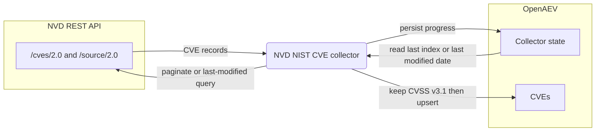

# OpenAEV NVD NIST CVE Collector

The NVD NIST CVE collector imports vulnerability records (CVEs) from the
[NVD (National Vulnerability Database)](https://nvd.nist.gov/vuln) into OpenAEV. It queries the public NVD REST API,
keeps only the CVEs that carry a CVSS v3.1 score, and upserts them (with their CWEs, references, and CISA enrichment)
so OpenAEV can associate vulnerabilities with payloads and injects. The collector performs a one-time full import and
then keeps the catalog up to date incrementally using its persisted state. This is an importer: it does not register a
security platform and does not validate detection or prevention expectations.

## Table of Contents

- [OpenAEV NVD NIST CVE Collector](#openaev-nvd-nist-cve-collector)
  - [Table of Contents](#table-of-contents)
  - [Introduction](#introduction)
  - [Requirements](#requirements)
  - [Configuration variables](#configuration-variables)
    - [OpenAEV environment variables](#openaev-environment-variables)
    - [Base collector environment variables](#base-collector-environment-variables)
    - [NVD NIST CVE collector environment variables](#nvd-nist-cve-collector-environment-variables)
  - [Deployment](#deployment)
    - [Docker Deployment](#docker-deployment)
    - [Manual Deployment](#manual-deployment)
  - [Usage](#usage)
  - [Behavior](#behavior)
  - [Required permissions and API endpoints](#required-permissions-and-api-endpoints)
  - [Debugging](#debugging)
  - [Additional information](#additional-information)

## Introduction

OpenAEV (Breach and Attack Simulation) uses a catalog of CVEs to enrich payloads and injects with the vulnerabilities
they target. This collector populates and maintains that catalog from the NVD. On its first run it performs a full
import (paging through the NVD `cves/2.0` endpoint); on subsequent runs it only fetches the CVEs modified since the last
synchronization, using the state stored on the collector. Only CVEs that include a CVSS v3.1 metric are kept; for each
of them the collector imports the CVSS v3.1 base score, the English description, the vulnerability status, the
referenced URLs, the associated CWEs, and the available CISA fields. The collector only imports reference knowledge; it
does not connect to a security platform and does not reconcile detection / prevention expectations.

## Requirements

- A running OpenAEV platform, reachable from where the collector runs, with an administrator API token
- Outbound network access to the NVD API (`https://services.nvd.nist.gov`)
- An NVD API key is optional but strongly recommended to raise the request rate limits enforced by NVD
- For a manual (non-Docker) deployment: Python >= 3.11 and [Poetry](https://python-poetry.org/) >= 2.1

## Configuration variables

The collector is configured either through environment variables (recommended, read from `docker-compose.yml` / the
`.env` file for a Docker deployment) or through a `config.yml` file (for a manual deployment). Copy the provided
`.env.sample` / `config.yml.sample` and fill in the values flagged with `ChangeMe`.

### OpenAEV environment variables

| Parameter         | config.yml          | Docker environment variable | Mandatory | Description                                                                        |
|-------------------|---------------------|-----------------------------|-----------|------------------------------------------------------------------------------------|
| OpenAEV URL       | `openaev.url`       | `OPENAEV_URL`               | Yes       | The URL of the OpenAEV platform. Must be reachable from where the collector runs.  |
| OpenAEV Token     | `openaev.token`     | `OPENAEV_TOKEN`             | Yes       | The administrator token of the OpenAEV platform.                                   |
| OpenAEV Tenant ID | `openaev.tenant_id` | `OPENAEV_TENANT_ID`         | No        | Tenant identifier for multi-tenant deployments. When set, it must be a valid UUID. |

### Base collector environment variables

| Parameter        | config.yml            | Docker environment variable | Default          | Mandatory | Description                                                                |
|------------------|-----------------------|-----------------------------|------------------|-----------|----------------------------------------------------------------------------|
| Collector ID     | `collector.id`        | `COLLECTOR_ID`              | /                | Yes       | A unique `UUIDv4` identifier for this collector instance.                   |
| Collector Name   | `collector.name`      | `COLLECTOR_NAME`            | CVE by NVD NIST  | No        | The name of the collector as shown in OpenAEV.                             |
| Collector Period | `collector.period`    | `COLLECTOR_PERIOD`          | PT2H             | No        | Interval between two runs, as an ISO 8601 duration (e.g. `PT2H` = 2 hours). |
| Log Level        | `collector.log_level` | `COLLECTOR_LOG_LEVEL`       | error            | No        | Verbosity of the logs. One of `debug`, `info`, `warn`, `error`.             |

### NVD NIST CVE collector environment variables

| Parameter    | config.yml              | Docker environment variable | Default                                  | Mandatory | Description                                                                                            |
|--------------|-------------------------|-----------------------------|------------------------------------------|-----------|--------------------------------------------------------------------------------------------------------|
| API Base URL | `nvdnistcve.api_base_url` | `NVDNISTCVE_API_BASE_URL`   | `https://services.nvd.nist.gov/rest/json` | No        | Base URL of the NVD REST API. The collector appends `/cves/2.0` and `/source/2.0` to it.               |
| API Key      | `nvdnistcve.api_key`    | `NVDNISTCVE_API_KEY`        | /                                        | No        | NVD API key. Optional but recommended: it significantly raises the NVD rate limits.                    |
| Start Year   | `nvdnistcve.start_year` | `NVDNISTCVE_START_YEAR`     | 2019                                     | No        | Earliest year used as the lower bound of the first incremental synchronization window.                 |

## Deployment

### Docker Deployment

Build the Docker image (or use the published `openaev/collector-nvd-nist-cve` image):

```shell
docker build . -t openaev/collector-nvd-nist-cve:latest
```

Create a `.env` file from `.env.sample` and fill in your values, then start the collector with the provided
`docker-compose.yml` (which reads those variables):

```shell
docker compose up -d
```

### Manual Deployment

Create a `config.yml` file from `config.yml.sample` and fill in your values, then install and run the collector:

```shell
poetry install --extras prod
poetry run python -m nvd_nist_cve.openaev_nvd_nist_cve
```

> For local development against a checkout of [client-python](https://github.com/OpenAEV-Platform/client-python)
> (cloned next to this repository), use `poetry install --extras dev` instead.

## Usage

Once started, the collector registers itself in OpenAEV and then runs automatically every `COLLECTOR_PERIOD` (2 hours by
default). The first runs perform the initial full import and can take a long time (NVD recommends a six-second pause
between requests, which the collector respects); the collector records its progress in its state, so an interrupted
import resumes where it stopped. Once the initial import is complete, each run only fetches the CVEs modified since the
last synchronization. No manual interaction is required.

## Behavior



On each run, the collector:

1. Reads its state from OpenAEV to decide between the initial full import and an incremental update.
2. Initial import: pages through `cves/2.0` by `startIndex` (2000 results per page), persisting `last_index` after each
   page and marking `initial_dataset_completed` when finished.
3. Incremental update: queries `cves/2.0` by `lastModStartDate` / `lastModEndDate` in 120-day windows, starting from
   `start_year` (first run) or the stored `last_modified_date_fetched`, up to the current time.
4. Filters the results to keep only CVEs that contain a CVSS v3.1 metric (`cvssMetricV31`), formats them (CVSS v3.1
   score, description, status, references, CWEs via the `source/2.0` endpoint, CISA fields), and upserts the batch into
   OpenAEV together with the updated state.

## Required permissions and API endpoints

- Required permission: none for read access. An NVD API key is optional but recommended; request one from the
  [NVD API key request page](https://nvd.nist.gov/developers/request-an-api-key). When set, it is sent as the `apiKey`
  request header.
- API endpoints used (relative to `NVDNISTCVE_API_BASE_URL`, default `https://services.nvd.nist.gov/rest/json`):
  - `GET /cves/2.0` (list CVEs, by index for the full import and by last-modified date range for updates)
  - `GET /source/2.0` (resolve the human-readable source name of a CWE)
- Reference: [NVD CVE API documentation](https://nvd.nist.gov/developers/vulnerabilities).

## Debugging

Set `COLLECTOR_LOG_LEVEL=debug` to get verbose logs, including the per-page fetch progress (batch size, index range, and
total progress against `totalResults`). Common issues:

- `Invalid apiKey.` in the logs means the configured `NVDNISTCVE_API_KEY` is wrong; remove it or fix it.
- Frequent throttling or slow imports usually mean no API key is set: NVD applies stricter rate limits to anonymous
  requests.
- Connectivity errors point to outbound access being blocked to `services.nvd.nist.gov`.

## Additional information

- The first synchronization is a full historical import and is intentionally slow because of the NVD-recommended
  six-second delay between requests; subsequent runs are incremental and much shorter.
- Only CVEs with a CVSS v3.1 metric are imported; CVEs that expose only older or newer scoring formats are skipped by
  design.
- The required permissions and endpoints reflect the current implementation. NVD may change its API over time, so always
  confirm against the official documentation before deploying.
