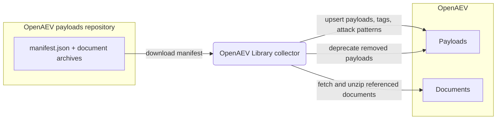

# OpenAEV Library Collector

The OpenAEV Library collector imports the official OpenAEV payload library
([OpenAEV-Platform/payloads](https://github.com/OpenAEV-Platform/payloads) on GitHub) into the platform. On each run it
downloads the published payload manifest and upserts the payloads, their tags, attack patterns, and any attached
documents, so an OpenAEV instance can be seeded and kept up to date with the curated payloads maintained by Filigran.
This is an importer: it does not register a security platform and does not validate detection or prevention
expectations.

## Table of Contents

- [OpenAEV Library Collector](#openaev-library-collector)
  - [Table of Contents](#table-of-contents)
  - [Introduction](#introduction)
  - [Requirements](#requirements)
  - [Configuration variables](#configuration-variables)
    - [OpenAEV environment variables](#openaev-environment-variables)
    - [Base collector environment variables](#base-collector-environment-variables)
  - [Deployment](#deployment)
    - [Docker Deployment](#docker-deployment)
    - [Manual Deployment](#manual-deployment)
  - [Usage](#usage)
  - [Behavior](#behavior)
  - [Data source](#data-source)
  - [Debugging](#debugging)
  - [Additional information](#additional-information)

## Introduction

OpenAEV (Breach and Attack Simulation) executes payloads to simulate attacker behavior. This collector seeds and
maintains the payload catalog from the official OpenAEV payload library hosted on GitHub. On each run it downloads the
`manifest.json` published under the configured payload repository prefix and, for every entry, upserts the payload along
with its tags, linked attack patterns, and any attached document. When a payload references a document, the collector
downloads the corresponding archive, extracts it (the archives are zipped with the standard `infected` password), and
uploads the file to OpenAEV before linking it to the payload. Each imported payload is tagged `source:openaev-datasets`
(and `type:native` when it belongs to the native collection). At the end of each run, payloads previously imported by
this collector but no longer present in the manifest are deprecated. The collector only imports payloads; it does not
connect to a security platform and does not reconcile detection / prevention expectations.

## Requirements

- A running OpenAEV platform, reachable from where the collector runs, with an administrator API token
- Outbound network access to GitHub (`raw.githubusercontent.com`) to download the payload manifest and archives
- No API key or account is required (the OpenAEV payload library is public)
- For a manual (non-Docker) deployment: Python >= 3.11 and [Poetry](https://python-poetry.org/) >= 2.1

## Configuration variables

The collector is configured either through environment variables (recommended, read from `docker-compose.yml` / the
`.env` file for a Docker deployment) or through a `config.yml` file (for a manual deployment). Copy the provided
`.env.sample` / `config.yml.sample` and fill in the values flagged with `ChangeMe`.

### OpenAEV environment variables

| Parameter          | config.yml                  | Docker environment variable  | Mandatory | Description                                                                                                                              |
|--------------------|-----------------------------|------------------------------|-----------|------------------------------------------------------------------------------------------------------------------------------------------|
| OpenAEV URL        | `openaev.url`               | `OPENAEV_URL`                | Yes       | The URL of the OpenAEV platform. Must be reachable from where the collector runs.                                                        |
| OpenAEV Token      | `openaev.token`             | `OPENAEV_TOKEN`              | Yes       | The administrator token of the OpenAEV platform.                                                                                         |
| OpenAEV Tenant ID  | `openaev.tenant_id`         | `OPENAEV_TENANT_ID`          | No        | Tenant identifier for multi-tenant deployments. When set, it must be a valid UUID.                                                       |
| Payloads URL prefix | `openaev.url_prefix`       | `OPENAEV_URL_PREFIX`         | No        | Base URL where the payload library is published. Defaults to `https://raw.githubusercontent.com/OpenAEV-Platform/payloads/refs/heads/main/`. The collector fetches `manifest.json` (and document archives) relative to it. |
| Import only native | `openaev.import_only_native` | `OPENAEV_IMPORT_ONLY_NATIVE` | No        | When `true`, import only payloads flagged as part of the native collection. Defaults to `false` (import all payloads).                    |

### Base collector environment variables

| Parameter        | config.yml            | Docker environment variable | Default          | Mandatory | Description                                                               |
|------------------|-----------------------|-----------------------------|------------------|-----------|---------------------------------------------------------------------------|
| Collector ID     | `collector.id`        | `COLLECTOR_ID`              | /                | Yes       | A unique `UUIDv4` identifier for this collector instance.                  |
| Collector Name   | `collector.name`      | `COLLECTOR_NAME`            | OpenAEV Datasets | No        | The name of the collector as shown in OpenAEV.                            |
| Collector Period | `collector.period`    | `COLLECTOR_PERIOD`          | P7D              | No        | Interval between two runs, as an ISO 8601 duration (e.g. `P7D` = 7 days).  |
| Log Level        | `collector.log_level` | `COLLECTOR_LOG_LEVEL`       | error            | No        | Verbosity of the logs. One of `debug`, `info`, `warn`, `error`.            |

## Deployment

### Docker Deployment

Build the Docker image (or use the published `openaev/collector-openaev` image):

```shell
docker build . -t openaev/collector-openaev:latest
```

Create a `.env` file from `.env.sample` and fill in your values, then start the collector with the provided
`docker-compose.yml` (which reads those variables):

```shell
docker compose up -d
```

### Manual Deployment

Create a `config.yml` file from `config.yml.sample` and fill in your values, then install and run the collector:

```shell
poetry install --extras prod
poetry run python -m openaev.openaev_openaev
```

> For local development against a checkout of [client-python](https://github.com/OpenAEV-Platform/client-python)
> (cloned next to this repository), use `poetry install --extras dev` instead.

## Usage

Once started, the collector registers itself in OpenAEV and then runs automatically every `COLLECTOR_PERIOD` (7 days by
default). Each run re-downloads the latest manifest, upserts the payloads (existing ones are updated in place), and
deprecates the payloads it previously imported that have since been removed from the library. No manual interaction is
required.

## Behavior



On each run, the collector:

1. Downloads `manifest.json` from the configured `OPENAEV_URL_PREFIX`.
2. Iterates over each payload entry. When `OPENAEV_IMPORT_ONLY_NATIVE` is enabled, entries that are not part of the
   native collection are skipped.
3. Upserts the payload tags and attack patterns, and, when a payload references a document, downloads the archive,
   extracts it (using the `infected` password), and uploads the file to OpenAEV.
4. Upserts the payload (tagged `source:openaev-datasets`, plus `type:native` when applicable), then deprecates the
   payloads previously imported by this collector that are no longer present in the manifest.

## Data source

This collector reads a public data source, so no credentials or API key are required.

- Source: the official OpenAEV payload library.
- Endpoint used: `GET <OPENAEV_URL_PREFIX>manifest.json` (default prefix
  `https://raw.githubusercontent.com/OpenAEV-Platform/payloads/refs/heads/main/`), followed by `GET` requests for the
  document archives referenced in the manifest (relative to the same prefix).
- The prefix can be overridden with `OPENAEV_URL_PREFIX` / `openaev.url_prefix` to point at an internal mirror or a
  specific branch.
- Reference: [OpenAEV-Platform/payloads](https://github.com/OpenAEV-Platform/payloads).

## Debugging

Set `COLLECTOR_LOG_LEVEL=debug` to get verbose logs, including each payload as it is imported. Common issues:

- Connectivity errors point to outbound access being blocked to `raw.githubusercontent.com` (or to your
  `OPENAEV_URL_PREFIX` mirror).
- A missing or malformed `manifest.json` at the configured prefix will stop the run; verify that `OPENAEV_URL_PREFIX`
  ends with a trailing slash and points at a valid payload library.
- An empty payload catalog after a run usually means `OPENAEV_IMPORT_ONLY_NATIVE` is enabled while the source contains
  no native payloads.

## Additional information

- The collector is idempotent: it upserts payloads on every run (keyed by their external id), so it is safe to run
  repeatedly, and it deprecates payloads removed from the library.
- `OPENAEV_URL_PREFIX` must end with a trailing slash, because the collector concatenates it directly with
  `manifest.json` and with each document path.
- The required data source reflects the current implementation. The payload library layout may change over time, so
  always confirm against the official repository before deploying.
