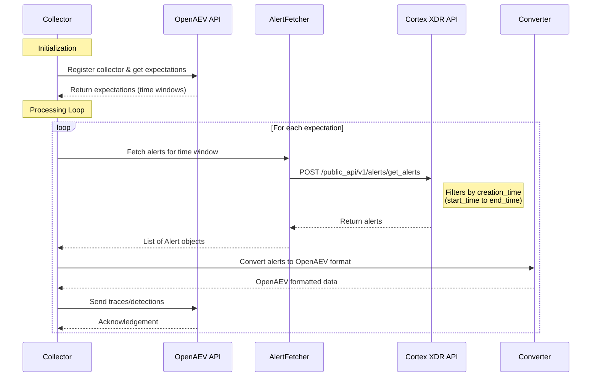

# Palo Alto Cortex XDR Collector

A collector for fetching security alerts and incidents from Palo Alto Cortex XDR and converting them to OpenAEV format for correlation and analysis.

## How It Works

The Cortex XDR collector integrates with the Palo Alto Cortex XDR API to retrieve security alerts and convert them into OpenAEV format for downstream processing.



### Data Flow Details

#### Input from OpenAEV
The collector receives **expectations** from OpenAEV, which are:
- Time windows to fetch alerts for (start_time, end_time)
- Signature types to process (e.g., "alert_id")

#### API Calls to Cortex XDR
The collector makes the following API calls:

**Endpoint:** `POST https://api-{FQDN}/public_api/v1/alerts/get_alerts`

**Request Body:**
```json
{
  "request_data": {
    "filters": [
      {
        "field": "creation_time",
        "operator": "gte",
        "value": <start_timestamp>
      },
      {
        "field": "creation_time",
        "operator": "lte",
        "value": <end_timestamp>
      }
    ]
  }
}
```

**Response:** List of alerts with fields including:
- `alert_id` - Unique identifier for the alert
- `creation_time` - When the alert was created
- Other alert metadata (severity, description, etc.)

#### Output to OpenAEV
The collector sends data to OpenAEV in the following format:

**OAEV Detection Format:**
```json
{
  "alert_id": {
    "type": "simple",
    "data": ["<alert_id>"],
    "score": 95
  }
}
```

Each alert is converted to an OpenAEV detection containing:
- **Signature type:** `alert_id`
- **Data:** The Cortex XDR alert ID
- **Score:** Confidence score (95) for correlation

## Prerequisites

- Python 3.11+
- Cortex XDR API credentials (API Key ID and API Key)
- Poetry or uv (for dependency management)
- Docker (optional, for containerized deployment)

## Installation

### Using Poetry

```bash
poetry install
```

### Using uv

```bash
uv sync
```

## Configuration

Set the following environment variables:

- `CORTEX_XDR_API_KEY_ID`: Your Cortex XDR API Key ID
- `CORTEX_XDR_API_KEY`: Your Cortex XDR API Key
- `CORTEX_XDR_FQDN`: Your Cortex XDR FQDN (e.g., `api-example.xdr.us.paloaltonetworks.com`)

## Running the Collector

### Manually with Poetry

```bash
poetry run python -m palo_alto_cortex_xdr.main
```

### Manually with uv

```bash
uv run python -m palo_alto_cortex_xdr.main
```

### Using Docker

Build the Docker image:

```bash
docker build -t palo-alto-cortex-xdr-collector .
```

Run the container:

```bash
docker run -e CORTEX_XDR_API_KEY_ID=your_key_id \
           -e CORTEX_XDR_API_KEY=your_api_key \
           -e CORTEX_XDR_FQDN=your_fqdn \
           palo-alto-cortex-xdr-collector
```

## Testing

### Run tests with Poetry

```bash
poetry run pytest
```

### Run tests with uv

```bash
uv run pytest
```

### Run tests with coverage

```bash
# With Poetry
poetry run pytest --cov=palo_alto_cortex_xdr --cov-report=term-missing

# With uv
uv run pytest --cov=palo_alto_cortex_xdr --cov-report=term-missing
```
