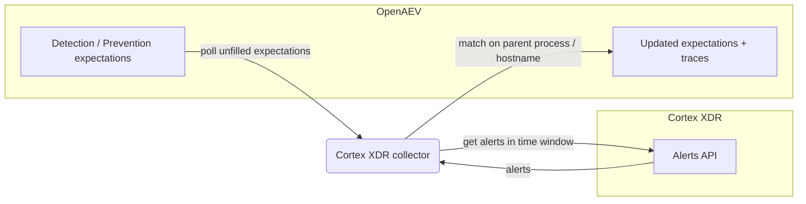

# OpenAEV Palo Alto Cortex XDR Collector

The Palo Alto Cortex XDR collector validates OpenAEV detection and prevention expectations against
[Palo Alto Cortex XDR](https://www.paloaltonetworks.com/cortex/cortex-xdr), Palo Alto Networks' extended detection and
response (XDR) platform. After OpenAEV agents execute attacks, the collector pulls the matching Cortex XDR alerts and
correlates them with the related injects to confirm whether the activity was detected and/or prevented.

## Table of Contents

- [OpenAEV Palo Alto Cortex XDR Collector](#openaev-palo-alto-cortex-xdr-collector)
  - [Table of Contents](#table-of-contents)
  - [Introduction](#introduction)
  - [Requirements](#requirements)
  - [Configuration variables](#configuration-variables)
    - [OpenAEV environment variables](#openaev-environment-variables)
    - [Base collector environment variables](#base-collector-environment-variables)
    - [Palo Alto Cortex XDR collector environment variables](#palo-alto-cortex-xdr-collector-environment-variables)
  - [Deployment](#deployment)
    - [Docker Deployment](#docker-deployment)
    - [Manual Deployment](#manual-deployment)
  - [Usage](#usage)
  - [Behavior](#behavior)
  - [Required permissions and API endpoints](#required-permissions-and-api-endpoints)
  - [Debugging](#debugging)
  - [Additional information](#additional-information)

## Introduction

OpenAEV (Breach and Attack Simulation) raises "expectations" each time it executes an inject (a simulated attack) on an
endpoint: a DETECTION expectation (the security product should raise an alert) and/or a PREVENTION expectation (the
security product should block the action). This collector connects to the Palo Alto Cortex XDR API, registers a
`SecurityPlatform` of type `EDR`, and periodically reconciles those expectations with the alerts produced by Cortex XDR,
marking each expectation as detected/not detected and prevented/not prevented and attaching a trace that links back to
the originating Cortex XDR alert.

## Requirements

- OpenAEV Platform >= 1.19.0
- A Palo Alto Cortex XDR tenant
- A Cortex XDR API key (Standard or Advanced) with read access to alerts, together with its API Key ID and the tenant
  FQDN (for example `api-example.xdr.us.paloaltonetworks.com`)
- For a manual (non-Docker) deployment: Python >= 3.12 and [Poetry](https://python-poetry.org/) >= 2.1

## Configuration variables

The collector is configured either through environment variables (recommended, set in `docker-compose.yml` for a Docker
deployment) or through a `config.yml` file (for a manual deployment). Copy the provided `src/config.yml.sample` and fill
in the values flagged with `ChangeMe`.

### OpenAEV environment variables

| Parameter         | config.yml          | Docker environment variable | Mandatory | Description                                                                              |
|-------------------|---------------------|-----------------------------|-----------|------------------------------------------------------------------------------------------|
| OpenAEV URL       | `openaev.url`       | `OPENAEV_URL`               | Yes       | The URL of the OpenAEV platform. Must be reachable from where the collector runs.        |
| OpenAEV Token     | `openaev.token`     | `OPENAEV_TOKEN`             | Yes       | The administrator token of the OpenAEV platform.                                         |
| OpenAEV Tenant ID | `openaev.tenant_id` | `OPENAEV_TENANT_ID`         | No        | Tenant identifier for multi-tenant deployments. When set, it must be a valid UUID.       |

### Base collector environment variables

| Parameter        | config.yml            | Docker environment variable | Default              | Mandatory | Description                                                                                  |
|------------------|-----------------------|-----------------------------|----------------------|-----------|----------------------------------------------------------------------------------------------|
| Collector ID     | `collector.id`        | `COLLECTOR_ID`              | /                    | Yes       | A unique `UUIDv4` identifier for this collector instance.                                     |
| Collector Name   | `collector.name`      | `COLLECTOR_NAME`            | Palo Alto Cortex XDR | No        | The name of the collector as shown in OpenAEV.                                                |
| Collector Period | `collector.period`    | `COLLECTOR_PERIOD`          | PT2M                 | No        | Interval between two runs, as an ISO 8601 duration (e.g. `PT2M` = 2 minutes).                 |
| Log Level        | `collector.log_level` | `COLLECTOR_LOG_LEVEL`       | error                | No        | Verbosity of the logs. One of `debug`, `info`, `warn`, `error`.                               |
| Platform         | `collector.platform`  | `COLLECTOR_PLATFORM`        | EDR                  | No        | The `SecurityPlatform` type registered in OpenAEV. One of `EDR`, `XDR`, `SIEM`, `SOAR`, `NDR`, `ISPM`. |

### Palo Alto Cortex XDR collector environment variables

| Parameter    | config.yml                          | Docker environment variable        | Default  | Mandatory | Description                                                          |
|--------------|-------------------------------------|------------------------------------|----------|-----------|---------------------------------------------------------------------|
| FQDN         | `palo_alto_cortex_xdr.fqdn`         | `PALO_ALTO_CORTEX_XDR_FQDN`        | /        | Yes       | The unique host/domain name of your Cortex XDR tenant.              |
| API Key      | `palo_alto_cortex_xdr.api_key`      | `PALO_ALTO_CORTEX_XDR_API_KEY`     | /        | Yes       | The Cortex XDR API key used in the `Authorization` header.          |
| API Key ID   | `palo_alto_cortex_xdr.api_key_id`   | `PALO_ALTO_CORTEX_XDR_API_KEY_ID`  | /        | Yes       | The Cortex XDR API key ID that identifies the API key.              |
| API Key Type | `palo_alto_cortex_xdr.api_key_type` | `PALO_ALTO_CORTEX_XDR_API_KEY_TYPE`| standard | No        | The API key type, either `standard` or `advanced`.                  |

## Deployment

### Docker Deployment

Build the Docker image (or use the published `openaev/collector-palo-alto-cortex-xdr` image):

```shell
docker build . -t openaev/collector-palo-alto-cortex-xdr:latest
```

Set your values in the `environment` section of the provided `docker-compose.yml`, then start the collector:

```shell
docker compose up -d
```

### Manual Deployment

Create a `src/config.yml` file from `src/config.yml.sample` and fill in your values, then install and run the collector:

```shell
poetry install --extras prod
poetry run python -m src
```

> For local development against a checkout of [client-python](https://github.com/OpenAEV-Platform/client-python)
> (cloned next to this repository), use `poetry install --extras local` instead.

## Usage

Once started, the collector registers itself (and its `SecurityPlatform`) in OpenAEV and then runs automatically every
`COLLECTOR_PERIOD`. No manual interaction is required: as soon as injects produce expectations bound to this collector,
they are reconciled on the next run.

## Behavior


```mermaid
flowchart LR
    subgraph OpenAEV
        E[Detection / Prevention expectations]
        R[Updated expectations + traces]
    end
    subgraph Cortex XDR
        A[Alerts API]
    end
    C(Cortex XDR collector)
    E -->|poll unfilled expectations| C
    C -->|get alerts in time window| A
    A -->|alerts| C
    C -->|match on parent process / hostname| R
```

On each run, the collector:

1. Fetches the unfilled expectations assigned to this collector from OpenAEV.
2. Determines the search window from the expectation `end_date` signature (falling back to now when absent); the window
   spans `end_date - time_window` to `end_date` (default `time_window` is 1 hour).
3. Pulls alerts from the Cortex XDR `get_alerts_multi_events` endpoint (paginated, 100 per page), filtered by
   `creation_time`. It keeps only alerts that reference an `oaev-implant-*` process - either directly from the alert
   events, or after enriching alerts through the `get_original_alerts` endpoint.
4. Matches alerts to expectations using these signatures: `parent_process_name` (simple, score 95, on the implant
   process names), `target_hostname_address`, and `end_date` (used to scope the query, not for matching).
5. Updates each matched expectation:
   - DETECTION: marked `Detected` when the matching alert's `action_pretty` contains `Detected` or `Prevented`,
     otherwise `Not Detected` once the expectation expires.
   - PREVENTION: marked `Prevented` when the matching alert's `action_pretty` contains `Prevented`, otherwise
     `Not Prevented`.
6. Creates an expectation trace for each match, including the alert details and a link back to the Cortex XDR console.

## Required permissions and API endpoints

- Required permission: a Cortex XDR API key (Standard or Advanced) with read access to alerts, plus its API Key ID.
- API endpoints used:
  - `POST /public_api/v1/alerts/get_alerts_multi_events` (list alerts in the time window)
  - `POST /public_api/v1/alerts/get_original_alerts` (enrich alerts to extract implant process names)
  - Authentication uses the `x-xdr-auth-id` and `Authorization` headers (Standard), with `x-xdr-timestamp` /
    `x-xdr-nonce` and a SHA-256 hashed authorization added for Advanced keys.
- Reference: [Cortex XDR API documentation](https://docs.paloaltonetworks.com/cortex/cortex-xdr/cortex-xdr-api)

## Debugging

Set `COLLECTOR_LOG_LEVEL=debug` to get verbose logs, including expectation polling, the number of alerts fetched and
enriched, and the matching decisions. Common causes of "nothing detected": an incorrect `FQDN`, an API key / API key ID
mismatch, the wrong `api_key_type` (Standard vs Advanced), or alerts that do not reference an `oaev-implant-*` process.

## Additional information

- The search window is anchored on the inject `end_date` and defaults to one hour; the collector is designed to validate
  expectations shortly after an inject runs, not to back-fill historical data.
- The required Cortex XDR permissions and endpoints reflect the current implementation. Palo Alto Networks may change its
  API over time, so always confirm against the official documentation before deploying.
