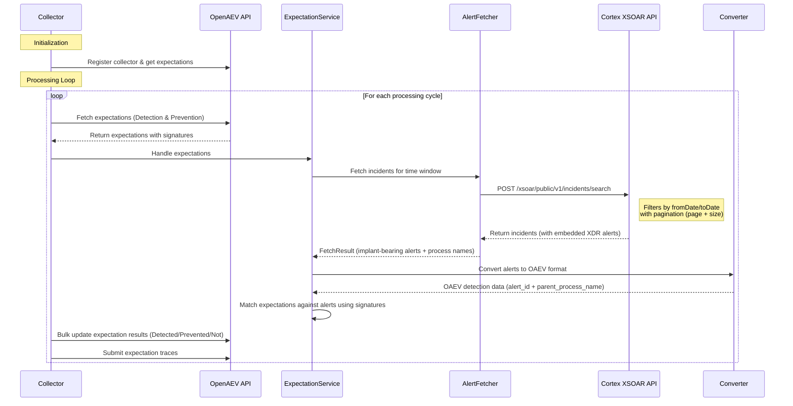

# Palo Alto Cortex XSOAR Collector

A collector for fetching security incidents and their embedded XDR alerts from Palo Alto Cortex XSOAR, converting them to OpenAEV format for expectation matching and correlation.

## How It Works

The Cortex XSOAR collector integrates with the Palo Alto Cortex XSOAR API to retrieve incidents (which contain XDR alerts), match them against OpenAEV expectations using implant process-name signatures, and report detection/prevention results back to OpenAEV.



### Data Flow Details

#### Input from OpenAEV
The collector receives **expectations** from OpenAEV, each containing signatures to match against. Supported signature types:
- `parent_process_name` — matches implant process names in alerts
- `target_hostname_address` — matches target hostname/address
- `end_date` — used to determine the query time window

#### API Calls to Cortex XSOAR

**Search Incidents:** `POST https://{API_URL}/xsoar/public/v1/incidents/search`

```json
{
  "filter": {
    "page": 0,
    "size": 100,
    "sort": [{"field": "created", "asc": true}],
    "fromDate": "2026-04-01T00:00:00Z",
    "toDate": "2026-04-27T12:00:00Z"
  }
}
```

Returns a paginated list of incidents. Each incident may contain embedded XDR alerts via `CustomFields.xdralerts`.

#### Alert Matching Logic
1. Incidents are fetched for the computed time window (derived from `end_date` signature or current time minus `time_window`).
2. XDR alerts are extracted from each incident's `CustomFields.xdralerts`.
3. Alerts are filtered for **implant process names** matching the pattern `oaev-implant-<uuid>-agent-<uuid>` in `actor_process_image_name` or `actor_process_command_line`.
4. Matched alerts are compared against expectations using the OpenAEV detection helper.
5. **Detection expectations** are satisfied if the alert action is `Detected` or `Prevented`.
6. **Prevention expectations** are satisfied only if the alert action is `Prevented`.

#### Output to OpenAEV

**Expectation Results:** Bulk-updated via the OpenAEV API with:
- `result`: `"Detected"` / `"Not Detected"` or `"Prevented"` / `"Not Prevented"`
- `is_success`: Boolean indicating whether the expectation was matched

**Expectation Traces:** For each matched alert:
```json
{
  "inject_expectation_trace_expectation": "<expectation_id>",
  "inject_expectation_trace_source_id": "<collector_id>",
  "inject_expectation_trace_alert_name": "PaloAltoCortexXSOAR Alert <alert_id>",
  "inject_expectation_trace_alert_link": "https://<web_console_host>/issue-view/<alert_id>",
  "inject_expectation_trace_date": "2026-04-27T12:00:00Z"
}
```

## Prerequisites

- Python 3.12+
- Cortex XSOAR API credentials (API Key ID and API Key)
- Poetry or uv (for dependency management)
- Docker (optional, for containerized deployment)

## Installation

### Using Poetry

```bash
poetry install --extras local
```

### Using uv

```bash
uv sync
```

## Configuration

Configuration is loaded in priority order:
1. `.env` file (if present in `src/`)
2. `config.yml` file (if present in `src/`)
3. Environment variables (fallback)

Copy the sample configuration and edit it:

```bash
cp src/config.yml.sample src/config.yml
```

### Configuration Parameters

#### OpenAEV

| Parameter           | Env Variable      | Description                          |
|---------------------|-------------------|--------------------------------------|
| `openaev.url`       | `OPENAEV_URL`     | OpenAEV platform URL                 |
| `openaev.token`     | `OPENAEV_TOKEN`   | OpenAEV API token                    |

#### Collector

| Parameter               | Env Variable         | Description                               | Default                  |
|--------------------------|----------------------|-------------------------------------------|--------------------------|
| `collector.id`           | `COLLECTOR_ID`       | Unique collector instance ID (UUIDv4)     | Auto-generated           |
| `collector.name`         | `COLLECTOR_NAME`     | Display name of the collector             | `Palo Alto Cortex XSOAR` |
| `collector.log_level`    | `COLLECTOR_LOG_LEVEL`| Log level (`debug`, `info`, `warning`, …) | —                        |

#### Palo Alto Cortex XSOAR

| Parameter                              | Env Variable                             | Description                                      | Default      |
|-----------------------------------------|------------------------------------------|--------------------------------------------------|--------------|
| `palo_alto_cortex_xsoar.api_url`       | `PALO_ALTO_CORTEX_XSOAR_API_URL`        | XSOAR tenant API URL (without `https://`)        | *(required)* |
| `palo_alto_cortex_xsoar.api_key`       | `PALO_ALTO_CORTEX_XSOAR_API_KEY`        | API Key for authentication                       | *(required)* |
| `palo_alto_cortex_xsoar.api_key_id`    | `PALO_ALTO_CORTEX_XSOAR_API_KEY_ID`     | API Key ID for authentication                    | *(required)* |
| `palo_alto_cortex_xsoar.api_key_type`  | `PALO_ALTO_CORTEX_XSOAR_API_KEY_TYPE`   | Key type: `standard` or `advanced`               | `standard`   |
| `palo_alto_cortex_xsoar.time_window`   | `PALO_ALTO_CORTEX_XSOAR_TIME_WINDOW`    | Default time window for incident searches        | `1 hour`     |

### Example `config.yml`

```yaml
openaev:
  url: 'http://localhost:8081'
  token: "ChangeMe"

collector:
  id: "Palo Alto Cortex XSOAR"

palo_alto_cortex_xsoar:
  api_url: "api-example.xsoar.fa.paloaltonetworks.com"
  api_key: "ChangeMe"
  api_key_id: "ChangeMe"
  api_key_type: "standard"  # standard or advanced
```

### Authentication

The collector supports two authentication modes:

- **Standard:** The API key is sent directly in the `Authorization` header.
- **Advanced:** A nonce and timestamp are generated, and the API key is hashed with SHA-256 for HMAC-style authentication (`x-xdr-timestamp`, `x-xdr-nonce`, `Authorization` headers).

Both modes include the `x-xdr-auth-id` header with the API Key ID.

## Running the Collector

### With Poetry

```bash
poetry run python -m src
```

### With uv

```bash
uv run python -m src
```

### Using Docker

Build and run:

```bash
docker build -t palo-alto-cortex-xsoar-collector .
docker run palo-alto-cortex-xsoar-collector
```

Or with environment variables:

```bash
docker run \
  -e PALO_ALTO_CORTEX_XSOAR_API_URL=api-example.xsoar.fa.paloaltonetworks.com \
  -e PALO_ALTO_CORTEX_XSOAR_API_KEY=your_api_key \
  -e PALO_ALTO_CORTEX_XSOAR_API_KEY_ID=your_key_id \
  -e PALO_ALTO_CORTEX_XSOAR_API_KEY_TYPE=standard \
  -e OPENAEV_URL=http://localhost:8081 \
  -e OPENAEV_TOKEN=your_token \
  palo-alto-cortex-xsoar-collector
```

### Using Docker Compose

```bash
docker compose up
```

## Project Structure

```
src/
├── __main__.py                      # Entry point
├── config.yml                       # Configuration file
├── collector/
│   ├── collector.py                 # Core CollectorDaemon subclass
│   ├── expectation_manager.py       # Fetches, processes, and updates expectations
│   ├── trace_manager.py             # Submits traces to OpenAEV
│   ├── models.py                    # ExpectationResult, ExpectationTrace, ProcessingSummary
│   └── exception.py                 # Collector-level exceptions
├── models/
│   ├── incident.py                  # Alert, Incident, CustomFields, XSOARSearchIncidentsResponse
│   ├── authentication.py            # Authentication helper (standard & advanced)
│   └── settings/
│       ├── config_loader.py         # Main ConfigLoader (YAML / .env / env vars)
│       ├── palo_alto_cortex_xsoar_configs.py  # XSOAR-specific settings
│       ├── collector_configs.py     # Base collector settings
│       └── base_settings.py         # Shared Pydantic settings base
└── services/
    ├── alert_fetcher.py             # Paginated incident fetching & implant filtering
    ├── client_api.py                # HTTP client for XSOAR REST API
    ├── converter.py                 # Alert → OAEV format conversion
    ├── expectation_service.py       # Expectation matching orchestration
    ├── trace_service.py             # Trace creation from results
    ├── exception.py                 # Service-level exceptions
    └── utils/
        ├── signature_extractor.py   # Signature grouping & end_date extraction
        └── trace_builder.py         # Alert trace dict builder
```

## API Permissions and Endpoints Used

| Endpoint                                    | Method | Purpose                                       |
|---------------------------------------------|--------|-----------------------------------------------|
| `/xsoar/public/v1/incidents/search`         | POST   | Search and paginate incidents by time window   |

**Required permissions:** API Key (Standard or Advanced) with read access to incidents and alerts.

> **Note** *(as of April 27, 2026)*: The endpoints and permissions listed above are based on the current implementation. Palo Alto Networks may change API requirements at any time. Always check the [official Cortex XSOAR API documentation](https://cortex-panw.stoplight.io/docs/cortex-xsoar) for the latest requirements before deploying.

## Testing

```bash
# With Poetry
poetry run pytest

# With uv
uv run pytest

# With coverage
poetry run pytest --cov=src --cov-report=term-missing
uv run pytest --cov=src --cov-report=term-missing
```
