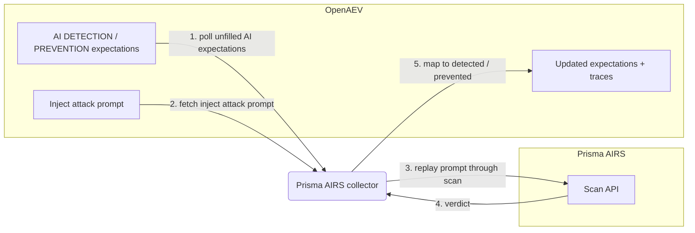

# OpenAEV Palo Alto Prisma AIRS Collector

The Palo Alto Prisma AIRS collector validates OpenAEV detection and prevention expectations against
[Palo Alto Prisma AIRS](https://www.paloaltonetworks.com/prisma/prisma-airs), Palo Alto Networks' AI
Runtime Security platform that inspects prompts and model traffic for adversarial and unsafe content.
This is an agentless validator: instead of waiting for an endpoint agent, it replays each AI
adversarial inject's attack prompt through the Prisma AIRS Scan API and maps the returned verdict to
detected and/or prevented.

## Table of Contents

- [OpenAEV Palo Alto Prisma AIRS Collector](#openaev-palo-alto-prisma-airs-collector)
  - [Table of Contents](#table-of-contents)
  - [Introduction](#introduction)
  - [Requirements](#requirements)
  - [Configuration variables](#configuration-variables)
    - [OpenAEV environment variables](#openaev-environment-variables)
    - [Base collector environment variables](#base-collector-environment-variables)
    - [Prisma AIRS collector environment variables](#prisma-airs-collector-environment-variables)
  - [Deployment](#deployment)
    - [Docker Deployment](#docker-deployment)
    - [Manual Deployment](#manual-deployment)
  - [Usage](#usage)
  - [Behavior](#behavior)
  - [Required permissions and API endpoints](#required-permissions-and-api-endpoints)
  - [Debugging](#debugging)
  - [Additional information](#additional-information)

## Introduction

OpenAEV (Breach and Attack Simulation) raises "expectations" each time its AI red-team injector
launches an adversarial prompt: a DETECTION expectation (the AI security product should flag the
prompt) and/or a PREVENTION expectation (the product should block it). This collector connects to
Palo Alto Prisma AIRS, registers a `SecurityPlatform` of type `LLM_FIREWALL`, and validates those
expectations by replaying each inject's attack prompt through the Prisma AIRS Scan API. It maps the
scan verdict to detected/not detected and prevented/not prevented and attaches a trace that links
back to the originating inject. No endpoint agent is involved: the collector re-scans the recorded
attack content directly through the vendor API.

## Requirements

- An OpenAEV platform with AI red-team support (the AI inject-expectations domain exposed by
  `pyoaev`; platforms without AI red-team support are not compatible)
- A Palo Alto Prisma AIRS (AI Runtime Security) subscription with API access
- A Prisma AIRS API key (sent as the `x-pan-token` header) and an AI security profile name
- For a manual (non-Docker) deployment: Python >= 3.11 and [Poetry](https://python-poetry.org/) >= 2.1

## Configuration variables

The collector is configured either through environment variables (recommended, read from
`docker-compose.yml` / the `.env` file for a Docker deployment) or through a `config.yml` file (for a
manual deployment). Copy the provided `.env.sample` / `prisma_airs/config.yml.sample` and fill in the
values flagged with `ChangeMe`. The collector-specific settings live under the `collector:` section
as `collector.*` keys, mapped to `COLLECTOR_*` environment variables.

### OpenAEV environment variables

| Parameter         | config.yml          | Docker environment variable | Mandatory | Description                                                                        |
|-------------------|---------------------|-----------------------------|-----------|------------------------------------------------------------------------------------|
| OpenAEV URL       | `openaev.url`       | `OPENAEV_URL`               | Yes       | The URL of the OpenAEV platform. Must be reachable from where the collector runs.  |
| OpenAEV Token     | `openaev.token`     | `OPENAEV_TOKEN`             | Yes       | The administrator token of the OpenAEV platform.                                   |
| OpenAEV Tenant ID | `openaev.tenant_id` | `OPENAEV_TENANT_ID`         | No        | Tenant identifier for multi-tenant deployments. When set, it must be a valid UUID. |

### Base collector environment variables

| Parameter        | config.yml            | Docker environment variable | Default               | Mandatory | Description                                                                          |
|------------------|-----------------------|-----------------------------|-----------------------|-----------|-------------------------------------------------------------------------------------|
| Collector ID     | `collector.id`        | `COLLECTOR_ID`              | /                     | Yes       | A unique identifier for this collector instance (`UUIDv4` recommended).             |
| Collector Name   | `collector.name`      | `COLLECTOR_NAME`            | Palo Alto Prisma AIRS | No        | The name of the collector as shown in OpenAEV.                                       |
| Collector Period | `collector.period`    | `COLLECTOR_PERIOD`          | PT120S                | No        | Interval between two runs, as an ISO 8601 duration (e.g. `PT120S` = 2 minutes).      |
| Log Level        | `collector.log_level` | `COLLECTOR_LOG_LEVEL`       | error                 | No        | Verbosity of the logs. One of `debug`, `info`, `warn`, `error`.                      |
| Platform         | `collector.platform`  | `COLLECTOR_PLATFORM`        | LLM_FIREWALL          | No        | The `SecurityPlatform` type registered in OpenAEV. Use `LLM_FIREWALL` for AI firewall / guardrail validators. |

### Prisma AIRS collector environment variables

| Parameter    | config.yml             | Docker environment variable | Default                                              | Mandatory | Description                                                       |
|--------------|------------------------|-----------------------------|------------------------------------------------------|-----------|-----------------------------------------------------------------|
| API Base URL | `collector.base_url`   | `COLLECTOR_BASE_URL`        | `https://service.api.aisecurity.paloaltonetworks.com` | No        | Region-specific Prisma AIRS Scan API base URL.                  |
| API Key      | `collector.api_key`    | `COLLECTOR_API_KEY`         | /                                                    | Yes       | Prisma AIRS API key, sent as the `x-pan-token` header.          |
| AI Profile   | `collector.ai_profile` | `COLLECTOR_AI_PROFILE`      | /                                                    | Yes       | Prisma AIRS AI security profile name to apply during the scan.  |

> Note: the default `base_url` targets the US region. Use the region-specific host for your tenant
> (for example the EU `service-de.api...` endpoint); refer to the Prisma AIRS documentation for the
> exact regional hostnames.

## Deployment

### Docker Deployment

Build the Docker image (or use the published `openaev/collector-prisma-airs` image):

```shell
docker build . -t openaev/collector-prisma-airs:latest
```

Create a `.env` file from `.env.sample` and fill in your values, then start the collector with the
provided `docker-compose.yml` (which reads those variables):

```shell
docker compose up -d
```

### Manual Deployment

Create a `config.yml` file from `prisma_airs/config.yml.sample` and fill in your values, then install
and run the collector:

```shell
poetry install --extras prod
poetry run python -m prisma_airs.openaev_prisma_airs
```

> For local development against a checkout of [client-python](https://github.com/OpenAEV-Platform/client-python)
> (cloned next to this repository), use `poetry install --extras dev` instead.

## Usage

Once started, the collector registers itself (and its `SecurityPlatform`) in OpenAEV and then runs
automatically every `COLLECTOR_PERIOD`. No manual interaction is required: as soon as the AI red-team
injector produces DETECTION / PREVENTION expectations bound to this collector, they are validated on
the next run by replaying the attack prompt through Prisma AIRS.

## Behavior



On each run, the collector:

1. Polls the unfilled AI DETECTION / PREVENTION expectations assigned to this collector from OpenAEV
   (`GET /api/injects/expectations/ai/{collector_id}`).
2. For each expectation, fetches the originating inject (`GET /api/injects/{inject_id}`), reads its
   `inject_content.attack_prompt`, and substitutes the inject's unique marker into the prompt.
3. Replays the attack prompt through the Prisma AIRS Scan API (one scan per inject, cached for the
   run).
4. Maps the verdict returned by Prisma AIRS:
   - DETECTION: marked `Detected` when `category` is `malicious`, any `prompt_detected` entry is true,
     or `action` is `block`; otherwise `Not Detected`.
   - PREVENTION: marked `Prevented` when `action` is `block`; otherwise `Not Prevented`.
5. Updates each expectation with the result and the matched categories in its metadata, and creates an
   expectation trace for each success.

## Required permissions and API endpoints

- Required permission: a Prisma AIRS API key with access to the Scan API, plus an AI security profile
  name to apply.
- API endpoint used:
  - `POST {base_url}/v1/scan/sync/request` (synchronous prompt scan), authenticated with the
    `x-pan-token` header; the request body carries `ai_profile.profile_name`.
- Reference: [Prisma AIRS API documentation](https://pan.dev/prisma-airs/api/airuntimesecurity/)

## Debugging

Set `COLLECTOR_LOG_LEVEL=debug` to get verbose logs, including expectation polling, the prompts
replayed to Prisma AIRS, and the verdict mapping. Common causes of unexpected results:

- A wrong `base_url` for your Prisma AIRS region (the scan calls fail or time out).
- A missing or misspelled `ai_profile`: the API key and profile name are both required, and an
  unknown profile changes the verdict.
- An API key without Scan API access (the requests are rejected).

## Additional information

- The collector is agentless: it validates expectations by replaying the recorded attack prompt
  through the Prisma AIRS Scan API, so it does not require an OpenAEV endpoint agent.
- The required permissions and endpoints reflect the current implementation. Palo Alto Networks may
  change the Prisma AIRS API over time, so always confirm against the official documentation before
  deploying.
