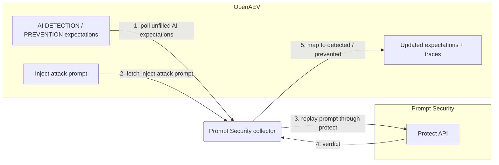

# OpenAEV Prompt Security Collector

The Prompt Security collector validates OpenAEV detection and prevention expectations against
[Prompt Security](https://www.prompt.security/) (SentinelOne), which inspects and enforces policy on
GenAI prompts and responses. This is an agentless validator: instead of waiting for an endpoint agent,
it replays each AI adversarial inject's attack prompt through the Prompt Security protect API and maps
the returned verdict to detected and/or prevented.

## Table of Contents

- [OpenAEV Prompt Security Collector](#openaev-prompt-security-collector)
  - [Table of Contents](#table-of-contents)
  - [Introduction](#introduction)
  - [Requirements](#requirements)
  - [Configuration variables](#configuration-variables)
    - [OpenAEV environment variables](#openaev-environment-variables)
    - [Base collector environment variables](#base-collector-environment-variables)
    - [Prompt Security collector environment variables](#prompt-security-collector-environment-variables)
  - [Deployment](#deployment)
    - [Docker Deployment](#docker-deployment)
    - [Manual Deployment](#manual-deployment)
  - [Usage](#usage)
  - [Behavior](#behavior)
  - [Required permissions and API endpoints](#required-permissions-and-api-endpoints)
  - [Debugging](#debugging)
  - [Additional information](#additional-information)

## Introduction

OpenAEV (Breach and Attack Simulation) raises "expectations" each time its AI red-team injector
launches an adversarial prompt: a DETECTION expectation (the AI security product should flag the
prompt) and/or a PREVENTION expectation (the product should block it). This collector connects to
Prompt Security, registers a `SecurityPlatform` of type `LLM_FIREWALL`, and validates those
expectations by replaying each inject's attack prompt through the Prompt Security protect API. It maps
the verdict to detected/not detected and prevented/not prevented and attaches a trace that links back
to the originating inject. No endpoint agent is involved: the collector re-scans the recorded attack
content directly through the vendor API.

## Requirements

- An OpenAEV platform with AI red-team support (the AI inject-expectations domain exposed by
  `pyoaev`; platforms without AI red-team support are not compatible)
- A Prompt Security tenant with protect API access
- A Prompt Security tenant base URL and an application id (APP-ID) authorized to call the protect API
- For a manual (non-Docker) deployment: Python >= 3.11 and [Poetry](https://python-poetry.org/) >= 2.1

## Configuration variables

The collector is configured either through environment variables (recommended, read from
`docker-compose.yml` / the `.env` file for a Docker deployment) or through a `config.yml` file (for a
manual deployment). Copy the provided `.env.sample` / `prompt_security/config.yml.sample` and fill in
the values flagged with `ChangeMe`. The collector-specific settings live under the `collector:`
section as `collector.*` keys, mapped to `COLLECTOR_*` environment variables.

### OpenAEV environment variables

| Parameter         | config.yml          | Docker environment variable | Mandatory | Description                                                                        |
|-------------------|---------------------|-----------------------------|-----------|------------------------------------------------------------------------------------|
| OpenAEV URL       | `openaev.url`       | `OPENAEV_URL`               | Yes       | The URL of the OpenAEV platform. Must be reachable from where the collector runs.  |
| OpenAEV Token     | `openaev.token`     | `OPENAEV_TOKEN`             | Yes       | The administrator token of the OpenAEV platform.                                   |
| OpenAEV Tenant ID | `openaev.tenant_id` | `OPENAEV_TENANT_ID`         | No        | Tenant identifier for multi-tenant deployments. When set, it must be a valid UUID. |

### Base collector environment variables

| Parameter        | config.yml            | Docker environment variable | Default         | Mandatory | Description                                                                          |
|------------------|-----------------------|-----------------------------|-----------------|-----------|-------------------------------------------------------------------------------------|
| Collector ID     | `collector.id`        | `COLLECTOR_ID`              | /               | Yes       | A unique identifier for this collector instance (`UUIDv4` recommended).             |
| Collector Name   | `collector.name`      | `COLLECTOR_NAME`            | Prompt Security | No        | The name of the collector as shown in OpenAEV.                                       |
| Collector Period | `collector.period`    | `COLLECTOR_PERIOD`          | PT120S          | No        | Interval between two runs, as an ISO 8601 duration (e.g. `PT120S` = 2 minutes).      |
| Log Level        | `collector.log_level` | `COLLECTOR_LOG_LEVEL`       | error           | No        | Verbosity of the logs. One of `debug`, `info`, `warn`, `error`.                      |
| Platform         | `collector.platform`  | `COLLECTOR_PLATFORM`        | LLM_FIREWALL    | No        | The `SecurityPlatform` type registered in OpenAEV. Use `LLM_FIREWALL` for AI firewall / guardrail validators. |

### Prompt Security collector environment variables

| Parameter    | config.yml              | Docker environment variable | Default   | Mandatory | Description                                                                      |
|--------------|-------------------------|-----------------------------|-----------|-----------|---------------------------------------------------------------------------------|
| API Base URL | `collector.base_url`    | `COLLECTOR_BASE_URL`        | /         | Yes       | Prompt Security tenant base URL (e.g. `https://<tenant>.prompt.security`). The collector appends `/api/protect`. |
| App ID       | `collector.app_id`      | `COLLECTOR_APP_ID`          | /         | Yes       | Prompt Security application id / API key.                                        |
| Auth Header  | `collector.auth_header` | `COLLECTOR_AUTH_HEADER`     | `APP-ID`  | No        | HTTP header used to carry the application id.                                    |

## Deployment

### Docker Deployment

Build the Docker image (or use the published `openaev/collector-prompt-security` image):

```shell
docker build . -t openaev/collector-prompt-security:latest
```

Create a `.env` file from `.env.sample` and fill in your values, then start the collector with the
provided `docker-compose.yml` (which reads those variables):

```shell
docker compose up -d
```

### Manual Deployment

Create a `config.yml` file from `prompt_security/config.yml.sample` and fill in your values, then
install and run the collector:

```shell
poetry install --extras prod
poetry run python -m prompt_security.openaev_prompt_security
```

> For local development against a checkout of [client-python](https://github.com/OpenAEV-Platform/client-python)
> (cloned next to this repository), use `poetry install --extras dev` instead.

## Usage

Once started, the collector registers itself (and its `SecurityPlatform`) in OpenAEV and then runs
automatically every `COLLECTOR_PERIOD`. No manual interaction is required: as soon as the AI red-team
injector produces DETECTION / PREVENTION expectations bound to this collector, they are validated on
the next run by replaying the attack prompt through Prompt Security.

## Behavior



On each run, the collector:

1. Polls the unfilled AI DETECTION / PREVENTION expectations assigned to this collector from OpenAEV
   (`GET /api/injects/expectations/ai/{collector_id}`).
2. For each expectation, fetches the originating inject (`GET /api/injects/{inject_id}`), reads its
   `inject_content.attack_prompt` (and optional `system_prompt`), and substitutes the inject's unique
   marker into the prompt.
3. Replays the attack prompt through the Prompt Security protect API (one call per inject, cached for
   the run).
4. Maps the verdict returned by Prompt Security:
   - DETECTION: marked `Detected` when the response carries violations or the action is `block`,
     `modify`, or `log`; otherwise `Not Detected`.
   - PREVENTION: marked `Prevented` only when the action is `block`; otherwise `Not Prevented`.
5. Updates each expectation with the result and the matched violation in its metadata, and creates an
   expectation trace for each success.

## Required permissions and API endpoints

- Required permission: a Prompt Security application id (APP-ID) authorized to call the protect API on
  your tenant base URL.
- API endpoint used:
  - `POST {base_url}/api/protect` (prompt enforcement), authenticated with the configurable auth header
    (default `APP-ID`).
- Reference: [Prompt Security](https://www.prompt.security/) (refer to your tenant's Prompt Security
  API documentation; the protect endpoint and auth header are configurable).

## Debugging

Set `COLLECTOR_LOG_LEVEL=debug` to get verbose logs, including expectation polling, the prompts
replayed to Prompt Security, and the verdict mapping. Common causes of unexpected results:

- A wrong tenant `base_url` (the protect calls fail or time out); set it to the scheme + host, the
  collector appends `/api/protect`.
- A missing or unauthorized `app_id` (the requests are rejected).
- A mismatched `auth_header`: if your tenant expects a different header name, override
  `COLLECTOR_AUTH_HEADER` accordingly.

## Additional information

- The collector is agentless: it validates expectations by replaying the recorded attack prompt
  through the Prompt Security protect API, so it does not require an OpenAEV endpoint agent.
- The required permissions and endpoints reflect the current implementation. Prompt Security was
  acquired by SentinelOne and is being integrated into that platform, so always confirm the protect
  endpoint and auth header against the official documentation before deploying.
