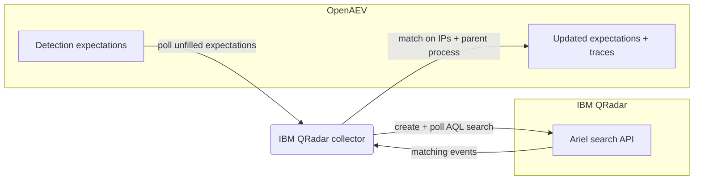

# OpenAEV IBM QRadar Collector

The IBM QRadar collector validates OpenAEV detection expectations against [IBM QRadar](https://www.ibm.com/products/qradar-siem),
IBM's SIEM. After OpenAEV agents execute attacks, the collector runs Ariel (AQL) searches against the QRadar REST API and
correlates the returned events with the related injects to confirm whether the activity was detected.

## Table of Contents

- [OpenAEV IBM QRadar Collector](#openaev-ibm-qradar-collector)
  - [Table of Contents](#table-of-contents)
  - [Introduction](#introduction)
  - [Requirements](#requirements)
  - [Configuration variables](#configuration-variables)
    - [OpenAEV environment variables](#openaev-environment-variables)
    - [Base collector environment variables](#base-collector-environment-variables)
    - [QRadar collector environment variables](#qradar-collector-environment-variables)
  - [Deployment](#deployment)
    - [Docker Deployment](#docker-deployment)
    - [Manual Deployment](#manual-deployment)
  - [Usage](#usage)
  - [Behavior](#behavior)
  - [Required permissions and API endpoints](#required-permissions-and-api-endpoints)
  - [Debugging](#debugging)
  - [Additional information](#additional-information)

## Introduction

OpenAEV (Breach and Attack Simulation) raises "expectations" each time it executes an inject (a simulated attack) on an
endpoint: a DETECTION expectation (the security product should raise an alert) and/or a PREVENTION expectation (the
security product should block the action). This collector connects to IBM QRadar, registers a `SecurityPlatform` of type
`SIEM`, and periodically reconciles those expectations with the events returned by the QRadar Ariel API, marking each
expectation as detected/not detected and attaching a trace that links back to the QRadar Log Activity view. QRadar is a
detection source, so this collector validates DETECTION expectations only; PREVENTION expectations are not supported.

## Requirements

- OpenAEV Platform >= 1.19.0
- An IBM QRadar console with the REST API enabled
- A QRadar authorized service token (preferred) or a username/password pair allowed to create and read Ariel searches
- For a manual (non-Docker) deployment: Python >= 3.11 and [Poetry](https://python-poetry.org/) >= 2.1

## Configuration variables

The collector is configured either through environment variables (recommended, read from `docker-compose.yml` / the
`.env` file for a Docker deployment) or through a `config.yml` file (for a manual deployment). Copy the provided
`src/.env.sample` / `src/config.yml.sample` and fill in the values flagged with `ChangeMe`.

### OpenAEV environment variables

| Parameter         | config.yml          | Docker environment variable | Mandatory | Description                                                                              |
|-------------------|---------------------|-----------------------------|-----------|------------------------------------------------------------------------------------------|
| OpenAEV URL       | `openaev.url`       | `OPENAEV_URL`               | Yes       | The URL of the OpenAEV platform. Must be reachable from where the collector runs.        |
| OpenAEV Token     | `openaev.token`     | `OPENAEV_TOKEN`             | Yes       | The administrator token of the OpenAEV platform.                                         |
| OpenAEV Tenant ID | `openaev.tenant_id` | `OPENAEV_TENANT_ID`         | No        | Tenant identifier for multi-tenant deployments. When set, it must be a valid UUID.       |

### Base collector environment variables

| Parameter        | config.yml            | Docker environment variable | Default    | Mandatory | Description                                                                                            |
|------------------|-----------------------|-----------------------------|------------|-----------|--------------------------------------------------------------------------------------------------------|
| Collector ID     | `collector.id`        | `COLLECTOR_ID`              | /          | Yes       | A unique `UUIDv4` identifier for this collector instance.                                               |
| Collector Name   | `collector.name`      | `COLLECTOR_NAME`            | IBM QRadar | No        | The name of the collector as shown in OpenAEV.                                                          |
| Collector Period | `collector.period`    | `COLLECTOR_PERIOD`          | PT1M       | No        | Interval between two runs, as an ISO 8601 duration (e.g. `PT1M` = 1 minute).                            |
| Log Level        | `collector.log_level` | `COLLECTOR_LOG_LEVEL`       | error      | No        | Verbosity of the logs. One of `debug`, `info`, `warn`, `error`.                                         |
| Platform         | `collector.platform`  | `COLLECTOR_PLATFORM`        | SIEM       | No        | The `SecurityPlatform` type registered in OpenAEV. One of `EDR`, `XDR`, `SIEM`, `SOAR`, `NDR`, `ISPM`.  |

### QRadar collector environment variables

| Parameter      | config.yml              | Docker environment variable | Default                      | Mandatory   | Description                                                                              |
|----------------|-------------------------|-----------------------------|------------------------------|-------------|-----------------------------------------------------------------------------------------|
| Base URL       | `qradar.base_url`       | `QRADAR_BASE_URL`           | `https://qradar.company.com` | Yes         | Base URL of the QRadar console.                                                          |
| Token          | `qradar.token`          | `QRADAR_TOKEN`              | /                            | Conditional | Authorized service token (preferred). Sent in the `SEC` header.                          |
| Username       | `qradar.username`       | `QRADAR_USERNAME`           | /                            | Conditional | Username for HTTP basic authentication (used when no token is set).                      |
| Password       | `qradar.password`       | `QRADAR_PASSWORD`           | /                            | Conditional | Password for HTTP basic authentication.                                                  |
| API Version    | `qradar.api_version`    | `QRADAR_API_VERSION`        | 20.0                         | No          | QRadar REST API version sent in the `Version` header.                                    |
| Data Source    | `qradar.data_source`    | `QRADAR_DATA_SOURCE`        | events                       | No          | Ariel data source to query (`events` or `flows`).                                        |
| Console URL    | `qradar.console_url`    | `QRADAR_CONSOLE_URL`        | /                            | No          | QRadar console URL used to build trace links (defaults to `base_url`).                   |
| Verify SSL     | `qradar.verify_ssl`     | `QRADAR_VERIFY_SSL`         | true                         | No          | Whether to verify the QRadar TLS certificate.                                            |
| Time Window    | `qradar.time_window`    | `QRADAR_TIME_WINDOW`        | PT1H                         | No          | Default search window when no date signatures are provided, as an ISO 8601 duration.     |
| Offset         | `qradar.offset`         | `QRADAR_OFFSET`             | PT30S                        | No          | Delay between retry attempts to absorb event ingestion latency, as an ISO 8601 duration. |
| Max Retry      | `qradar.max_retry`      | `QRADAR_MAX_RETRY`          | 3                            | No          | Maximum number of retry attempts after the initial search returns no results.            |
| Search Timeout | `qradar.search_timeout` | `QRADAR_SEARCH_TIMEOUT`     | PT5M                         | No          | Maximum time to wait for an Ariel search to complete, as an ISO 8601 duration.           |
| Poll Interval  | `qradar.poll_interval`  | `QRADAR_POLL_INTERVAL`      | PT5S                         | No          | Interval between Ariel search status polls, as an ISO 8601 duration.                     |

> Note: authentication is required. Provide either `QRADAR_TOKEN` (preferred) or both `QRADAR_USERNAME` and
> `QRADAR_PASSWORD`. The collector fails to start if neither is configured.

## Deployment

### Docker Deployment

Build the Docker image (or use the published `openaev/collector-qradar` image):

```shell
docker build . -t openaev/collector-qradar:latest
```

Create a `.env` file from `src/.env.sample` and fill in your values, then start the collector with the provided
`docker-compose.yml` (which reads those variables):

```shell
docker compose up -d
```

### Manual Deployment

Create a `config.yml` file from `src/config.yml.sample` and fill in your values, then install and run the collector:

```shell
poetry install --extras prod
poetry run QRadarCollector
```

> For local development against a checkout of [client-python](https://github.com/OpenAEV-Platform/client-python)
> (cloned next to this repository as `client-python`), use `poetry install --extras local` instead.

## Usage

Once started, the collector registers itself (and its `SecurityPlatform`) in OpenAEV and then runs automatically every
`COLLECTOR_PERIOD`. No manual interaction is required: as soon as injects produce expectations bound to this collector,
they are reconciled on the next run.

## Behavior



On each run, the collector:

1. Fetches the unfilled DETECTION expectations assigned to this collector from OpenAEV. PREVENTION expectations are
   marked invalid because QRadar only supports detection.
2. Builds an AQL query from the expectation signatures (`sourceip='...'`, `destinationip='...'`, and
   `"URL" LIKE '%<inject path>%'` derived from the inject/agent UUIDs embedded in the parent process name), combined
   with OR and bounded by `LAST N MINUTES` (from `QRADAR_TIME_WINDOW`). At least one filter must be derived; the
   collector refuses to scan the entire time window.
3. Creates an Ariel search (`POST /api/ariel/searches`), polls its status (`GET /api/ariel/searches/{search_id}`) every
   `QRADAR_POLL_INTERVAL` until it is `COMPLETED` or `QRADAR_SEARCH_TIMEOUT` elapses, then fetches the results.
4. Retries up to `QRADAR_MAX_RETRY` times, waiting `QRADAR_OFFSET` between attempts and progressively widening the
   window, to absorb event ingestion latency.
5. Matches events against the expectation signatures: the `parent_process_name` signature must match and, when IP
   signatures are present, at least one source or destination IP must match. Each matched DETECTION expectation is marked
   `Detected` and gets an expectation trace linking to the QRadar Log Activity view (`QRADAR_CONSOLE_URL`, or `base_url`
   when unset).

Expectations that remain unmatched after all retries are left for OpenAEV to mark as failed (`Not Detected`) once they
expire.

## Required permissions and API endpoints

- Required permission: a QRadar authorized service token or user account allowed to create and read Ariel searches
  (`/api/ariel/searches`) with read access to the configured data source (events or flows).
- API endpoints used:
  - `POST /api/ariel/searches?query_expression=<AQL>` (create an Ariel search)
  - `GET /api/ariel/searches/{search_id}` (poll the search status)
  - `GET /api/ariel/searches/{search_id}/results` (fetch the results)
  - Authentication: `SEC` header (authorized service token) or HTTP basic; the `Version` header carries
    `QRADAR_API_VERSION`.
- AQL fields used for matching: `sourceip`, `destinationip`, `"URL"`, `qidname`, `categoryname`, `starttime`.
- Reference: [QRadar REST API overview](https://www.ibm.com/docs/en/qsip/7.5?topic=api-rest-overview) and
  [authorized service tokens](https://www.ibm.com/docs/en/qsip/7.5?topic=app-creating-authorized-service-token)

## Debugging

Set `COLLECTOR_LOG_LEVEL=debug` to get verbose logs, including expectation polling, the AQL queries created, the search
poll cycles, and the matching decisions. Common causes of "nothing detected" are an incompatible `QRADAR_API_VERSION`,
the wrong `QRADAR_DATA_SOURCE` (events vs flows), or a `QRADAR_TIME_WINDOW` shorter than your event ingestion latency. A
"no usable filter conditions" error means the expectation carried neither IP nor parent-process signatures. For consoles
with self-signed certificates, set `QRADAR_VERIFY_SSL=false` (or trust the CA) if requests fail on TLS verification.

## Additional information

- This collector validates detection only; it does not support prevention expectations.
- The collector never issues an unbounded `WHERE (1=1)` scan: it requires at least one source/target IP or a
  parent-process-derived inject path before searching.
- Trace links use `QRADAR_CONSOLE_URL` when set, otherwise the configured `base_url`.
- The required permissions and endpoints reflect the current implementation. IBM may change its API over time, so always
  confirm against the official documentation before deploying.
