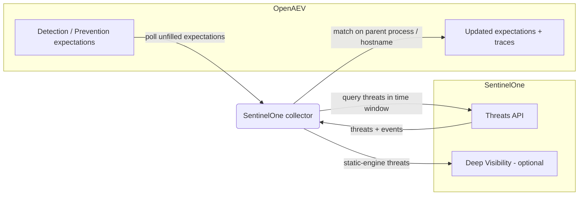

# OpenAEV SentinelOne Collector

The SentinelOne collector validates OpenAEV detection and prevention expectations against
[SentinelOne](https://www.sentinelone.com/), SentinelOne's autonomous endpoint detection and response (EDR/XDR)
platform. After OpenAEV agents execute attacks, the collector polls the SentinelOne Threats API (and, optionally, Deep
Visibility) and correlates the resulting threats with the related injects to confirm whether the activity was detected
and/or prevented.

## Table of Contents

- [OpenAEV SentinelOne Collector](#openaev-sentinelone-collector)
  - [Table of Contents](#table-of-contents)
  - [Introduction](#introduction)
  - [Requirements](#requirements)
  - [Configuration variables](#configuration-variables)
    - [OpenAEV environment variables](#openaev-environment-variables)
    - [Base collector environment variables](#base-collector-environment-variables)
    - [SentinelOne collector environment variables](#sentinelone-collector-environment-variables)
  - [Deployment](#deployment)
    - [Docker Deployment](#docker-deployment)
    - [Manual Deployment](#manual-deployment)
  - [Usage](#usage)
  - [Behavior](#behavior)
  - [Required permissions and API endpoints](#required-permissions-and-api-endpoints)
  - [Debugging](#debugging)
  - [Additional information](#additional-information)

## Introduction

OpenAEV (Breach and Attack Simulation) raises "expectations" each time it executes an inject (a simulated attack) on an
endpoint: a DETECTION expectation (the security product should raise an alert) and/or a PREVENTION expectation (the
security product should block the action). This collector connects to the SentinelOne Management Console, registers a
`SecurityPlatform` of type `EDR`, and periodically reconciles those expectations with the threats produced by
SentinelOne, marking each expectation as detected/not detected and prevented/not prevented and attaching a trace that
links back to the originating SentinelOne threat.

## Requirements

- OpenAEV Platform >= 1.19.0
- A SentinelOne Management Console with API access
- A SentinelOne API token with the `Threats` and `Threat Events` permissions (Deep Visibility and a Complete license are
  additionally required to validate static-engine detections)
- For a manual (non-Docker) deployment: Python >= 3.11 and [Poetry](https://python-poetry.org/) >= 2.1

## Configuration variables

The collector is configured either through environment variables (recommended, read from `docker-compose.yml` for a
Docker deployment) or through a `config.yml` file (for a manual deployment). Copy the provided `src/.env.sample` /
`src/config.yml.sample` and fill in the values flagged with `ChangeMe`.

### OpenAEV environment variables

| Parameter         | config.yml          | Docker environment variable | Mandatory | Description                                                                              |
|-------------------|---------------------|-----------------------------|-----------|------------------------------------------------------------------------------------------|
| OpenAEV URL       | `openaev.url`       | `OPENAEV_URL`               | Yes       | The URL of the OpenAEV platform. Must be reachable from where the collector runs.        |
| OpenAEV Token     | `openaev.token`     | `OPENAEV_TOKEN`             | Yes       | The administrator token of the OpenAEV platform.                                         |
| OpenAEV Tenant ID | `openaev.tenant_id` | `OPENAEV_TENANT_ID`         | No        | Tenant identifier for multi-tenant deployments. When set, it must be a valid UUID.       |

### Base collector environment variables

| Parameter        | config.yml            | Docker environment variable | Default     | Mandatory | Description                                                                                  |
|------------------|-----------------------|-----------------------------|-------------|-----------|----------------------------------------------------------------------------------------------|
| Collector ID     | `collector.id`        | `COLLECTOR_ID`              | /           | Yes       | A unique `UUIDv4` identifier for this collector instance.                                     |
| Collector Name   | `collector.name`      | `COLLECTOR_NAME`            | SentinelOne | No        | The name of the collector as shown in OpenAEV.                                                |
| Collector Period | `collector.period`    | `COLLECTOR_PERIOD`          | PT2M        | No        | Interval between two runs, as an ISO 8601 duration (e.g. `PT2M` = 2 minutes).                 |
| Log Level        | `collector.log_level` | `COLLECTOR_LOG_LEVEL`       | error       | No        | Verbosity of the logs. One of `debug`, `info`, `warn`, `error`.                               |
| Platform         | `collector.platform`  | `COLLECTOR_PLATFORM`        | EDR         | No        | The `SecurityPlatform` type registered in OpenAEV. One of `EDR`, `XDR`, `SIEM`, `SOAR`, `NDR`, `ISPM`. |

### SentinelOne collector environment variables

| Parameter | config.yml             | Docker environment variable | Default                       | Mandatory | Description                                                                |
|-----------|------------------------|-----------------------------|-------------------------------|-----------|----------------------------------------------------------------------------|
| Base URL  | `sentinelone.base_url` | `SENTINELONE_BASE_URL`      | `https://api.sentinelone.com` | No        | The SentinelOne Management Console API base URL.                           |
| API Key   | `sentinelone.api_key`  | `SENTINELONE_API_KEY`       | /                             | Yes       | The SentinelOne API token with `Threats` and `Threat Events` permissions.  |

## Deployment

### Docker Deployment

Build the Docker image (or use the published `openaev/collector-sentinelone` image):

```shell
docker build . -t openaev/collector-sentinelone:latest
```

Set your values in the `environment` section of the provided `docker-compose.yml`, then start the collector:

```shell
docker compose up -d
```

### Manual Deployment

Create a `src/config.yml` file from `src/config.yml.sample` and fill in your values, then install and run the collector:

```shell
poetry install --extras prod
poetry run python -m src
```

> For local development against a checkout of [client-python](https://github.com/OpenAEV-Platform/client-python)
> (cloned next to this repository), use `poetry install --extras local` instead.

## Usage

Once started, the collector registers itself (and its `SecurityPlatform`) in OpenAEV and then runs automatically every
`COLLECTOR_PERIOD`. No manual interaction is required: as soon as injects produce expectations bound to this collector,
they are reconciled on the next run.

## Behavior



On each run, the collector:

1. Fetches the unfilled expectations assigned to this collector from OpenAEV and groups them into batches.
2. Determines the search window from the expectation `end_date` signature (falling back to now when absent); the window
   spans `end_date - time_window` to `end_date` (default `time_window` is 1 hour). Expectations without an `end_date`
   signature are skipped by default.
3. Queries the SentinelOne Threats API for that window. Behavioral (non-static) threats are enriched with their threat
   events; static-engine threats are enriched through Deep Visibility when that search is enabled (requires a Complete
   license).
4. Matches threats to expectations using these signatures: `parent_process_name` (fuzzy, score 95, on the
   `oaev-implant-*` process names found in events / Deep Visibility), `target_hostname_address`, and `end_date` (used to
   scope the query, not for matching).
5. Updates each matched expectation:
   - DETECTION: marked `Detected` when a threat matches the signatures, otherwise `Not Detected` once the expectation
     expires.
   - PREVENTION: marked `Prevented` when the matching threat additionally reports `is_mitigated`, otherwise
     `Not Prevented`.
6. Creates an expectation trace for each match, including the threat details and a link back to the SentinelOne console.

## Required permissions and API endpoints

- Required permissions: a SentinelOne API token with **`Threats`** and **`Threat Events`** read access. Static-engine
  validation additionally requires **Deep Visibility** (Complete license).
- API endpoints used:
  - `GET /web/api/v2.1/threats` (list threats in the time window)
  - `GET /web/api/v2.1/threat-events` (fetch threat events for behavioral threats)
  - Deep Visibility (when enabled): `POST /web/api/v2.1/dv/init-query`, `GET /web/api/v2.1/dv/query-status`,
    `GET /web/api/v2.1/dv/events`
  - Authentication uses the `Authorization: ApiToken <api_key>` header.
- Reference: [SentinelOne API documentation](https://developer.sentinelone.com/reference)

## Debugging

Set `COLLECTOR_LOG_LEVEL=debug` to get verbose logs, including expectation batching, the threats fetched per window, and
the matching decisions. Common causes of "nothing detected": a `base_url` pointing at the wrong console, an API token
missing the `Threats` / `Threat Events` permissions, expectations skipped because they carry no `end_date` signature, or
static-engine detections that require Deep Visibility (Complete license).

## Additional information

- The search window is anchored on the inject `end_date` and defaults to one hour; the collector is designed to validate
  expectations shortly after an inject runs, not to back-fill historical data.
- Static-engine (static AI) detections rely on Deep Visibility, which requires a Complete license; behavioral detections
  are validated on Core and Control licenses as well.
- The required SentinelOne permissions and endpoints reflect the current implementation. SentinelOne may change its API
  over time, so always confirm against the official documentation before deploying.
