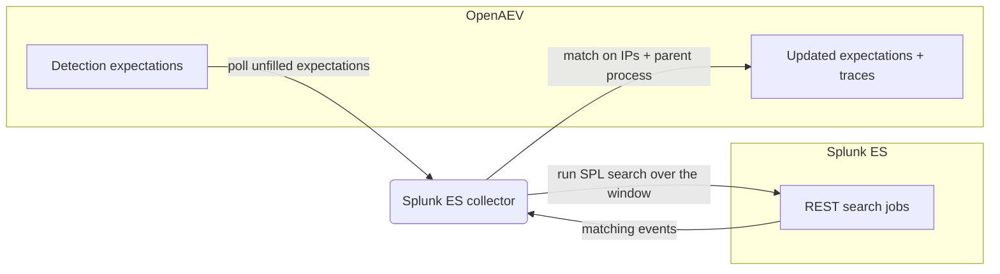

# OpenAEV Splunk Enterprise Security Collector

The Splunk Enterprise Security collector validates OpenAEV detection expectations against
[Splunk Enterprise Security](https://www.splunk.com/en_us/products/enterprise-security.html), Splunk's SIEM. After
OpenAEV agents execute attacks, the collector runs REST search jobs against Splunk ES and correlates the returned events
with the related injects to confirm whether the activity was detected.

## Table of Contents

- [OpenAEV Splunk Enterprise Security Collector](#openaev-splunk-enterprise-security-collector)
  - [Table of Contents](#table-of-contents)
  - [Introduction](#introduction)
  - [Requirements](#requirements)
  - [Configuration variables](#configuration-variables)
    - [OpenAEV environment variables](#openaev-environment-variables)
    - [Base collector environment variables](#base-collector-environment-variables)
    - [Splunk ES collector environment variables](#splunk-es-collector-environment-variables)
    - [Query template](#query-template)
  - [Deployment](#deployment)
    - [Docker Deployment](#docker-deployment)
    - [Manual Deployment](#manual-deployment)
  - [Usage](#usage)
  - [Behavior](#behavior)
  - [Required permissions and API endpoints](#required-permissions-and-api-endpoints)
  - [Debugging](#debugging)
  - [Additional information](#additional-information)

## Introduction

OpenAEV (Breach and Attack Simulation) raises "expectations" each time it executes an inject (a simulated attack) on an
endpoint: a DETECTION expectation (the security product should raise an alert) and/or a PREVENTION expectation (the
security product should block the action). This collector connects to Splunk Enterprise Security, registers a
`SecurityPlatform` of type `SIEM`, and periodically reconciles those expectations with the events returned by the Splunk
REST search API, marking each expectation as detected/not detected and attaching a trace that links back to the Splunk ES
search results. Splunk ES is a detection source, so this collector validates DETECTION expectations only; PREVENTION
expectations are not supported.

## Requirements

- OpenAEV Platform >= 1.19.0
- A Splunk Enterprise Security instance with the REST API reachable (typically on management port 8089)
- A Splunk user account with REST API search access and read access to the configured events index
- For a manual (non-Docker) deployment: Python >= 3.11 and [Poetry](https://python-poetry.org/) >= 2.1

## Configuration variables

The collector is configured either through environment variables (recommended, read from `docker-compose.yml` / the
`.env` file for a Docker deployment) or through a `config.yml` file (for a manual deployment). Copy the provided
`src/.env.sample` / `src/config.yml.sample` and fill in the values flagged with `ChangeMe`.

### OpenAEV environment variables

| Parameter         | config.yml          | Docker environment variable | Mandatory | Description                                                                              |
|-------------------|---------------------|-----------------------------|-----------|------------------------------------------------------------------------------------------|
| OpenAEV URL       | `openaev.url`       | `OPENAEV_URL`               | Yes       | The URL of the OpenAEV platform. Must be reachable from where the collector runs.        |
| OpenAEV Token     | `openaev.token`     | `OPENAEV_TOKEN`             | Yes       | The administrator token of the OpenAEV platform.                                         |
| OpenAEV Tenant ID | `openaev.tenant_id` | `OPENAEV_TENANT_ID`         | No        | Tenant identifier for multi-tenant deployments. When set, it must be a valid UUID.       |

### Base collector environment variables

| Parameter        | config.yml            | Docker environment variable | Default   | Mandatory | Description                                                                                            |
|------------------|-----------------------|-----------------------------|-----------|-----------|--------------------------------------------------------------------------------------------------------|
| Collector ID     | `collector.id`        | `COLLECTOR_ID`              | /         | Yes       | A unique `UUIDv4` identifier for this collector instance.                                               |
| Collector Name   | `collector.name`      | `COLLECTOR_NAME`            | Splunk ES | No        | The name of the collector as shown in OpenAEV.                                                          |
| Collector Period | `collector.period`    | `COLLECTOR_PERIOD`          | PT1M      | No        | Interval between two runs, as an ISO 8601 duration (e.g. `PT1M` = 1 minute).                            |
| Log Level        | `collector.log_level` | `COLLECTOR_LOG_LEVEL`       | error     | No        | Verbosity of the logs. One of `debug`, `info`, `warn`, `error`.                                         |
| Platform         | `collector.platform`  | `COLLECTOR_PLATFORM`        | SIEM      | No        | The `SecurityPlatform` type registered in OpenAEV. One of `EDR`, `XDR`, `SIEM`, `SOAR`, `NDR`, `ISPM`.  |

### Splunk ES collector environment variables

| Parameter      | config.yml                 | Docker environment variable | Default      | Mandatory | Description                                                                              |
|----------------|----------------------------|-----------------------------|--------------|-----------|-----------------------------------------------------------------------------------------|
| Base URL       | `splunk_es.base_url`       | `SPLUNKES_BASE_URL`         | /            | Yes       | Splunk ES management URL (e.g. `https://splunk.company.com:8089`).                       |
| Username       | `splunk_es.username`       | `SPLUNKES_USERNAME`         | /            | Yes       | Splunk username with REST API search permissions.                                       |
| Password       | `splunk_es.password`       | `SPLUNKES_PASSWORD`         | /            | Yes       | Splunk user password.                                                                    |
| Alerts Index   | `splunk_es.alerts_index`   | `SPLUNKES_ALERTS_INDEX`     | main         | No        | Splunk index to search for security alerts.                                              |
| Time Window    | `splunk_es.time_window`    | `SPLUNKES_TIME_WINDOW`      | PT1H         | No        | Default search window when no date signatures are provided, as an ISO 8601 duration.     |
| Offset         | `splunk_es.offset`         | `SPLUNKES_OFFSET`           | PT30S        | No        | Delay between retry attempts to absorb alert ingestion latency, as an ISO 8601 duration. |
| Max Retry      | `splunk_es.max_retry`      | `SPLUNKES_MAX_RETRY`        | 3            | No        | Maximum number of retry attempts after the initial search returns no results.            |
| Query Template | `splunk_es.query_template` | `SPLUNKES_QUERY_TEMPLATE`   | *(built-in)* | No        | Custom SPL query template with placeholders (leave empty to use the default below).      |

### Query template

`SPLUNKES_QUERY_TEMPLATE` lets you customize the SPL query used to fetch security events. The query template supports the
following placeholders, resolved at runtime:

| Placeholder            | Description                                                                  |
|------------------------|------------------------------------------------------------------------------|
| `{alerts_index}`       | The configured Splunk index (`SPLUNKES_ALERTS_INDEX`).                        |
| `{source_ips}`         | Source IP values quoted for the Splunk `IN` operator (`*` if none).          |
| `{target_ips}`         | Target IP values quoted for the Splunk `IN` operator (`*` if none).          |
| `{implant_urls}`       | Implant callback URL paths quoted for the Splunk `IN` operator (`*` if none).|
| `{implant_names}`      | Implant process names quoted for the Splunk `IN` operator (`*` if none).     |
| `{start_date}`         | Start date from signatures, or a relative time fallback (e.g. `-3600s`).      |
| `{end_date}`           | End date from signatures, or `now` fallback.                                  |
| `{ip_conditions}`      | Legacy: auto-generated source + destination IP filter.                        |
| `{process_conditions}` | Legacy: auto-generated URL path / process filter.                             |
| `{time_window}`        | Legacy: computed earliest time in seconds.                                    |

The query must include `| table _time` for proper alert parsing. The default template is:

```spl
index={alerts_index} (src_ip IN ({source_ips}) OR src IN ({source_ips}) OR source_ip IN ({source_ips}) OR client_ip IN ({source_ips})) (dst_ip IN ({target_ips}) OR dest IN ({target_ips}) OR dest_ip IN ({target_ips}) OR destination_ip IN ({target_ips}) OR server_ip IN ({target_ips})) (url_path IN ({implant_urls}) OR url IN ({implant_urls}) OR path IN ({implant_urls}) OR query IN ({implant_urls}) OR process_name IN ({implant_names}) OR parent_process_name IN ({implant_names})) earliest={start_date} latest={end_date} | table _time, src_ip, src, source_ip, client_ip, dst_ip, dest, dest_ip, destination_ip, server_ip, signature, rule_name, event_type, severity, url_path, url, path, query, process_name, parent_process_name, _raw | sort -_time
```

## Deployment

### Docker Deployment

Build the Docker image (or use the published `openaev/collector-splunk-es` image):

```shell
docker build . -t openaev/collector-splunk-es:latest
```

Create a `.env` file from `src/.env.sample` and fill in your values, then start the collector with the provided
`docker-compose.yml` (which reads those variables):

```shell
docker compose up -d
```

### Manual Deployment

Create a `config.yml` file from `src/config.yml.sample` and fill in your values, then install and run the collector:

```shell
poetry install --extras prod
poetry run SplunkESCollector
```

> For local development against a checkout of [client-python](https://github.com/OpenAEV-Platform/client-python)
> (cloned next to this repository as `client-python`), use `poetry install --extras local` instead.

## Usage

Once started, the collector registers itself (and its `SecurityPlatform`) in OpenAEV and then runs automatically every
`COLLECTOR_PERIOD`. No manual interaction is required: as soon as injects produce expectations bound to this collector,
they are reconciled on the next run.

## Behavior



On each run, the collector:

1. Fetches the unfilled DETECTION expectations assigned to this collector from OpenAEV. PREVENTION expectations are
   marked invalid because Splunk ES only supports detection.
2. Builds an SPL query by resolving the (configurable) query template from the expectation signatures: source/target
   IPs, the implant callback URL paths and implant process names derived from the parent process name, the alerts index,
   and the time range (from the start/end date signatures or a relative window from `SPLUNKES_TIME_WINDOW`).
3. Runs a oneshot search job (`POST /services/search/jobs` with `exec_mode=oneshot`, `output_mode=json`).
4. Retries up to `SPLUNKES_MAX_RETRY` times, waiting `SPLUNKES_OFFSET` between attempts and progressively widening the
   relative window, to absorb alert ingestion latency.
5. Matches events against the expectation signatures: the `parent_process_name` signature must match and, when IP
   signatures are present, at least one source or destination IP must match. Each matched DETECTION expectation is marked
   `Detected` and gets an expectation trace linking to the Splunk ES search results.

Expectations that remain unmatched after all retries are left for OpenAEV to mark as failed (`Not Detected`) once they
expire.

## Required permissions and API endpoints

- Required permission: a Splunk user with REST API search access and read access to the configured events index
  (e.g. `main`).
- API endpoints used:
  - `POST /services/search/jobs` (oneshot search via the Splunk REST API, authenticated with HTTP basic authentication)
- Reference: [Splunk roles and capabilities](https://docs.splunk.com/Documentation/Splunk/latest/Security/Aboutusersandroles)
  and the [Splunk REST API reference](https://docs.splunk.com/Documentation/Splunk/latest/RESTREF/RESTsearch)

## Debugging

Set `COLLECTOR_LOG_LEVEL=debug` to get verbose logs, including the resolved SPL query, the search job issued, and the
matching decisions. Common causes of "nothing detected" are the wrong `SPLUNKES_ALERTS_INDEX`, a `SPLUNKES_TIME_WINDOW`
shorter than your ingestion latency, or a custom `SPLUNKES_QUERY_TEMPLATE` that omits `| table _time` (which breaks field
extraction). Make sure `SPLUNKES_BASE_URL` targets the Splunk management port (typically 8089), not the web UI port.

## Additional information

- This collector validates detection only; it does not support prevention expectations.
- The SPL query is fully customizable via `SPLUNKES_QUERY_TEMPLATE`; a custom template must keep the `| table _time`
  pipe so that the resulting events can be parsed.
- TLS certificate verification is disabled for requests to Splunk; deploy the collector on a trusted network segment.
- The required permissions and endpoints reflect the current implementation. Splunk may change its API over time, so
  always confirm against the official documentation before deploying.
