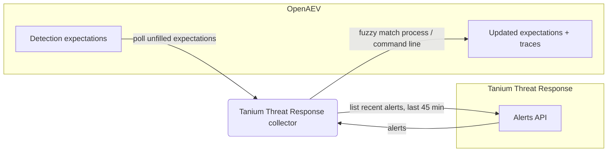

# OpenAEV Tanium Threat Response Collector

The Tanium Threat Response collector validates OpenAEV detection expectations against
[Tanium Threat Response](https://www.tanium.com/products/tanium-threat-response/), Tanium's endpoint detection and
response (EDR) module. After OpenAEV agents execute attacks, the collector pulls the recent Tanium Threat Response
alerts and correlates them with the related injects to confirm whether the activity was detected.

## Table of Contents

- [OpenAEV Tanium Threat Response Collector](#openaev-tanium-threat-response-collector)
  - [Table of Contents](#table-of-contents)
  - [Introduction](#introduction)
  - [Requirements](#requirements)
  - [Configuration variables](#configuration-variables)
    - [OpenAEV environment variables](#openaev-environment-variables)
    - [Base collector environment variables](#base-collector-environment-variables)
    - [Tanium Threat Response collector environment variables](#tanium-threat-response-collector-environment-variables)
  - [Deployment](#deployment)
    - [Docker Deployment](#docker-deployment)
    - [Manual Deployment](#manual-deployment)
  - [Usage](#usage)
  - [Behavior](#behavior)
  - [Required permissions and API endpoints](#required-permissions-and-api-endpoints)
  - [Debugging](#debugging)
  - [Additional information](#additional-information)

## Introduction

OpenAEV (Breach and Attack Simulation) raises "expectations" each time it executes an inject (a simulated attack) on an
endpoint. This collector connects to Tanium Threat Response, registers a `SecurityPlatform` of type `EDR`, and
periodically reconciles the DETECTION expectations assigned to it with the alerts produced by Tanium, marking each
expectation as detected/not detected and attaching a trace that links back to the originating Tanium alert.

## Requirements

- OpenAEV Platform >= 1.19.0
- A Tanium deployment with the Threat Response module enabled
- A Tanium API token with read access to Threat Response data, plus the Tanium API URL and console URL
- For a manual (non-Docker) deployment: Python >= 3.11 and [Poetry](https://python-poetry.org/) >= 2.1

## Configuration variables

The collector is configured either through environment variables (recommended, read from `docker-compose.yml` / the
`.env` file for a Docker deployment) or through a `config.yml` file (for a manual deployment). Copy the provided
`.env.sample` / `config.yml.sample` and fill in the values flagged with `ChangeMe`.

### OpenAEV environment variables

| Parameter         | config.yml          | Docker environment variable | Mandatory | Description                                                                              |
|-------------------|---------------------|-----------------------------|-----------|------------------------------------------------------------------------------------------|
| OpenAEV URL       | `openaev.url`       | `OPENAEV_URL`               | Yes       | The URL of the OpenAEV platform. Must be reachable from where the collector runs.        |
| OpenAEV Token     | `openaev.token`     | `OPENAEV_TOKEN`             | Yes       | The administrator token of the OpenAEV platform.                                         |
| OpenAEV Tenant ID | `openaev.tenant_id` | `OPENAEV_TENANT_ID`         | No        | Tenant identifier for multi-tenant deployments. When set, it must be a valid UUID.       |

### Base collector environment variables

| Parameter        | config.yml            | Docker environment variable | Default                | Mandatory | Description                                                                                  |
|------------------|-----------------------|-----------------------------|------------------------|-----------|----------------------------------------------------------------------------------------------|
| Collector ID     | `collector.id`        | `COLLECTOR_ID`              | /                      | Yes       | A unique `UUIDv4` identifier for this collector instance.                                     |
| Collector Name   | `collector.name`      | `COLLECTOR_NAME`            | Tanium Threat Response | No        | The name of the collector as shown in OpenAEV.                                                |
| Collector Period | `collector.period`    | `COLLECTOR_PERIOD`          | PT1M                   | No        | Interval between two runs, as an ISO 8601 duration (e.g. `PT1M` = 1 minute).                  |
| Log Level        | `collector.log_level` | `COLLECTOR_LOG_LEVEL`       | error                  | No        | Verbosity of the logs. One of `debug`, `info`, `warn`, `error`.                               |
| Platform         | `collector.platform`  | `COLLECTOR_PLATFORM`        | EDR                    | No        | The `SecurityPlatform` type registered in OpenAEV. One of `EDR`, `XDR`, `SIEM`, `SOAR`, `NDR`, `ISPM`. |

### Tanium Threat Response collector environment variables

| Parameter        | config.yml                     | Docker environment variable    | Default | Mandatory | Description                                            |
|------------------|--------------------------------|--------------------------------|---------|-----------|--------------------------------------------------------|
| Tanium URL       | `collector.tanium_url`         | `COLLECTOR_TANIUM_URL`         | /       | Yes       | The base URL of your Tanium API instance.              |
| Tanium Console URL | `collector.tanium_url_console` | `COLLECTOR_TANIUM_URL_CONSOLE` | /       | Yes       | The base URL of your Tanium console, used in trace links. |
| Tanium API Token | `collector.tanium_token`       | `COLLECTOR_TANIUM_TOKEN`       | /       | Yes       | The Tanium API token (sent as the `session` header).   |
| SSL Verify       | `collector.tanium_ssl_verify`  | `COLLECTOR_TANIUM_SSL_VERIFY`  | true    | No        | Whether to verify the Tanium server TLS certificate.   |

## Deployment

### Docker Deployment

Build the Docker image (or use the published `openaev/collector-tanium-threat-response` image):

```shell
docker build . -t openaev/collector-tanium-threat-response:latest
```

Create a `.env` file from `.env.sample` and fill in your values, then start the collector with the provided
`docker-compose.yml` (which reads those variables):

```shell
docker compose up -d
```

### Manual Deployment

Create a `config.yml` file from `config.yml.sample` and fill in your values, then install and run the collector:

```shell
poetry install --extras prod
poetry run python -m tanium_threat_response.openaev_tanium_threat_response
```

> For local development against a checkout of [client-python](https://github.com/OpenAEV-Platform/client-python)
> (cloned next to this repository), use `poetry install --extras dev` instead.

## Usage

Once started, the collector registers itself (and its `SecurityPlatform`) in OpenAEV and then runs automatically every
`COLLECTOR_PERIOD`. No manual interaction is required: as soon as injects produce expectations bound to this collector,
they are reconciled on the next run.

## Behavior



On each run, the collector:

1. Fetches the unfilled DETECTION expectations assigned to this collector from OpenAEV (looking back 45 minutes).
2. Queries the Tanium Threat Response alerts endpoint, sorted by most recent, and scans the first 200 alerts.
3. Considers only alerts created within the last 45 minutes that are not `suppressed`, and skips alerts whose
   `matchType` is `windows_defender` or `deep_instinct` (those are handled by their dedicated collectors).
4. Matches alerts to expectations using these signatures: `process_name` and `parent_process_name` (fuzzy, score 95,
   built from the alert process tree file names), `command_line` (fuzzy, score 60), and `file_name` / `hostname` /
   `ipv4_address` / `ipv6_address` (simple match against the raw alert).
5. Updates each matched expectation:
   - DETECTION: marked `Detected` when a matching alert is found, otherwise `Not Detected` once the expectation expires.
6. Creates an expectation trace for each match, including the alert (intel) name, a link to the alert in the Tanium
   console (`<tanium_url_console>/ui/threatresponse/alerts?guid=<guid>`), and the finding's first-seen date.

## Required permissions and API endpoints

- Required permission: a Tanium API token with read access to Threat Response data.
- API endpoints used:
  - `GET /plugin/products/threat-response/api/v1/alerts` (list recent alerts)
  - `GET /plugin/products/threat-response/api/v1/intels/<intel_id>` (resolve the alert/intel name)
  - Authentication uses the `session` header set to the API token.
- Reference: [Tanium Threat Response API documentation](https://docs.tanium.com/threatresponse/threatresponse/api.html)

## Debugging

Set `COLLECTOR_LOG_LEVEL=debug` to get verbose logs, including expectation polling, the number of alerts returned, and
the matching decisions. Common causes of "nothing detected": an incorrect `COLLECTOR_TANIUM_URL`, an invalid or expired
API token, or TLS verification failures (for a lab with a self-signed certificate you can set
`COLLECTOR_TANIUM_SSL_VERIFY=false`, which is not recommended in production). Alerts attributed to Windows Defender or
Deep Instinct are intentionally skipped.

## Additional information

- This collector reconciles DETECTION expectations only.
- The collector only reads recent alerts (a 45-minute sliding window, first 200 alerts); it is designed to validate
  expectations shortly after an inject runs, not to back-fill historical data.
- The required Tanium permissions and endpoints reflect the current implementation. Tanium may change its API over time,
  so always confirm against the official documentation before deploying.
